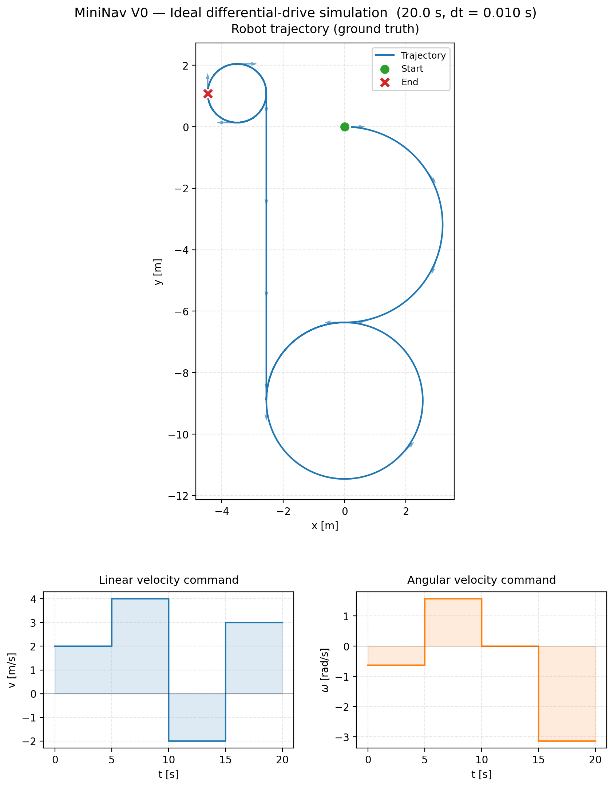
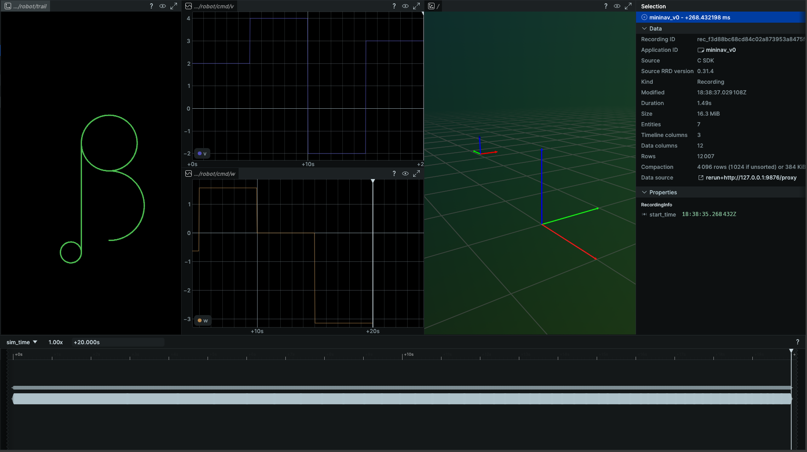

<div align="center">

# MiniNav

**Indoor mobile robot localization & navigation system in modern C++.**

From kinematic simulation to a Raspberry Pi 5 + 4WD car indoor navigation
demo — built incrementally, version by version.

[](https://en.cppreference.com/w/cpp/23)
[](https://cmake.org/)
[](#)
[](#)
[](LICENSE)



*V0: ideal differential-drive simulation, 20 s of staged commands rendered to CSV, Rerun, and a static PNG.*

</div>

---

## What is MiniNav?

MiniNav is a personal robotics project that builds a complete — though
deliberately simplified — indoor navigation stack for a mobile robot.
Every layer of the classic mobile-robotics pipeline is implemented from
scratch in modern C++, validated in simulation first, and progressively
brought onto real hardware.

It answers the three core questions of mobile robot navigation:

| Question | Topic | Core technique |
|---|---|---|
| **Where am I?** | Localization | Wheel odometry, IMU, EKF sensor fusion |
| **Where am I going?** | Planning | Occupancy grid map, A\* global planner |
| **How do I get there?** | Control | Pure Pursuit path tracking |

The project is structured as a multi-stage roadmap (V0 → V7), each
version solving one well-scoped problem and building on the previous one.
The goal of V0 is **not** to demonstrate a particular algorithm but to
establish a clean, modular, evolvable codebase on which the harder
versions can be built without rewrites.

> **Current status: V0 complete.** V1 (sensor noise & odometry) is
> the next milestone. See [`docs/v0_summary.md`](docs/v0_summary.md)
> for a deep dive into the V0 design decisions and lessons learned.

---

## V0 highlights

What V0 actually delivers, in one screen:

- **Ideal 2D differential-drive kinematics** — first-order Euler
  integration with explicit `wrap_angle` normalization, exposed as a
  pure free function so every future component (noisy models, real-car
  driver, EKF prediction) reuses the same equation.
- **Versioned simulation state (`SimStateV0`)** — non-inheritance state
  evolution: future versions add `odom_pose`, `ekf_pose`, covariance
  matrices as new structs rather than overloading a single base class.
- **`Trajectory<T>` template + ADL extension points** — adding
  `SimStateV1` only requires a new `csv_row(SimStateV1)` overload; old
  V0 code is never modified. This is the project's main bet on
  Open/Closed Principle in C++.
- **Dual-track output: CSV + Rerun** — CSV (deterministic, diff-able)
  serves as a regression baseline; Rerun (interactive, replayable) is
  the development view. A `--no-viz` mode runs CSV-only for CI.
- **PIMPL-isolated visualization** — the `viz` static library hides the
  Rerun SDK behind a `unique_ptr<Impl>`, so neither downstream targets
  nor compile-time depend on the Rerun headers.
- **Modern C++ tooling** — C++23 modules (`FILE_SET CXX_MODULES`),
  Clang 18, CMake 3.28 + Ninja, GoogleTest via `FetchContent`, strict
  warnings (`-Wall -Wextra -Wconversion -Werror` on Debug).

Visualization is intentionally split across three consumers:

| Output | Audience | Purpose |
|---|---|---|
| `data/traj.csv` | scripts, CI | regression baseline, post-processing |
| Rerun Viewer | the developer | live replayable inspection |
| `results/traj_v0.png` | recruiters, README | static publication-grade figure |

---

## Architecture

```
┌─────────────────────────────────────────────┐
│ Layer 5: Real Robot Deployment              │  Raspberry Pi 5 + 4WD car  (V6+)
├─────────────────────────────────────────────┤
│ Layer 4: Motion Control                     │  Pure Pursuit / PID        (V4)
├─────────────────────────────────────────────┤
│ Layer 3: Global Planning                    │  Occupancy grid + A*       (V3)
├─────────────────────────────────────────────┤
│ Layer 2: Localization & State Estimation    │  Odom + IMU + EKF          (V1, V2)
├─────────────────────────────────────────────┤
│ Layer 1: Kinematic Simulation               │  Differential-drive model  (V0 ✓)
└─────────────────────────────────────────────┘
```

V0 implements Layer 1 in full and provides the data, I/O, and
visualization scaffolding that the upper layers will reuse.

### V0 module layout

```
src/
├── core/                          # Static lib — no Rerun dependency
│   ├── types.{ixx,cpp}            # Pose2D, Twist2D, SimStateV0
│   ├── math.ixx                   # wrap_angle, kPi
│   ├── kinematics.{ixx,cpp}       # differential_drive_step (free function)
│   ├── robot_model.{ixx,cpp}      # RobotModel  (thin wrapper, future polymorphism)
│   ├── command_source.ixx +       # CommandSource base
│   │   staged_command_source.cpp  # StagedCommandSource (V0 only impl)
│   ├── trajectory.ixx             # Trajectory<T> template
│   ├── csv_format.{ixx,cpp}       # csv_header / csv_row(SimStateV0)
│   ├── csv_writer.ixx             # write_csv<T> via ADL
│   └── logger.ixx
├── viz/                           # Static lib — depends on Rerun (PIMPL'd)
│   ├── rerun_sink.{ixx,cpp}       # RerunSink
│   └── sim_state_log.{ixx,cpp}    # log_to_rerun(SimStateV0, ...)
└── apps/
    └── sim_v0_main.cpp            # CLI parsing + main loop
```

Module dependency graph:

```
sim_v0 ──▶ core ──▶ Eigen3
   │
   └────▶ viz ───┬──▶ core
                 └──▶ Rerun SDK (hidden behind PIMPL)

tests ──▶ core
       └──▶ GoogleTest
```

---

## Build & run

### Prerequisites

- Linux (or WSL2) — currently tested on Ubuntu 24.04
- Clang 18+ with C++23 modules support
- CMake 3.28+, Ninja
- Eigen3 ≥ 3.4 (`sudo apt install libeigen3-dev`)
- Python venv with `rerun-sdk==0.31.4` for the Rerun Viewer:

  ```bash
  python3 -m venv .venv
  .venv/bin/pip install rerun-sdk==0.31.4
  ```

GoogleTest and the Rerun SDK are fetched automatically via `FetchContent`.

### Build

```bash
# First-time configure
cmake --preset clang18-debug

# Incremental builds afterwards
cmake --build --preset build-debug -j

# Run unit tests
ctest --preset test-debug --output-on-failure
```

### Run the simulation

V0 supports three runtime modes:

```bash
# Mode 1 — Spawn:  auto-launches the Rerun Viewer, streams data via gRPC
./build/clang18-debug/sim_v0

# Mode 2 — Save:   writes a .rrd recording, replay later with `rerun results/v0.rrd`
./build/clang18-debug/sim_v0 --rrd results/v0.rrd

# Mode 3 — CSV-only:  used in CI and regression diff
./build/clang18-debug/sim_v0 --no-viz
```

All modes write `data/traj.csv`. Modes 1 and 2 additionally produce
Rerun output. `--rrd` and `--no-viz` are mutually exclusive.

### Generate the static PNG

```bash
source .venv/bin/activate
pip install matplotlib pandas numpy
python scripts/plot_trajectory.py \
    --input data/traj.csv \
    --output results/traj_v0.png
```

---

## Visualization

Live development view (Rerun Viewer, 4-pane blueprint):



The layout shows, left to right:

- 2D top-down trail of the robot's trajectory
- 3D scene with world frame and live robot body frame
- linear velocity command `v(t)`
- angular velocity command `ω(t)`

The same 20 s simulation, rendered to a static figure for sharing
(see top of this README).

---

## Documentation

In-depth design notes, math derivations, and per-version retrospectives
live under `docs/`:

- [`docs/project-overview.md`](docs/project-overview.md) — full
  vision, V0–V7 roadmap, and technology choices
- [`docs/v0_summary.md`](docs/v0_summary.md) — V0 retrospective:
  every non-trivial design decision, its alternatives, and what was
  learned

---

## License

MIT — see [`LICENSE`](LICENSE).