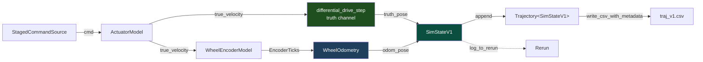
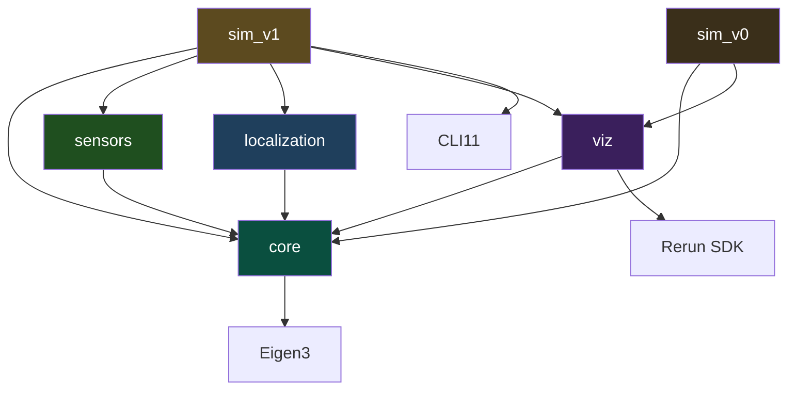

<div align="center">

# MiniNav

[](https://github.com/xinlei-robotics/MiniNav/actions/workflows/ci.yml)
[](https://en.cppreference.com/w/cpp/23)
[](https://cmake.org/)
[](LICENSE)

**Indoor mobile robot localization & navigation system in modern C++.**

From kinematic simulation to a Raspberry Pi 5 + 4WD car indoor navigation
demo — built incrementally, version by version.


*V1, replayed in Rerun's 3D view: command path (green), ground truth
(blue), and wheel-odometry estimate (orange) starting together and
drifting apart over 20 s. The orange–blue gap is the problem V2's EKF
is built to fix.*

</div>

---

## What is MiniNav?

MiniNav is a personal robotics project that builds a complete — though
deliberately simplified — indoor navigation stack for a mobile robot.
Every layer of the classic mobile-robotics pipeline is implemented from
scratch in modern C++, validated in simulation first, and progressively
brought onto real hardware.

It answers the three core questions of mobile robot navigation:

| Question                | Topic        | Core technique                         |
|-------------------------|--------------|----------------------------------------|
| **Where am I?**         | Localization | Wheel odometry, IMU, EKF sensor fusion |
| **Where am I going?**   | Planning     | Occupancy grid map, A\* global planner |
| **How do I get there?** | Control      | Pure Pursuit path tracking             |

The project is organized as a multi-stage roadmap (V0 → V6), each
version solving one well-scoped problem and building on the previous one.

> **Current status: V1 complete.** V2 (EKF sensor fusion) is the next
> milestone. See [`docs/v1_summary.md`](docs/v1_summary.md) for a deep
> dive into V1's design decisions, the noise models, and the odometry
> drift problem.

---

## Latest milestone — V1: Sensors, noise & odometry drift

V1 is the first version of MiniNav that *has something to fix*. V0
established a clean codebase running an ideal differential-drive robot
that perfectly executes every command. V1 introduces **two independent
imperfect channels** on top of that codebase — one at the actuator,
one at the sensor — and quantifies the resulting drift.

<p align="center">
  
  
</p>

### Two-channel architecture



The truth channel and the estimation channel use **the same**
`differential_drive_step` integrator. Any divergence between
`truth_pose` and `odom_pose` therefore comes entirely from differences
between their inputs — not from numerical asymmetry between two
parallel pipelines. This means the drift is *causally attributable* to
sensor and actuator imperfections, exactly the property a probabilistic
filter needs.

### What V1 actually contains

- **Velocity Motion Model** (Thrun, *Probabilistic Robotics* §5.3) for
  actuator noise: variance is `α₁v² + α₂ω²`, so a stationary command
  has zero variance — no static drift, unlike naive additive Gaussian.
- **Physically causal encoder model**: inverse kinematics → multiplicative
  slip noise → accumulated arc length → quantize to integer ticks →
  differential output. The accumulate-then-diff pattern correctly handles
  low-speed undersampling (where one tick can take many simulation steps
  to register).
- **`WheelOdometry` as a dependency-inverted estimator**. Its
  `update(EncoderTicks, dt)` signature has no knowledge of where the
  ticks came from. On the V6 real car, a Pi 5 GPIO interrupt counter
  will feed the *same* `EncoderTicks` struct — the estimator code does
  not change.
- **`RngFactory` with per-tag seed derivation** (FNV-1a hash). Each
  noise source owns an independent RNG, so adding a new noise source
  in a future PR does not shift the random sequence of existing ones.
  `--seed` controls every stochastic decision in the simulation.
- **Three preset noise levels** (`low-noise` / `default` / `high-noise`)
  swappable via `--preset`. The `default` preset is tuned so drift is
  clearly visible in 20 s without being unrealistic.
- **Self-documenting CSV output**. Every `traj_v1.csv` carries header
  comments embedding `seed`, `preset`, `dt`, `duration`, and
  `generated_at` — any saved trajectory can be exactly re-run.

V1 is where MiniNav stops being a textbook toy and starts looking like
a real estimation problem.

---

## Roadmap

| Version | Theme                    | Key deliverables                                                                                   | Status |
|---------|--------------------------|----------------------------------------------------------------------------------------------------|--------|
| **V0**  | Simulation scaffolding   | Differential-drive kinematics, `Trajectory<T>`, CSV/Rerun dual output, GoogleTest, strict warnings | ✅      |
| **V1**  | Sensors, noise, odometry | Velocity Motion Model, encoder slip + quantization, `WheelOdometry`, drift experiments             | ✅      |
| **V2**  | EKF state estimation     | IMU model, EKF predict + update, RMSE quantification vs odom baseline                              | → next |
| **V3**  | Path planning            | Occupancy grid map, A\* global planner                                                             |        |
| **V4**  | Control + ROS 2          | Pure Pursuit tracker, packaged as ROS 2 nodes                                                      |        |
| **V5**  | Full simulation loop     | Goal-pose → plan → track → arrive demo in ROS 2                                                    |        |
| **V6**  | Real-world deploy        | Sim-to-real on Pi 5 + 4WD car, indoor navigation video                                             |        |

---

## Engineering foundations

Capabilities established in V0 and reused by every subsequent version.

- **C++23 modules** via CMake 3.28 `FILE_SET CXX_MODULES`. Module
  interface files (`.ixx`) export only the API surface; heavy headers
  like Eigen stay in implementation files or global module fragments,
  keeping the module scan cost manageable.
- **ADL-based extension points**. `csv_row(T)` and `log_to_rerun(T, ...)`
  are free functions resolved by Argument-Dependent Lookup. Adding a
  new `SimStateV2` only requires writing new overloads in new files —
  V0 and V1 code is never touched. This is the Open/Closed Principle
  expressed in C++ at its most natural.
- **Versioned state structs**. `SimStateV0`, `SimStateV1`, … evolve by
  addition rather than inheritance. State is plain data; the `Trajectory`
  container is a class template so each version reuses the same
  container code.
- **PIMPL-isolated visualization**. The `viz` static library hides the
  Rerun SDK behind `unique_ptr<Impl>`. Downstream targets do not
  transitively `#include <rerun.hpp>` — neither symbols nor compile time
  leak through.
- **Dual-track output**. CSV is deterministic and diff-able (regression
  baseline + Python post-processing); Rerun is interactive (live
  development); static PNGs are the publication artifact. Each format
  has a different reader and a different job.
- **Strict warning policy**. `-Wall -Wextra -Wconversion -Werror` on
  Debug, with `SYSTEM` exemption for third-party headers — *strict on
  our code, permissive on theirs*.
- **Modern toolchain**. Clang 18, CMake 3.28 + Ninja, CLI11 / GoogleTest /
  Rerun SDK fetched via `FetchContent`, `gtest_discover_tests` for
  per-test CTest registration, `compile_commands.json` for clangd
  integration.

---

## Architecture

```
┌─────────────────────────────────────────────┐
│ Layer 5: Real Robot Deployment              │  Raspberry Pi 5 + 4WD car  (V6)
├─────────────────────────────────────────────┤
│ Layer 4: Motion Control                     │  Pure Pursuit / PID        (V4)
├─────────────────────────────────────────────┤
│ Layer 3: Global Planning                    │  Occupancy grid + A*       (V3)
├─────────────────────────────────────────────┤
│ Layer 2: Localization & State Estimation    │  Odom + IMU + EKF          (V1 ✅, V2)
├─────────────────────────────────────────────┤
│ Layer 1: Kinematic Simulation               │  Differential-drive model  (V0 ✅)
└─────────────────────────────────────────────┘
```

### Module dependencies (after V1)



`sensors` and `localization` are **independent of each other** — they
only communicate through the `EncoderTicks` plain struct, passed through
the `sim_v1` main loop. This dependency inversion is what makes V6 work
without modifying the estimator: real GPIO ticks plug into the same
struct the simulated encoder produces.

`sim_v0` is preserved as a regression baseline; V1 does not replace it.

---

## Build & run

### Prerequisites

- Linux (or WSL 2) — tested on Ubuntu 24.04
- Clang 18+ with C++23 modules support
- CMake 3.28+, Ninja
- Eigen3 ≥ 3.4 (`sudo apt install libeigen3-dev`)
- Python venv with `rerun-sdk==0.31.4`:

  ```bash
  python3 -m venv .venv
  .venv/bin/pip install -r requirements.txt
  ```

CLI11, GoogleTest, and the Rerun SDK are fetched automatically via
`FetchContent`.

### Build

```bash
# First-time configure (downloads Rerun SDK on first run)
cmake --preset clang18-debug

# Incremental builds
cmake --build --preset build-debug -j

# Run all tests (core / sensors / localization)
ctest --preset test-debug --output-on-failure
```

### Run the V1 simulation

```bash
# Default: random seed, default preset, spawns Rerun Viewer via gRPC
./build/clang18-debug/sim_v1

# Fully reproducible run (the seed prints to stdout when omitted)
./build/clang18-debug/sim_v1 --seed 42 --preset default

# Cycle through the three noise levels
./build/clang18-debug/sim_v1 --preset low-noise
./build/clang18-debug/sim_v1 --preset default
./build/clang18-debug/sim_v1 --preset high-noise

# Save a .rrd recording, replay later with `rerun results/v1.rrd`
./build/clang18-debug/sim_v1 --rrd results/v1.rrd

# Headless / CI mode — only writes data/traj_v1.csv
./build/clang18-debug/sim_v1 --no-viz
```

### Generate drift figures

```bash
source .venv/bin/activate
python scripts/v1/analyze_drift.py
```

Produces `results/v1/trajectory.png` and `results/v1/drift_over_time.png`,
and prints final / peak position error and final yaw error to stdout.

### V0 simulation (preserved as regression baseline)

```bash
./build/clang18-debug/sim_v0 --no-viz   # writes data/traj.csv
```

---

## Visualization

The Rerun Viewer is the primary live-development surface. The header
animation at the top of this README is a screen capture of the 3D view
during a `default`-preset run; locally, you can scrub, pause, change
the camera, toggle individual entities on/off, and inspect the
underlying time series.

Entity paths logged by `sim_v1`:

| Entity path                   | Meaning                                               |
|-------------------------------|-------------------------------------------------------|
| `/world/robot/cmd_traj/trail` | Where a perfect executor would go (≡ V0 trajectory)   |
| `/world/robot/truth/trail`    | Actual ground truth (after actuator noise)            |
| `/world/robot/odom/trail`     | Wheel-odometry estimate (after the full sensor chain) |

Additional scalar time series are logged for diagnostics:
`cmd_v` / `cmd_w`, `true_velocity_v` / `true_velocity_w`, encoder
`dticks_l` / `dticks_r`, and direct `error/position` + `error/yaw`
channels.

---

## Documentation

Per-version retrospectives and design notes live under `docs/`:

- [`docs/project-overview.md`](docs/project-overview.md) — full vision, V0 → V6 roadmap, technology choices
- [`docs/v0_summary.md`](docs/v0_summary.md) — V0 retrospective: scaffolding design, alternatives, lessons learned
- [`docs/v1_summary.md`](docs/v1_summary.md) — V1 retrospective: noise modelling, encoder physics, RNG design, drift analysis

---

## License

MIT — see [`LICENSE`](LICENSE).