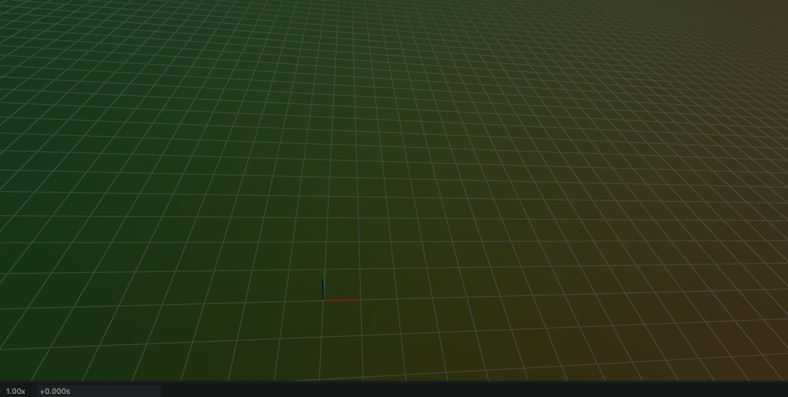
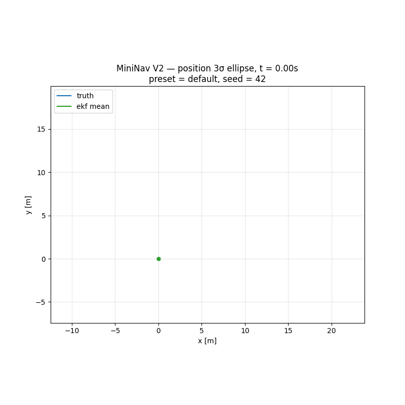
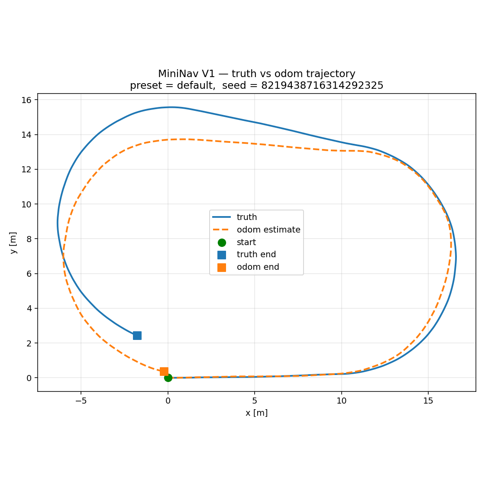
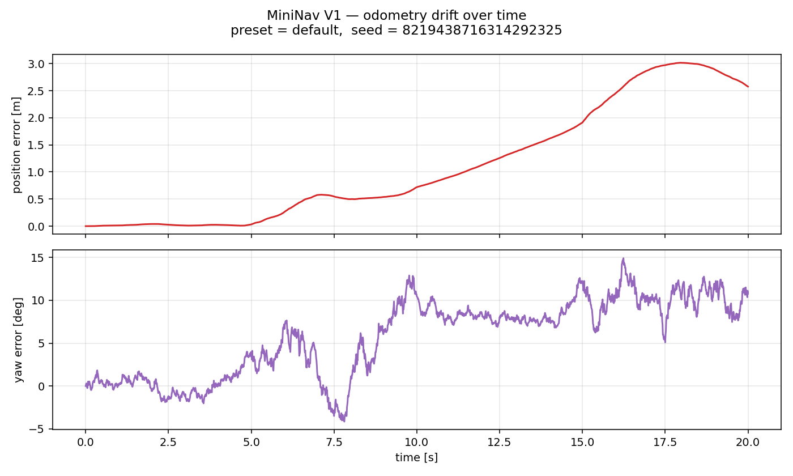
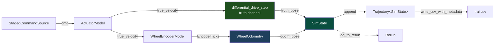
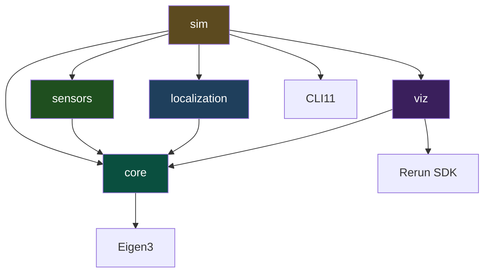

<div align="center">

# MiniNav

[](https://github.com/xinlei-robotics/MiniNav/actions/workflows/ci.yml)
[](https://en.cppreference.com/w/cpp/23)
[](https://cmake.org/)
[](LICENSE)

**Indoor mobile robot localization & navigation system in modern C++.**

From kinematic simulation to a Raspberry Pi 5 + 4WD car indoor navigation
demo — built incrementally, version by version.



*V1, replayed in Rerun's 3D view: command path (green), ground truth
(blue), and wheel-odometry estimate (orange) starting together and
drifting apart over 20 s. The orange–blue gap is the problem V2's EKF
is built to fix.*

</div>

---

## What is MiniNav?

MiniNav is a personal robotics project that builds a complete — though
deliberately simplified — indoor navigation stack for a mobile robot.
Every layer of the classic mobile-robotics pipeline is implemented from
scratch in modern C++, validated in simulation first, and progressively
brought onto real hardware.

It answers the three core questions of mobile robot navigation:

| Question                | Topic        | Core technique                         |
|-------------------------|--------------|----------------------------------------|
| **Where am I?**         | Localization | Wheel odometry, IMU, EKF sensor fusion |
| **Where am I going?**   | Planning     | Occupancy grid map, A\* global planner |
| **How do I get there?** | Control      | Pure Pursuit path tracking             |

The project is organized as a multi-stage roadmap (V0 → V6), each
version solving one well-scoped problem and building on the previous one.

> **Current status: V2 complete.** A 6-state EKF now fuses wheel encoders
> and a gyro to fight the V1 odometry drift, with online gyro-bias
> estimation, RK4 process integration, and NIS consistency diagnostics.
> See [`docs/experiments/v2_ekf_fusion.md`](docs/experiments/v2_ekf_fusion.md)
> for the full quantitative study, and [`docs/v1_summary.md`](docs/v1_summary.md)
> for the drift problem V2 was built to address.

---

## Latest milestone — V2: EKF sensor fusion

V2 replaces V1's open-loop wheel odometry with a probabilistic
**Extended Kalman Filter** that fuses two independent proprioceptive
sensors — wheel encoders and a gyro — into a single state estimate. It
was built incrementally across four PRs: the math foundation and
predict-only filter (#61), the encoder + IMU measurement updates (#62),
online gyro-bias estimation (#63), and the engineering-polish layer —
RK4 integration, `Q`/`R` tuning knobs, and NIS diagnostics (#64).

<p align="center">
  
  
</p>

### The filter

V2 estimates a **6-dimensional state**

```
x = [ pₓ  p_y  θ  v  ω  b_ω ]ᵀ
```

with a constant-velocity process model: position integrates the body
twist `(v, ω)`, while `(v, ω, b_ω)` are modelled as random walks. The
position rows of the process model and its Jacobian use **RK4**
integration; the analytic Jacobian is checked column-by-column against
finite differences for *both* the Euler and RK4 paths.

Both sensors are treated as **observations of the hidden state**, not as
control inputs — their rates differ, and keeping the updates separate
improves fault tolerance:

| Sensor  | Observes  | Notes                                                               |
|---------|-----------|---------------------------------------------------------------------|
| Encoder | `(v, ω)`  | Independently constrains the body twist                             |
| Gyro    | `ω + b_ω` | The `b_ω` coupling makes bias *jointly observable* with the encoder |

Covariance updates use the **Joseph form** and force symmetry every step
for numerical stability. Process noise `Q` is derived from V1's
velocity-motion-model `α` parameters and measurement noise `R` from V1's
sensor-noise parameters; `--q-scale` / `--r-scale` only *scale* these
physically-derived values for sensitivity analysis.

### What the experiment actually found

The full study lives in
[`docs/experiments/v2_ekf_fusion.md`](docs/experiments/v2_ekf_fusion.md)
— all numbers are 20-seed aggregates across three noise presets, not
cherry-picked single runs.

- **Fusion lowers error, but the gain is preset-dependent.** At
  `low-noise` the full EKF cuts position RMSE by **−48.9 %** vs odom
  (0.557 m → 0.285 m); at `default` the margin shrinks to **−8.3 %**
  with large seed-to-seed spread. There is no honest single "−X %".
- **Online bias estimation has an operating envelope — the headline
  engineering lesson.** When the gyro bias dominates (`low-noise`) it is
  indispensable, but at `high-noise` the bias state becomes too weakly
  observable and *destabilizes* the filter — 19 of 20 seeds diverge,
  blowing heading RMSE from 19.6° to 80.5°. A more expressive model only
  helps when the new state can actually be pinned down.
- **The filter is mildly overconfident** (encoder NIS ≈ 4.7 vs the
  expected 2), because the constant-velocity model cannot track the
  per-step actuator white noise. It stays consistent on *pose* even so,
  and is tunable via `--q-scale`.
- **Position is unobservable from proprioception alone.** The 3σ
  covariance ellipse grows ~1.9×10⁵× over a 20 s run, anisotropy ≈ 9.8,
  with the major axis tracking heading — a direct picture of why V3+
  needs an exteroceptive (map / scan-matching) sensor.
- **Euler→RK4 does not move this benchmark** at `dt = 0.01 s` with
  per-step observations (+0.28 % ± 1.43 %, statistically indistinguishable
  from zero). It is kept for *correctness*, reported honestly as a null
  result.

V2 is where MiniNav stops *measuring* drift and starts *fighting* it —
while being honest about exactly where fusion stops helping.

---

## Previous milestone — V1: Sensors, noise & odometry drift

V1 is the first version of MiniNav that *has something to fix*. V0
established a clean codebase running an ideal differential-drive robot
that perfectly executes every command. V1 introduces **two independent
imperfect channels** on top of that codebase — one at the actuator,
one at the sensor — and quantifies the resulting drift.

<p align="center">
  
  
</p>

### Two-channel architecture



The truth channel and the estimation channel use **the same**
`differential_drive_step` integrator. Any divergence between
`truth_pose` and `odom_pose` therefore comes entirely from differences
between their inputs — not from numerical asymmetry between two
parallel pipelines. This means the drift is *causally attributable* to
sensor and actuator imperfections, exactly the property a probabilistic
filter needs.

### What V1 actually contains

- **Velocity Motion Model** (Thrun, *Probabilistic Robotics* §5.3) for
  actuator noise: variance is `α₁v² + α₂ω²`, so a stationary command
  has zero variance — no static drift, unlike naive additive Gaussian.
- **Physically causal encoder model**: inverse kinematics → multiplicative
  slip noise → accumulated arc length → quantize to integer ticks →
  differential output. The accumulate-then-diff pattern correctly handles
  low-speed undersampling (where one tick can take many simulation steps
  to register).
- **`WheelOdometry` as a dependency-inverted estimator**. Its
  `update(EncoderTicks, dt)` signature has no knowledge of where the
  ticks came from. On the V6 real car, a Pi 5 GPIO interrupt counter
  will feed the *same* `EncoderTicks` struct — the estimator code does
  not change.
- **`RngFactory` with per-tag seed derivation** (FNV-1a hash). Each
  noise source owns an independent RNG, so adding a new noise source
  in a future PR does not shift the random sequence of existing ones.
  `--seed` controls every stochastic decision in the simulation.
- **Three preset noise levels** (`low-noise` / `default` / `high-noise`)
  swappable via `--preset`. The `default` preset is tuned so drift is
  clearly visible in 20 s without being unrealistic.
- **Self-documenting CSV output**. Every `traj.csv` carries header
  comments embedding `seed`, `preset`, `dt`, `duration`, and
  `generated_at` — any saved trajectory can be exactly re-run.

V1 is where MiniNav stops being a textbook toy and starts looking like
a real estimation problem.

---

## Roadmap

| Version | Theme                    | Key deliverables                                                                                   | Status |
|---------|--------------------------|----------------------------------------------------------------------------------------------------|--------|
| **V0**  | Simulation scaffolding   | Differential-drive kinematics, `Trajectory<T>`, CSV/Rerun dual output, GoogleTest, strict warnings | ✅      |
| **V1**  | Sensors, noise, odometry | Velocity Motion Model, encoder slip + quantization, `WheelOdometry`, drift experiments             | ✅      |
| **V2**  | EKF state estimation     | Gyro IMU model, 6-state EKF (predict + encoder/IMU updates), online gyro-bias estimation, RK4 process model, NIS diagnostics, 20-seed RMSE study vs odom baseline | ✅      |
| **V3**  | Path planning            | Occupancy grid map, A\* global planner                                                             |        |
| **V4**  | Control + ROS 2          | Pure Pursuit tracker, packaged as ROS 2 nodes                                                      |        |
| **V5**  | Full simulation loop     | Goal-pose → plan → track → arrive demo in ROS 2                                                    |        |
| **V6**  | Real-world deploy        | Sim-to-real on Pi 5 + 4WD car, indoor navigation video                                             |        |

---

## Engineering foundations

Capabilities established in V0 and reused by every subsequent version.

- **C++23 modules** via CMake 3.28 `FILE_SET CXX_MODULES`. Module
  interface files (`.ixx`) export only the API surface; heavy headers
  like Eigen stay in implementation files or global module fragments,
  keeping the module scan cost manageable.
- **ADL-based extension points**. `csv_row(T)` and `log_to_rerun(T, ...)`
  are free functions resolved by Argument-Dependent Lookup. Supporting a
  new state type means adding overloads rather than touching the
  `Trajectory` container or the Rerun sink — the serialization and viz
  layers stay open for extension.
- **Plain-data state struct**. `SimState` is plain data (no inheritance);
  the `Trajectory` container is a class template parameterized over it, so
  the same container code serves any record type.
- **PIMPL-isolated visualization**. The `viz` static library hides the
  Rerun SDK behind `unique_ptr<Impl>`. Downstream targets do not
  transitively `#include <rerun.hpp>` — neither symbols nor compile time
  leak through.
- **Dual-track output**. CSV is deterministic and diff-able (regression
  baseline + Python post-processing); Rerun is interactive (live
  development); static PNGs are the publication artifact. Each format
  has a different reader and a different job.
- **Strict warning policy**. `-Wall -Wextra -Wconversion -Werror` on
  Debug, with `SYSTEM` exemption for third-party headers — *strict on
  our code, permissive on theirs*.
- **Modern toolchain**. Clang 18, CMake 3.28 + Ninja, CLI11 / GoogleTest /
  Rerun SDK fetched via `FetchContent`, `gtest_discover_tests` for
  per-test CTest registration, `compile_commands.json` for clangd
  integration.

---

## Architecture

```
┌─────────────────────────────────────────────┐
│ Layer 5: Real Robot Deployment              │  Raspberry Pi 5 + 4WD car  (V6)
├─────────────────────────────────────────────┤
│ Layer 4: Motion Control                     │  Pure Pursuit / PID        (V4)
├─────────────────────────────────────────────┤
│ Layer 3: Global Planning                    │  Occupancy grid + A*       (V3)
├─────────────────────────────────────────────┤
│ Layer 2: Localization & State Estimation    │  Odom + IMU + EKF          (V1 ✅, V2 ✅)
├─────────────────────────────────────────────┤
│ Layer 1: Kinematic Simulation               │  Differential-drive model  (V0 ✅)
└─────────────────────────────────────────────┘
```

### Module dependencies (after V2)



`sensors` and `localization` remain **independent of each other** — they
communicate only through plain structs (`EncoderTicks` plus a scalar gyro
reading), passed through the `sim` main loop. The `Ekf` lives in the *same*
`localization` library as the `WheelOdometry` baseline and consumes the
*same* `EncoderTicks`; `sim` runs both side by side so the EKF can be
scored against the odometry baseline on identical sensor streams. This
dependency inversion is what makes V6 work without modifying the
estimator: real GPIO ticks plug into the same struct the simulated
encoder produces.

**Versioning policy.** `main` reflects the current best design; superseded
code is refactored away rather than kept alongside. Each completed
milestone is preserved as a git tag and GitHub release (`v0.1.0`=V0,
`v0.2.0`=V1, `v0.3.0`=V2) plus a retrospective in `docs/`, so every prior
version stays reachable through history without weighing down the trunk.

---

## Build & run

### Prerequisites

- Linux (or WSL 2) — tested on Ubuntu 24.04
- Clang 18+ with C++23 modules support
- CMake 3.28+, Ninja
- Eigen3 ≥ 3.4 (`sudo apt install libeigen3-dev`)
- Python venv with `rerun-sdk==0.31.4`:

  ```bash
  python3 -m venv .venv
  .venv/bin/pip install -r requirements.txt
  ```

CLI11, GoogleTest, and the Rerun SDK are fetched automatically via
`FetchContent`.

### Build

```bash
# First-time configure (downloads Rerun SDK on first run)
cmake --preset clang18-debug

# Incremental builds
cmake --build --preset build-debug -j

# Run all tests (core / sensors / localization)
ctest --preset test-debug --output-on-failure
```

### Run the simulation

```bash
# Default: random seed, default preset, RK4 integrator, online bias estimation
./build/clang18-debug/sim

# Fully reproducible run (the seed prints to stdout when omitted)
./build/clang18-debug/sim --seed 42 --preset default

# Disable online gyro-bias estimation (the 'ekf (no bias)' baseline).
# Write to its own file so it doesn't clobber the with-bias run above.
./build/clang18-debug/sim --seed 42 --preset default --no-bias --out data/traj_nobias.csv

# Sensitivity knobs: scale the EKF's physics-derived Q / R (1.0 = physical
# value). These tune the *filter* only — the simulated truth/measurements
# are untouched.
./build/clang18-debug/sim --q-scale 2.0      # trust the motion model less
./build/clang18-debug/sim --r-scale 0.5      # trust the sensors more

# RK4-vs-Euler attribution: same seed/preset, integrator the only difference
./build/clang18-debug/sim --integrator euler --out data/traj_euler.csv
./build/clang18-debug/sim --integrator rk4   --out data/traj_rk4.csv

# Headless / CI mode — only writes data/traj.csv
./build/clang18-debug/sim --no-viz
```

### Generate the V2 EKF figures

```bash
source .venv/bin/activate

# Per-run diagnostics from the two runs above: three-trajectory overlay,
# cumulative RMSE, NIS consistency, 3σ state-error envelopes, bias learning.
# The script is mode-aware (reads the CSV's `# mode` header).
python scripts/v2/analyze_ekf.py --input data/traj.csv --ekf-no-bias data/traj_nobias.csv
#   -> fusion_trajectory.png, fusion_rmse_over_time.png, nis_consistency.png,
#      state_errors.png, bias_learning.png

# 3σ position-covariance ellipse evolution (static + geometry + animated GIF)
python scripts/v2/analyze_covariance.py --input data/traj.csv
#   -> covariance_ellipses.png, covariance_geometry.png, covariance_evolution.gif

# RK4-vs-Euler attribution, single seed pair (consumes the two --out files above)
python scripts/v2/analyze_integrator.py --euler data/traj_euler.csv --rk4 data/traj_rk4.csv
#   -> integrator_rmse.png

# RK4-vs-Euler attribution, multi-seed average — drives sim itself per seed
python scripts/v2/sweep_integrator.py --n-seeds 30 --preset default
#   -> integrator_sweep.png
```

All figures land in `results/v2/` (override with `--output`). Every
`traj.csv` embeds `seed` / `preset` / `integrator` / `q_scale` /
`r_scale` / `bias` in its header comments, so any run replays exactly —
and `analyze_integrator.py` / `sweep_integrator.py` rely on the fact that
the EKF consumes no RNG, so an Euler and an RK4 run at the same seed share
a bit-identical truth and measurement stream.

### Reproducing earlier milestones (V0, V1)

V0 (kinematics scaffold) and V1 (noise + wheel-odometry drift) live at git
tags `v0.1.0` and `v0.2.0` — check one out to build and run its simulation,
or read the retrospectives in `docs/`. The trunk carries only the current
EKF simulation.

---

## Visualization

The Rerun Viewer is the primary live-development surface. The header
animation at the top of this README is a screen capture of the 3D view
during a `default`-preset run; locally, you can scrub, pause, change
the camera, toggle individual entities on/off, and inspect the
underlying time series.

Entity paths logged by `sim`:

| Entity path                   | Meaning                                               |
|-------------------------------|-------------------------------------------------------|
| `/world/robot/cmd_traj/trail` | Where a perfect executor would go (noise-free reference) |
| `/world/robot/truth/trail`    | Actual ground truth (after actuator noise)            |
| `/world/robot/odom/trail`     | Wheel-odometry estimate (after the full sensor chain) |

Additional scalar time series are logged for diagnostics:
`cmd_v` / `cmd_w`, `true_velocity_v` / `true_velocity_w`, encoder
`dticks_l` / `dticks_r`, and direct `error/position` + `error/yaw`
channels.

On top of the command / truth / odom surface above, `sim` adds the EKF
channels:

| Entity path               | Meaning                                                       |
|---------------------------|---------------------------------------------------------------|
| `/world/robot/ekf`        | EKF fused pose estimate (with its trail at `/world/trails/ekf`) |
| `/plots/bias_omega/ekf`   | Online gyro-bias *estimate* `b_ω` over time                   |
| `/plots/bias_omega/truth` | The simulator's *true* gyro bias, for direct comparison       |

The `bias_omega` pair is the most legible demonstration in the sim: in the
Rerun time-series view you watch `b_ω` start at 0 and converge toward the
true bias within a few seconds — the payoff of the state augmentation,
and (at `high-noise`) the place where you can watch it fail to settle.

---

## Documentation

Per-version retrospectives and design notes live under `docs/`:

- [`docs/project-overview.md`](docs/project_overview.md) — full vision, V0 → V6 roadmap, technology choices
- [`docs/v0_summary.md`](docs/v0_summary.md) — V0 retrospective: scaffolding design, alternatives, lessons learned
- [`docs/v1_summary.md`](docs/v1_summary.md) — V1 retrospective: noise modelling, encoder physics, RNG design, drift analysis
- [`docs/v2_summary.md`](docs/v2_summary.md) — V2 retrospective: 6-state EKF design, sensors-as-observations, the bias-estimation operating envelope, RK4 process model, NIS diagnostics
- [`docs/experiments/v2_ekf_fusion.md`](docs/experiments/v2_ekf_fusion.md) — V2 experiment report: 20-seed EKF-vs-odom RMSE study, the bias-estimation operating envelope, NIS consistency, covariance/observability analysis

Mathematical derivations live under `docs/math/`:

- [`docs/math/EKF_Foundations.md`](docs/math/EKF_Foundations.md) — EKF predict/update, Jacobians, Joseph-form covariance
- [`docs/math/runge_kutta_integration.md`](docs/math/runge_kutta_integration.md) — RK4 process integration and its analytic Jacobian
- [`docs/math/odom_noise.md`](docs/math/odom_noise.md) — velocity-motion-model noise, the basis for `Q` and `R`

---

## License

MIT — see [`LICENSE`](LICENSE).