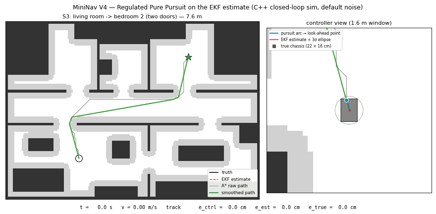
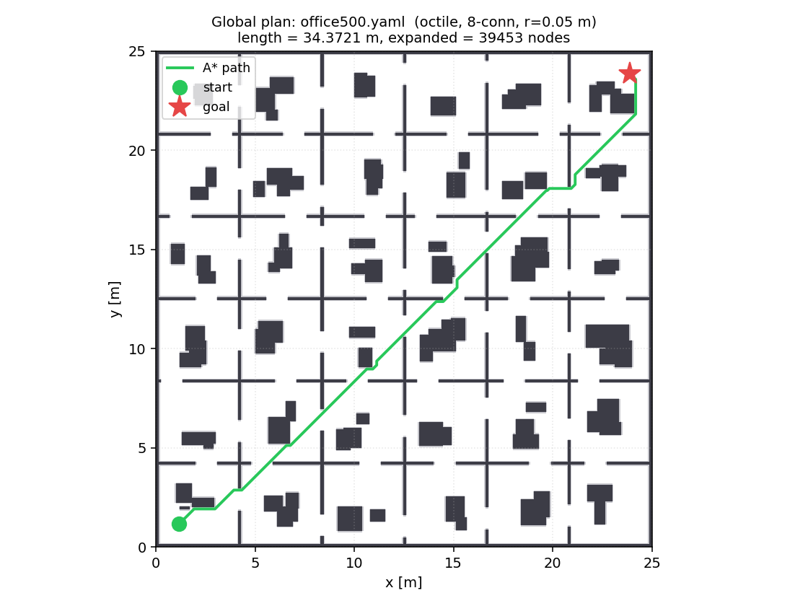
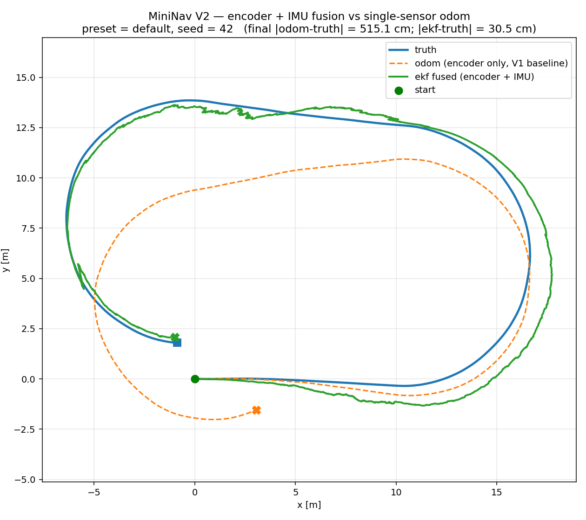
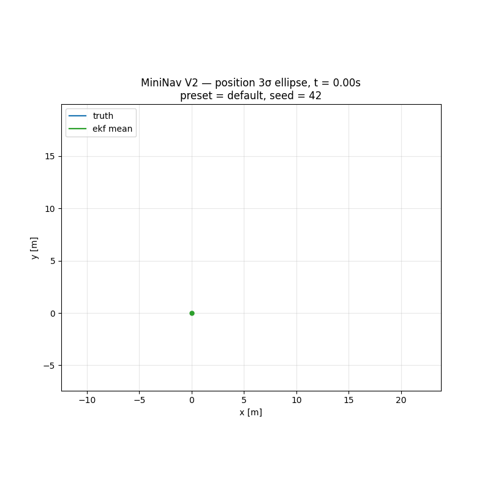
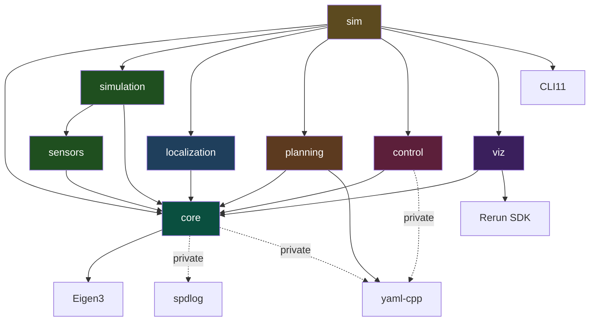
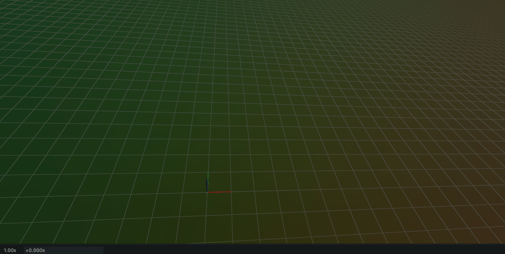

<div align="center">

# MiniNav

[](https://github.com/xinlei-robotics/MiniNav/actions/workflows/ci.yml)
[](https://en.cppreference.com/w/cpp/23)
[](https://cmake.org/)
[](LICENSE)

**Indoor mobile robot localization & navigation system in modern C++.**

From kinematic simulation to a Raspberry Pi 5 + 4WD car indoor navigation
demo — built incrementally, version by version.



*V4: closed loop in the deterministic C++ simulation — A\* plans from the EKF
estimate, the path is smoothed (gray → green), and a Regulated Pure Pursuit
controller tracks it through two doorways using the **estimate**, not the
ground truth (black: true trajectory, red: EKF). Right: the controller's view —
chassis, pursuit arc to the look-ahead point, and the EKF 3σ ellipse.
Experiments: [`docs/experiments/v4_control.md`](docs/experiments/v4_control.md).*

</div>

---

## What is MiniNav?

MiniNav is a personal robotics project that builds a complete — though
deliberately simplified — indoor navigation stack for a mobile robot.
Every layer of the classic mobile-robotics pipeline is implemented from
scratch in modern C++, validated in simulation first, and progressively
brought onto real hardware.

It answers the three core questions of mobile robot navigation:

| Question                | Topic        | Core technique                         |
|-------------------------|--------------|----------------------------------------|
| **Where am I?**         | Localization | Wheel odometry, IMU, EKF sensor fusion |
| **Where am I going?**   | Planning     | Occupancy grid map, A\* global planner |
| **How do I get there?** | Control      | Pure Pursuit path tracking             |

The project is organized as a multi-stage roadmap (V0 → V6), each
version solving one well-scoped problem and building on the previous one.

> **Current status: V3 complete.** An occupancy-grid map and an A\* global
> planner now sit on top of V2's EKF localization: `sim plan` loads a
> ROS-style map, inflates obstacles by the robot radius, and plans an optimal
> path in milliseconds. See
> [`docs/experiments/v3_planning.md`](docs/experiments/v3_planning.md) for the
> timing and optimality study, and [`docs/v3_summary.md`](docs/v3_summary.md)
> for the design retrospective.

---

## Latest milestone — V3: Global path planning

V3 gives MiniNav its first model of the *environment*. V2 showed that
proprioception alone can never pin down position; V3 builds the map
infrastructure that exteroceptive localization will need, and on top of it
delivers the first "where am I going, and how do I get there" capability.
It was built across seven PRs — the `planning` library scaffold with yaml-cpp
(#67), the `OccupancyGrid` core (#68), PGM + `map.yaml` loading (#69),
Euclidean obstacle inflation (#70), the A\* planner (#71), the spdlog / gmock
infrastructure upgrade (#72), and the `sim --map` integration (#73).

<p align="center">
  
</p>

### The planner

- **Occupancy grid** loaded from a ROS `map_server`-style PGM + `map.yaml`
  (self-written P2/P5 parser, no image library), tri-valued
  free / occupied / unknown, with world↔grid transforms anchored at the
  map's lower-left corner.
- **Obstacle inflation** through a multi-source Euclidean distance transform
  (the `costmap_2d` approach), so the robot is planned as a point in
  configuration space. The same distance field drives an opt-in clearance
  cost that makes equal-length paths keep away from walls.
- **A\*** with flat `g` / `parent` / `closed` tables and a binary-heap open
  set; 4- or 8-connectivity, Manhattan / Euclidean / Octile heuristics,
  tie-breaking toward the goal, and no corner-cutting on diagonals.
- **`GlobalPlanner` facade** shaped like `nav2_core::GlobalPlanner` but using
  MiniNav's own `Pose2D` / `Path` types — the V5 Nav2 integration only needs
  a thin plugin adapter.
- **External configuration** in `config/planner.yaml` (yaml-cpp), with each
  field overridable from the command line.

### What the experiments found

Full report in [`docs/experiments/v3_planning.md`](docs/experiments/v3_planning.md);
derivations in [`docs/math/astar_planning.md`](docs/math/astar_planning.md).

- **Fast, with headroom.** On 200×200 random-obstacle maps a single A\*
  query takes **3.9 ms at p95** (Release) against a 50 ms budget. The
  500×500 floor plan above plans corner to corner in ~12 ms.
- **Optimal.** Path lengths match a Dijkstra ground truth exactly (0-cell
  deviation against a ≤ 1-cell target) on the hand-drawn maps, and match the
  analytic shortest length on a 200×200 serpentine stress maze.
- **The optimality guarantee is conditional — the headline engineering
  lesson.** A\* is only optimal with a *consistent* heuristic, and that
  depends on how the heuristic is paired with the grid connectivity.
  Manhattan distance overestimates diagonal steps on an 8-connected grid:
  on the 500×500 map it returned a path 1.13 cells longer than optimal while
  expanding 97 % fewer nodes — with no error anywhere. The rule now lives in a
  single `constexpr is_admissible()` check, enforced both when `planner.yaml`
  is parsed and when the planner is constructed (which also catches CLI
  overrides).
- **Tighter heuristics expand less.** Octile distance — the exact
  obstacle-free cost on an 8-connected grid — finds the same optimal path as
  Euclidean with 26 % fewer expansions.
- **Deterministic without a seed.** A\* consumes no randomness, so the same
  map, start, goal, and config produce a byte-identical `path.csv`.
- **Test the case that matters.** The first timing test planned across an
  *empty* map — the heuristic's best case, exactly 200 expansions — and its
  assertion only ran in Release while CI builds Debug. It now runs on a
  serpentine stress maze (26,666 of 26,866 free cells expanded), backed by
  build-independent expansion-count checks that CI does enforce.

V3 is where MiniNav starts reasoning about the space around the robot —
and where "optimal" became a checked precondition rather than an assumption.

---

## Previous milestone — V2: EKF sensor fusion

V2 replaced V1's open-loop wheel odometry with a probabilistic **Extended
Kalman Filter** over the 6-dimensional state `[pₓ, p_y, θ, v, ω, b_ω]`,
fusing wheel encoders and a gyro as *observations of the hidden state*
(not control inputs), with online gyro-bias estimation, Joseph-form
covariance updates, an RK4 process model whose analytic Jacobian is checked
against finite differences, and NIS consistency diagnostics.

<p align="center">
  
  
</p>

Findings from the 20-seed study in
[`docs/experiments/v2_ekf_fusion.md`](docs/experiments/v2_ekf_fusion.md):

- **Fusion lowers error, but the gain is preset-dependent** — position RMSE
  drops **−48.9 %** vs odometry at `low-noise` but only **−8.3 %** at
  `default`. There is no honest single "−X %".
- **Online bias estimation has an operating envelope.** It is indispensable
  when the gyro bias dominates, but at `high-noise` the bias state becomes too
  weakly observable and destabilizes the filter (19 of 20 seeds diverge).
- **Position is unobservable from proprioception alone** — the 3σ position
  ellipse grows ~1.9×10⁵× over 20 s. That is the problem the V3 map
  infrastructure is the first step toward solving.

---

## Earlier milestones — V0 and V1

**V0** established the scaffolding every later version reuses: C++23
modules, differential-drive kinematics, the `Trajectory<T>` container with
ADL extension points, and deterministic CSV next to live Rerun output.
**V1** introduced two independent imperfect channels — a Velocity Motion
Model at the actuator and slip + quantization at the wheel encoder — and
quantified the open-loop odometry drift that V2's EKF was built to fight.
See [`docs/v0_summary.md`](docs/v0_summary.md) and
[`docs/v1_summary.md`](docs/v1_summary.md); both versions are reachable at
tags `v0.1.0` and `v0.2.0`.

---

## Roadmap

| Version | Theme                    | Key deliverables                                                                                   | Status |
|---------|--------------------------|----------------------------------------------------------------------------------------------------|--------|
| **V0**  | Simulation scaffolding   | Differential-drive kinematics, `Trajectory<T>`, CSV/Rerun dual output, GoogleTest, strict warnings | ✅      |
| **V1**  | Sensors, noise, odometry | Velocity Motion Model, encoder slip + quantization, `WheelOdometry`, drift experiments             | ✅      |
| **V2**  | EKF state estimation     | Gyro IMU model, 6-state EKF (predict + encoder/IMU updates), online gyro-bias estimation, RK4 process model, NIS diagnostics, 20-seed RMSE study vs odom baseline | ✅      |
| **V3**  | Path planning            | Occupancy grid (PGM + `map.yaml`), Euclidean obstacle inflation, A\* with admissibility-checked heuristics, YAML planner config, spdlog / gmock, `sim --map` planning mode | ✅      |
| **V4**  | Closed-loop path tracking | Regulated Pure Pursuit tracking the A\* path in the C++ simulation with the EKF estimate in the loop; control error measured separately from localization drift |        |
| **V5**  | ROS 2 + Nav2 integration | Simulation and EKF nodes on standard messages; the A\* planner and the controller as Nav2 plugins; RViz2 goal-to-arrival demo |        |
| **V6**  | Real-world deploy        | Sim-to-real on Pi 5 + 4WD car, indoor navigation video                                             |        |

---

## Engineering foundations

Engineering capabilities shared by every version — most established in V0,
extended as the stack grew.

- **C++23 modules** via CMake 3.28 `FILE_SET CXX_MODULES`. Module
  interface files (`.ixx`) export only the API surface; heavy headers
  like Eigen stay in implementation files or global module fragments,
  keeping the module scan cost manageable.
- **ADL-based extension points**. `csv_row(T)` and `log_to_rerun(T, ...)`
  are free functions resolved by Argument-Dependent Lookup. Supporting a
  new state type means adding overloads rather than touching the
  `Trajectory` container or the Rerun sink — the serialization and viz
  layers stay open for extension.
- **Plain-data state struct**. `SimState` is plain data (no inheritance);
  the `Trajectory` container is a class template parameterized over it, so
  the same container code serves any record type.
- **Interface-isolated, mockable visualization**. Visualization code talks
  to an abstract `VizSink`; `RerunSink` is its only Rerun-aware
  implementation and hides the SDK behind `unique_ptr<Impl>`, so downstream
  targets never transitively `#include <rerun.hpp>`. gmock-based tests
  assert the entity layout without spawning a viewer.
- **Dual-track output**. CSV is deterministic and diff-able (regression
  baseline + Python post-processing); Rerun is interactive (live
  development); static PNGs are the publication artifact. Each format
  has a different reader and a different job.
- **External configuration and structured logging**. yaml-cpp reads
  `robot.yaml` (the single source of robot geometry and limits),
  `planner.yaml` and `map.yaml`, rejecting unknown keys; spdlog backs the unchanged
  `mininav.core.logger` interface and is linked privately into `core`, so no
  spdlog type leaks downstream.
- **Strict warning policy**. `-Wall -Wextra -Wconversion -Werror` on
  Debug, with `SYSTEM` exemption for third-party headers — *strict on
  our code, permissive on theirs*.
- **Modern toolchain**. Clang 18, CMake 3.28 + Ninja; CLI11, GoogleTest /
  gmock, Rerun SDK, yaml-cpp and spdlog fetched via `FetchContent` (a system
  install is used when present); `gtest_discover_tests` for per-test CTest
  registration; `compile_commands.json` for clangd integration.

---

## Architecture

```
┌─────────────────────────────────────────────┐
│ Layer 5: Real Robot Deployment              │  Raspberry Pi 5 + 4WD car  (V6)
├─────────────────────────────────────────────┤
│ Layer 4: Motion Control                     │  Regulated Pure Pursuit    (V4)
├─────────────────────────────────────────────┤
│ Layer 3: Global Planning                    │  Occupancy grid + A*       (V3 ✅)
├─────────────────────────────────────────────┤
│ Layer 2: Localization & State Estimation    │  Odom + IMU + EKF          (V1 ✅, V2 ✅)
├─────────────────────────────────────────────┤
│ Layer 1: Kinematic Simulation               │  Differential-drive model  (V0 ✅)
└─────────────────────────────────────────────┘
```

### Module dependencies


```mermaid
graph TD
    sim[sim] --> core[core]
    sim --> simulation[simulation]
    sim --> localization[localization]
    sim --> planning[planning]
    sim --> control
    sim --> viz[viz]
    sim --> cli11[CLI11]

    simulation --> sensors[sensors]
    simulation --> core
    sensors --> core
    localization --> core
    planning --> core
    planning --> yamlcpp[yaml-cpp]
    control[control] --> core
    control -.->|private| yamlcpp
    viz --> core
    viz --> rerun[Rerun SDK]
    core --> eigen[Eigen3]
    core -.->|private| spdlog[spdlog]
    core -.->|private| yamlcpp

    style core fill:#0a4f3f,color:#fff
    style simulation fill:#1f4f1f,color:#fff
    style sensors fill:#1f4f1f,color:#fff
    style localization fill:#1f3f5c,color:#fff
    style planning fill:#5c3a1f,color:#fff
    style control fill:#5c1f3a,color:#fff
    style viz fill:#3a1f5c,color:#fff
    style sim fill:#5c4a1f,color:#fff
```

The simulated robot and the estimator remain **independent of each other**.
`simulation::Plant` (actuator noise, encoder and IMU models, ground truth)
and `localization::EkfPipeline` (decode, predict, update) communicate only
through plain structs — `EncoderTicks` plus a scalar gyro reading — passed
through the `sim` main loop. The `Ekf` lives in the *same* `localization`
library as the `WheelOdometry` baseline and consumes the *same*
`EncoderTicks`; `sim` runs both side by side so the EKF can be scored
against the odometry baseline on identical sensor streams. This dependency
inversion is what makes V6 work without modifying the estimator: real GPIO
ticks plug into the same struct the simulated encoder produces. It is also
the V5 node boundary — a simulation node wraps the `Plant`, an EKF node
wraps the `EkfPipeline`.

`planning` follows the same rule: it depends only on `core` and yaml-cpp —
an `OccupancyGrid` goes in, a `Path` (a `core` type, like `nav_msgs/Path` in
ROS) comes out — so a SLAM-built map or a
real robot's start pose can feed the same planner unchanged. `viz` in turn
does not depend on `planning`: a plan reaches the viewer as plain geometry
(points and poses), converted by the app.

`control` (V4) depends only on `core` as well: the Regulated
Pure Pursuit controller, velocity smoother, and goal / progress checkers
mirror the `nav2_core` plugin interfaces and see only `Path`, `Pose2D` and
`Twist2D` — no grid, no EKF, no sensors — so V5 can wrap them as Nav2 plugins
unchanged. The closed loop is assembled in the app (`sim nav`), and its view
reaches Rerun as plain geometry through `nav_log`, so `viz` still depends on
neither `planning` nor `control`.

**Versioning policy.** `main` reflects the current best design; superseded
code is refactored away rather than kept alongside. Each completed
milestone is preserved as a git tag and GitHub release (`v0.1.0`=V0,
`v0.2.0`=V1, `v0.3.0`=V2, `v0.4.0`=V3) plus a retrospective in `docs/`, so
every prior version stays reachable through history without weighing down
the trunk.

---

## Build & run

### Prerequisites

- Linux (or WSL 2) — tested on Ubuntu 24.04
- Clang 18+ with C++23 modules support
- CMake 3.28+, Ninja
- Eigen3 ≥ 3.4 (`sudo apt install libeigen3-dev`)
- Python venv with `rerun-sdk==0.31.4`:

  ```bash
  python3 -m venv .venv
  .venv/bin/pip install -r requirements.txt
  ```

CLI11, GoogleTest, the Rerun SDK, yaml-cpp, and spdlog are fetched
automatically via `FetchContent`.

### Build

```bash
# First-time configure (downloads Rerun SDK on first run)
cmake --preset clang18-debug

# Incremental builds
cmake --build --preset build-debug -j

# Run all tests (core / sensors / simulation / localization / planning / control / viz /
# regression / nav)
ctest --preset test-debug --output-on-failure

# Golden CSV regression only (end-to-end sim runs vs tests/golden/)
ctest --preset test-debug -L regression --output-on-failure
```

### Run the simulation

`sim` takes a subcommand: `sim ekf` runs the localization simulation,
`sim plan` a one-shot global plan, and `sim nav` the closed loop (V4, in
progress). `sim <mode> --help` lists each mode's options; `sim` alone prints
the overview.

```bash
# Default: random seed, default preset, RK4 integrator, online bias estimation
./build/clang18-debug/sim ekf

# Fully reproducible run (the seed prints to stdout when omitted)
./build/clang18-debug/sim ekf --seed 42 --preset default

# Disable online gyro-bias estimation (the 'ekf (no bias)' baseline).
# Write to its own file so it doesn't clobber the with-bias run above.
./build/clang18-debug/sim ekf --seed 42 --preset default --no-bias --out data/traj_nobias.csv

# Sensitivity knobs: scale the EKF's physics-derived Q / R (1.0 = physical
# value). These tune the *filter* only — the simulated truth/measurements
# are untouched.
./build/clang18-debug/sim ekf --q-scale 2.0      # trust the motion model less
./build/clang18-debug/sim ekf --r-scale 0.5      # trust the sensors more

# RK4-vs-Euler attribution: same seed/preset, integrator the only difference
./build/clang18-debug/sim ekf --integrator euler --out data/traj_euler.csv
./build/clang18-debug/sim ekf --integrator rk4   --out data/traj_rk4.csv

# Headless / CI mode — only writes data/traj.csv
./build/clang18-debug/sim ekf --no-viz
```

Robot geometry (wheel radius, wheel base, encoder resolution, footprint,
actuator limits) comes from `config/robot.yaml`; pass `--robot <file>` to
simulate a different robot.

### Plan a path (V3 planning mode)

`sim plan` runs a one-shot, RNG-free global plan: load the map, inflate
obstacles, run A\*, write `path.csv`, and show the result in Rerun.

```bash
# Plan across the two-room office map (opens the Rerun Viewer, writes data/path.csv)
./build/clang18-debug/sim plan --map maps/office.yaml --start 0.15,0.15 --goal 1.85,1.35 \
    --config config/planner.yaml

# Override individual planner.yaml fields from the command line
./build/clang18-debug/sim plan --map maps/maze.yaml --goal 0.95,0.95 --heuristic euclidean

# Manhattan is only admissible on a 4-connected grid; pairing it with 8 is rejected
./build/clang18-debug/sim plan --map maps/office.yaml --goal 1.85,1.35 \
    --heuristic manhattan --connectivity 4

# Headless: only writes the byte-deterministic path.csv
./build/clang18-debug/sim plan --map maps/office.yaml --goal 1.85,1.35 --no-viz --out data/path.csv

# Post-process the A* staircase (V4): true endpoints + line-of-sight shortcuts.
# On office500 this turns 524 waypoints / 34.37 m into 13 waypoints / 33.33 m.
./build/clang18-debug/sim plan --map maps/office500.yaml --start 1.175,1.175 \
    --goal 23.875,23.875 --config config/planner.yaml --smooth

# Real-scale floor plan for closed-loop experiments, inflated by the robot footprint
./build/clang18-debug/sim plan --map maps/apartment.yaml --start 2.9,1.6 --goal 7.2,5.6 \
    --inflation-radius 0.25 --smooth
```

`maps/apartment` is a 10 m × 7 m floor plan (rooms, 0.8–0.9 m doors, furniture)
generated from the rectangle list in `maps/src/apartment.toml` by
`python scripts/v4/gen_floorplan.py maps/src/apartment.toml`. Unlike the
hand-drawn demo maps, it stays connected once inflated by the robot footprint.
The current layout is a placeholder; editing the TOML with the real room's
measurements and regenerating swaps it out.

### Drive a path (V4 closed loop, in progress)

`sim nav` plans from the EKF's initial estimate, smooths the path, and tracks
it with Regulated Pure Pursuit at 20 Hz on a 100 Hz plant with actuator
saturation and lag, until the robot arrives, collides, stalls or times out.
Parameters come from `config/robot.yaml` and `config/nav.yaml`; the run writes
`nav.csv` (every `SimState` column plus look-ahead, curvature, regime, the
control / estimation / ground-truth error decomposition and clearance) and
shows the loop in Rerun.

```bash
# Hallway -> bedroom 1, turning to face west on arrival (EKF in the loop)
./build/clang18-debug/sim nav --map maps/apartment.yaml --start 0.6,3.6,0 \
    --goal 2.9,5.6,3.1416 --seed 42

# Oracle: ground truth into the controller, so only the control error remains
./build/clang18-debug/sim nav --map maps/apartment.yaml --start 2.9,1.6,1.5708 \
    --goal 7.2,5.6 --controller-input truth --no-viz

# Noise-free plant (encoder quantization only)
./build/clang18-debug/sim nav --map maps/apartment.yaml --start 2.9,1.6,1.5708 \
    --goal 7.2,5.6 --preset none --no-viz

# Follow a given path instead of planning one (Nav2 FollowPath); no map needed
./build/clang18-debug/sim nav --path tests/nav/l_path.csv --preset none \
    --controller-input truth --no-viz
```

When planning, `--map` and `--goal` are required and `--start` defaults to the
grid center (all in world meters). `--path` takes a `path.csv` as written by
`sim plan`, or any CSV with `x,y` columns: the goal is its last waypoint, the
start defaults to its first, and `--map` becomes optional (it only enables the
collision and clearance checks). Take timing numbers from the Release build
(`cmake --preset clang18-release && cmake --build --preset build-release -j`).

### Generate the V2 EKF figures

```bash
source .venv/bin/activate

# Per-run diagnostics from the two runs above: three-trajectory overlay,
# cumulative RMSE, NIS consistency, 3σ state-error envelopes, bias learning.
# The script is mode-aware (reads the CSV's `# mode` header).
python scripts/v2/analyze_ekf.py --input data/traj.csv --ekf-no-bias data/traj_nobias.csv
#   -> fusion_trajectory.png, fusion_rmse_over_time.png, nis_consistency.png,
#      state_errors.png, bias_learning.png

# 3σ position-covariance ellipse evolution (static + geometry + animated GIF)
python scripts/v2/analyze_covariance.py --input data/traj.csv
#   -> covariance_ellipses.png, covariance_geometry.png, covariance_evolution.gif

# RK4-vs-Euler attribution, single seed pair (consumes the two --out files above)
python scripts/v2/analyze_integrator.py --euler data/traj_euler.csv --rk4 data/traj_rk4.csv
#   -> integrator_rmse.png

# RK4-vs-Euler attribution, multi-seed average — drives sim itself per seed
python scripts/v2/sweep_integrator.py --n-seeds 30 --preset default
#   -> integrator_sweep.png
```

All figures land in `results/v2/` (override with `--output`). Every
`traj.csv` embeds `seed` / `preset` / `integrator` / `q_scale` /
`r_scale` / `bias` in its header comments, so any run replays exactly —
and `analyze_integrator.py` / `sweep_integrator.py` rely on the fact that
the EKF consumes no RNG, so an Euler and an RK4 run at the same seed share
a bit-identical truth and measurement stream.

### Generate the V3 planning figures

```bash
source .venv/bin/activate

# Map + inflation layer + A* path for one plan (reads the path.csv written above)
python scripts/v3/plot_plan.py --map maps/office.yaml --path data/path.csv
#   -> plan_office.png

# Timing benchmark on random N×N maps — drives the Release sim itself
python scripts/v3/benchmark_planner.py --sizes 50 100 200 --trials 12
#   -> planner_timing.png

# A* path length vs a Dijkstra ground truth
python scripts/v3/optimality_check.py --maps maps/office.yaml maps/maze.yaml maps/room.yaml \
    --goal-of office=1.85,1.35 maze=0.95,0.95 room=0.85,0.65 --start auto
#   -> optimality.png

# Animated A* expansion (the header GIF)
python scripts/v3/animate_search.py --map maps/office500.yaml --start 1.175,1.175 \
    --goal 23.875,23.875 --inflation-radius 0.05 --max-frames 160 --fps 24
#   -> search_office500.gif
```

All figures land in `results/v3/`, named after the map. Every `path.csv`
embeds the map, start, goal, heuristic, connectivity, inflation radius,
success flag, expanded-node count, and path length in its header comments.

### Generate the V4 control figures

```bash
cmake --build --preset build-release -j   # the scripts drive build/clang18-release/sim
source .venv/bin/activate

python scripts/v4/scenarios.py        # S1–S5 scenario list            -> scenarios.png
python scripts/v4/step_response.py    # E1: linearization and lag theory -> e1_*.png
python scripts/v4/corner_cutting.py   # E2: corner cutting and margins -> e2_*.png
python scripts/v4/run_scenarios.py    # E3/E4 batch runs (~1 min) into data/v4/
python scripts/v4/tracking_error.py   # E3/E4: trade-off, error split, drift -> e3_*.png, e4_*.png
python scripts/v4/animate_nav.py      # closed-loop animation (the header GIF) -> nav_s3.gif
```

Figures land in `results/v4/`; the raw runs stay in the gitignored `data/v4/`.
The scripts change parameters by writing variants of `config/robot.yaml` and
`config/nav.yaml`, so every run starts from the repository defaults.

### Reproducing earlier milestones (V0, V1)

V0 (kinematics scaffold) and V1 (noise + wheel-odometry drift) live at git
tags `v0.1.0` and `v0.2.0` — check one out to build and run its simulation,
or read the retrospectives in `docs/`. The trunk carries only the current
`sim`: the EKF simulation plus the V3 planning mode.

---

## Visualization

The Rerun Viewer is the primary live-development surface. Below is a V1 run
replayed in its 3D view — command path (green), ground truth (blue), and
wheel-odometry estimate (orange) starting together and drifting apart over
20 s. Locally, you can scrub, pause, change the camera, toggle individual
entities on/off, and inspect the underlying time series.

<p align="center">
  
</p>

Entity paths logged by `sim`:

| Entity path                   | Meaning                                               |
|-------------------------------|-------------------------------------------------------|
| `/world/robot/cmd_traj/trail` | Where a perfect executor would go (noise-free reference) |
| `/world/robot/truth/trail`    | Actual ground truth (after actuator noise)            |
| `/world/robot/odom/trail`     | Wheel-odometry estimate (after the full sensor chain) |

Additional scalar time series are logged for diagnostics:
`cmd_v` / `cmd_w`, `true_velocity_v` / `true_velocity_w`, encoder
`dticks_l` / `dticks_r`, and direct `error/position` + `error/yaw`
channels.

On top of the command / truth / odom surface above, `sim` adds the EKF
channels:

| Entity path               | Meaning                                                       |
|---------------------------|---------------------------------------------------------------|
| `/world/robot/ekf`        | EKF fused pose estimate (with its trail at `/world/trails/ekf`) |
| `/plots/bias_omega/ekf`   | Online gyro-bias *estimate* `b_ω` over time                   |
| `/plots/bias_omega/truth` | The simulator's *true* gyro bias, for direct comparison       |

The `bias_omega` pair is the most legible demonstration in the sim: in the
Rerun time-series view you watch `b_ω` start at 0 and converge toward the
true bias within a few seconds — the payoff of the state augmentation,
and (at `high-noise`) the place where you can watch it fail to settle.

In planning mode (`sim plan`), the whole scene is logged once as static
data:

| Entity path                  | Meaning                                         |
|------------------------------|-------------------------------------------------|
| `/world/map`                 | Occupied cells of the original map              |
| `/world/map/inflated`        | Cells added by inflation (the safety margin)    |
| `/world/plan/path`           | The A\* path as a line strip, plus `/waypoints` |
| `/world/robot/start`         | Start pose                                      |
| `/world/robot/goal`          | Goal pose                                       |

---

## Documentation

Per-version retrospectives and design notes live under `docs/`:

- [`docs/project_overview.md`](docs/project_overview.md) — full vision, V0 → V6 roadmap, technology choices
- [`docs/v0_summary.md`](docs/v0_summary.md) — V0 retrospective: scaffolding design, alternatives, lessons learned
- [`docs/v1_summary.md`](docs/v1_summary.md) — V1 retrospective: noise modelling, encoder physics, RNG design, drift analysis
- [`docs/v2_summary.md`](docs/v2_summary.md) — V2 retrospective: 6-state EKF design, sensors-as-observations, the bias-estimation operating envelope, RK4 process model, NIS diagnostics
- [`docs/v3_summary.md`](docs/v3_summary.md) — V3 retrospective: occupancy-grid and configuration-space design, the heuristic–connectivity admissibility rule, the timing-test lesson, technical debt toward V4
- [`docs/experiments/v2_ekf_fusion.md`](docs/experiments/v2_ekf_fusion.md) — V2 experiment report: 20-seed EKF-vs-odom RMSE study, the bias-estimation operating envelope, NIS consistency, covariance/observability analysis
- [`docs/experiments/v3_planning.md`](docs/experiments/v3_planning.md) — V3 experiment report: timing benchmark (200×200 and a 500×500 floor plan), optimality vs Dijkstra, heuristic admissibility, determinism
- [`docs/experiments/v4_control.md`](docs/experiments/v4_control.md) — V4 experiment report: Pure Pursuit theory vs simulation, corner cutting and safety margins, the look-ahead trade-off, the control vs localization error split and drift over distance

Mathematical derivations live under `docs/math/`:

- [`docs/math/EKF_Foundations.md`](docs/math/EKF_Foundations.md) — EKF predict/update, Jacobians, Joseph-form covariance
- [`docs/math/runge_kutta_integration.md`](docs/math/runge_kutta_integration.md) — RK4 process integration and its analytic Jacobian
- [`docs/math/odom_noise.md`](docs/math/odom_noise.md) — velocity-motion-model noise, the basis for `Q` and `R`
- [`docs/math/astar_planning.md`](docs/math/astar_planning.md) — occupancy grids, configuration-space inflation, the A\* optimality proof, heuristic admissibility and consistency under 4/8-connectivity
- [`docs/math/pure_pursuit.md`](docs/math/pure_pursuit.md) — Pure Pursuit geometry, linearization, the lag stability bound, corner cutting, the safety-margin budget, and the error decomposition

---

## License

MIT — see [`LICENSE`](LICENSE).
