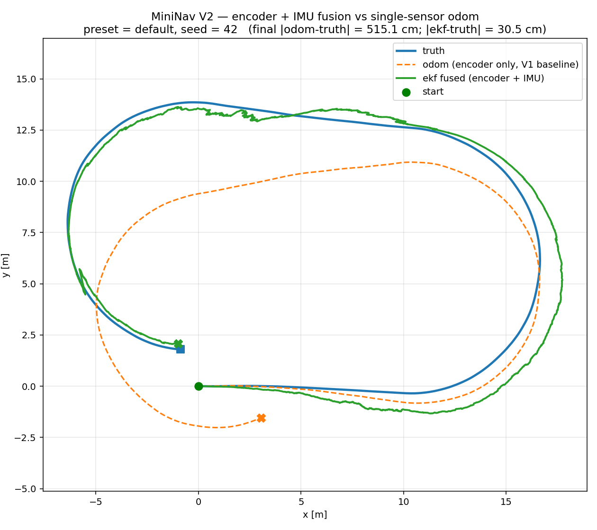
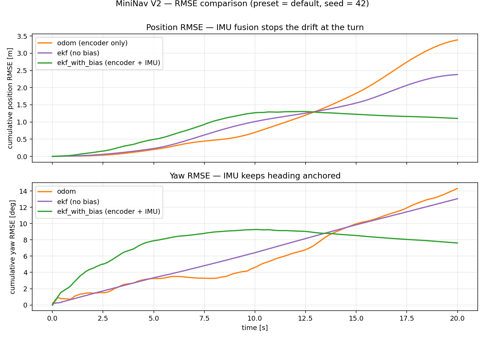
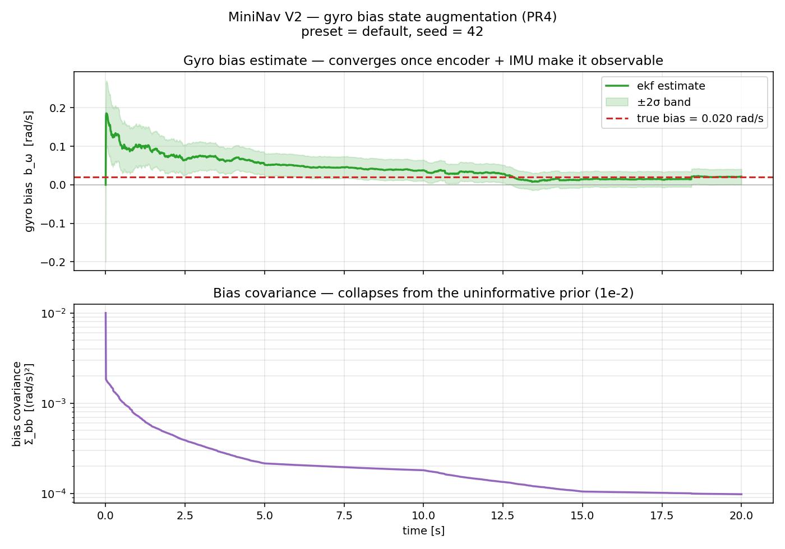
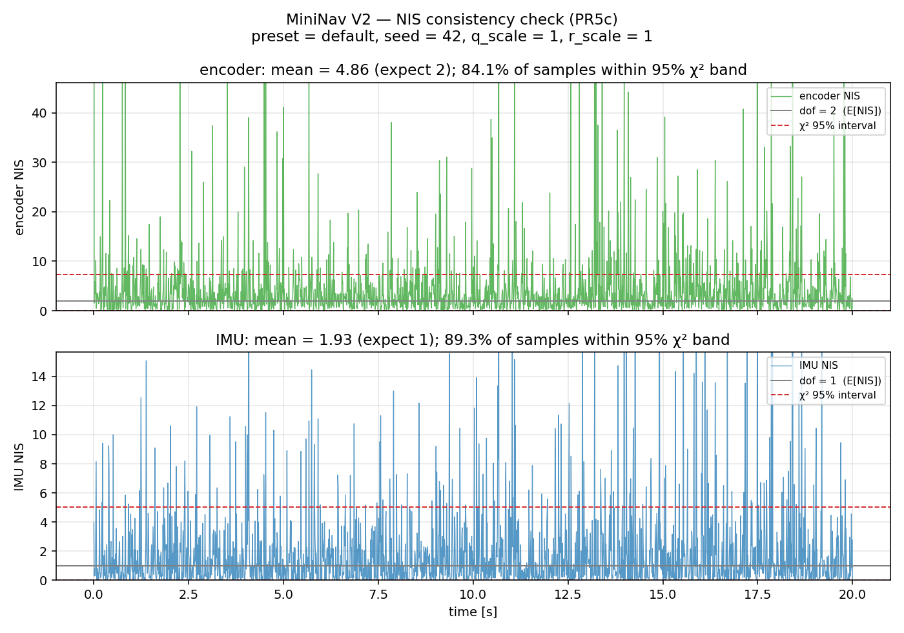
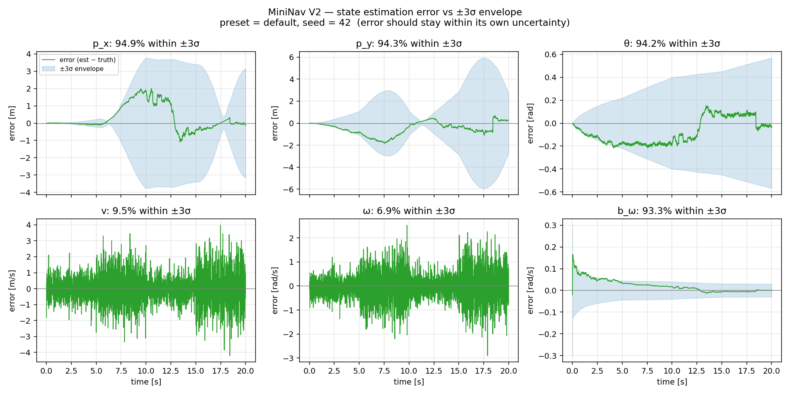
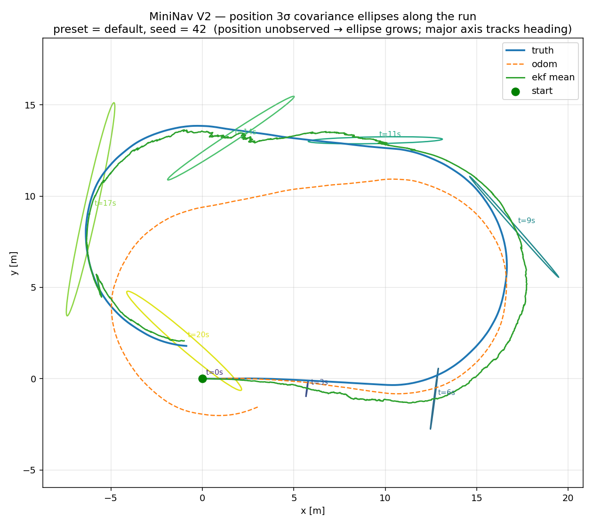
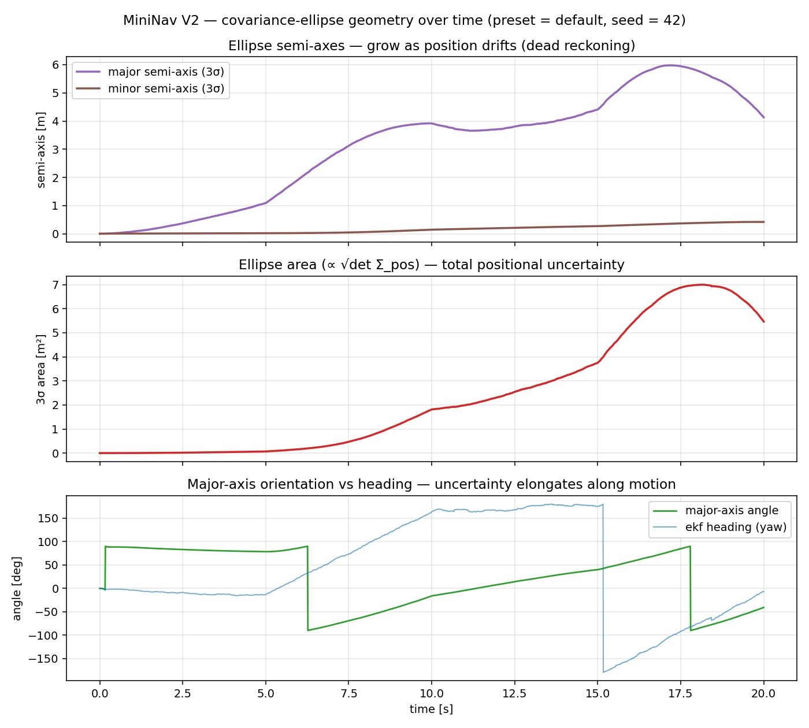
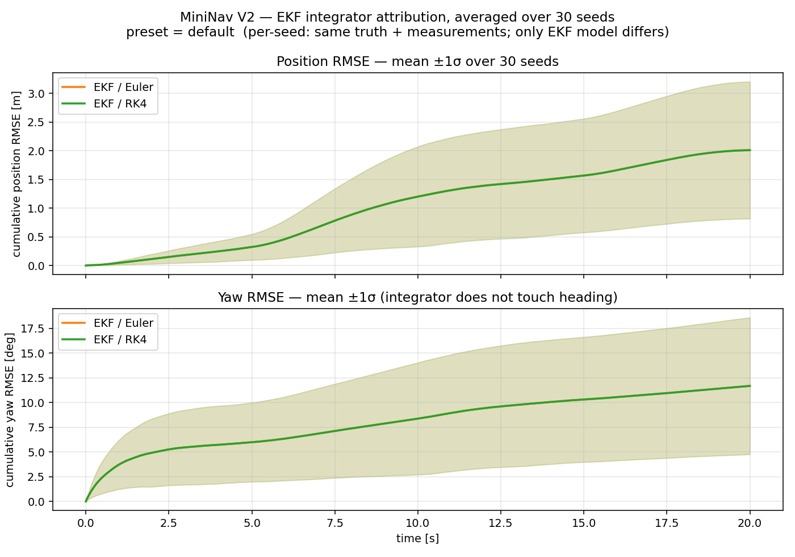

# EKF传感器融合与轮式里程计基线对比分析

>  本文是 V2 阶段的实验报告。用于定量分析融合轮式编码器与陀螺仪的
> 6 维 EKF,相对 V1 纯轮式里程计基线所带来的 position 与 heading RMSE 改善,
> 和在线陀螺 bias 估计的价值。以及同样重要的,它在哪里**不再**有效。
> 下文所有数字都来自本仓库的仿真器,可用[附录](#附录--复现)中的命令复现。数学推导见
> [`docs/math/EKF_Foundations.md`](../math/EKF_Foundations.md) 与
> [`docs/math/runge_kutta_integration.md`](../math/runge_kutta_integration.md);

---

## 1. 问题陈述

在 V1 版本中，我们在将真实世界的噪声引入机器人模型，轮式里程计
开环地积分编码器计数,因此任何打滑、量化或未建模的速度误差都会无界累积。
在 `default` preset 下跑 20 s,position 误差累计到数米,heading 误差随
seed 不同累计到约 10–25°。

V2 用第二个传感器(陀螺仪)和一个概率融合框架(扩展卡尔曼滤波器,EKF)
来消除误差的影响。本报告将以定量的方式回答:

- 在不同噪声档位下, 传感器融合能够消多少position/heading RMSE?
- filter 是否一致(它报告的协方差是否与实际误差相符)?
- 在线陀螺 bias 估计是否有帮助,以及在什么条件下有帮助?
- 将简单Euler积分更换为更为精确的 RK4 积分器升级是否可测量地改变了精度?

---

## 2. 系统与模型

### 2.1 状态与过程模型

V2 估计一个 6 维状态

$$
\mathbf{x} = \begin{bmatrix} p_x & p_y & \theta & v & \omega & b_\omega \end{bmatrix}^\top
$$

采用常速(constant-velocity)过程模型:位置积分车体 twist $(v,\omega)$,
而 $(v,\omega,b_\omega)$ 建模为随机游走。过程模型与其 Jacobian 的位置行用
**RK4** 积分(当一步内 twist 为常量时,RK4 塌缩为 Simpson 求积);解析
Jacobian 对 **Euler 和 RK4 两条路径**都逐列与有限差分校验
(`ekf_jacobian_finite_diff_tests.cpp`)。

### 2.2 观测模型

两个传感器都被当作**对隐状态的观测**,而非控制输入 : 传感器速率不同,
且分开做 update 能提升容错:

| 传感器 | 观测量               | $H$ 行                         |
|-----|-------------------|-------------------------------|
| 编码器 | $(v,\omega)$      | 选取 $v,\omega$ 两行              |
| 陀螺仪 | $\omega+b_\omega$ | 选取 $\omega$ **以及** $b_\omega$ |

陀螺行在 bias 列上放了一个 `1` —— 正是这一处耦合,使得在编码器独立约束
$\omega$ 之后,bias 变得*联合可观测*。协方差更新采用 **Joseph form**,且每步
强制对称以保证数值鲁棒性。

### 2.3 噪声来源

过程噪声 $Q$ 由 V1 的 velocity-motion-model 参数 $(\alpha_1..\alpha_4)$ 推导;
观测噪声 $R$ 由 V1 的传感器噪声参数推导。两个 CLI 旋钮 ——
`--q-scale` 与 `--r-scale` —— 只用于*缩放*这些物理推导值做敏感性分析,缺省
`1.0` 即物理值。

### 2.4 参与对比的三个估计器

| 标签                | 含义                                          |
|-------------------|---------------------------------------------|
| `odom`            | V1 轮式里程计(仅编码器,开环)—— 基线                      |
| `ekf (no bias)`   | 融合编码器 + 陀螺的 EKF,**关闭 bias 估计**(`--no-bias`) |
| `ekf (with bias)` | 融合编码器 + 陀螺的 EKF,**开启在线 bias 估计**(生产缺省)      |

`ekf (no bias)` 隔离出传感器融合本身的价值;它与 `ekf (with bias)` 的差距则隔离出
在线 bias 估计的价值。

---

## 3. 实验设计

- **Preset**(噪声档位):`low-noise`、`default`、`high-noise`。它们整体缩放
  actuator 的 $\alpha$、编码器打滑、陀螺白噪声,以及真实 IMU bias
  ($b_\omega^{\text{true}}$ 分别为 $0.01 / 0.02 / 0.03$ rad/s)。
- **估计器**:§2.4 的三个,在每个 seed 上跑*同一条* truth、*同一组*传感器流。
- **Seed**:每个单元格 20 个独立 master seed,RMSE 以跨 seed 的
  均值 ± 标准差报告。单 seed 图(seed 42)仅作为时间演化的*示意*;所有头条
  结论都是 20-seed 聚合值。
- **指标**:相对 truth 的 position RMSE [m] 与 heading RMSE [deg];用于一致性
  的 NIS(Normalized Innovation Squared);用于可观测性的协方差椭圆几何。
- **积分器归因**:固定其他一切、仅改变积分器的 Euler-vs-RK4 单独 sweep(30 seed)。

---

## 4. 实验结果

### 4.1 跨噪声档位的 RMSE(20 seed)

Position RMSE [m](均值 ± 标准差)与 heading RMSE [deg](均值):

| preset       | `odom` pos      | `ekf no-bias` pos | `ekf +bias` pos  | `odom` yaw | `ekf nb` yaw | `ekf +bias` yaw |
|--------------|-----------------|-------------------|------------------|-----------:|-------------:|----------------:|
| low-noise    | 0.557 ± 0.40    | 1.171 ± 0.02      | **0.285 ± 0.17** |      2.31° |        6.41° |       **1.65°** |
| default      | 2.267 ± 1.54    | 2.337 ± 0.09      | **2.078 ± 1.16** |      9.36° |       13.02° |          11.95° |
| high-noise   | 5.724 ± 3.53    | **3.472 ± 0.25**  | 17.663 ± 9.18    |     24.69° |   **19.57°** |          80.51° |

头条数字完全取决于档位,诚实的总结**不是**单一的 "−X %":

- **low-noise**:完整 EKF 决定性胜出 —— position 相对 odom **−48.9 %**。
- **default**:完整 EKF 小幅胜出 —— position 相对 odom **−8.3 %**,且 seed
  间方差很大(注意 odom 有 ±1.5 m 的散布)。
- **high-noise**:完整 EKF 反而**比 odom 更差**,但 *no-bias* EKF **好 −39 %**。
  损害完全来自 bias 状态 —— 见 §4.2。

> 关于挑数据(cherry-picking)的说明:在 `default` 上,单个有利的 seed 42
> 显示 odom 3.39 m → EKF 1.10 m(−67 %)。该 seed 不具代表性;20-seed 平均
> 改善只有 −8 %。下方的示意时间序列图是 seed 42,请把它读作"一次好的运行
> 长什么样",而非典型收益。





### 4.2 关键发现 —— 在线 bias 估计有其工作域(operating envelope)

V2 最重要的结果**不是**"融合降低误差"(它确实降低);而是**在线陀螺
bias 估计是档位相关的,且可能造成失稳**:

| preset     | 最佳估计器             | bias 估计裁决                                                                      |
|------------|-------------------|--------------------------------------------------------------------------------|
| low-noise  | `ekf (with bias)` | **不可或缺** —— bias 是主导误差;no-bias EKF(1.17 m)甚至*比* odom(0.56 m)*更差*,因为它信任了一个有偏的陀螺 |
| default    | `ekf (with bias)` | 略有帮助(相对 no-bias −11 %),在 seed 噪声范围内                                            |
| high-noise | `ekf (no bias)`   | **有害** —— 开启它会把 heading RMSE 从 19.6° 吹到 80.5°                                  |

在 `high-noise` 下,一旦开启 bias 估计,**20 个 seed 里有 19 个发散**
(heading RMSE > 40°)。bias 估计值(真值 0.03 rad/s)无法稳定下来 —— 它在
大约 ±0.5 到 ±1.4 rad/s 之间乱摆。机理是一个可观测性论证:bias 只能通过
陀螺的 $\omega+b_\omega$ 与编码器独立的 $\omega$ 之间的*差*来观测。当两个通道
都重度含噪时,这个差被噪声主导,bias 状态变得弱可观测,于是它充当了一个
"噪声吸收池",把随机波动吸进一个游走的 heading 里。no-bias EKF 没有这样一个
自由状态,因此保持良态。

这一结果也显示出了在 state augmentation 上的权衡:更具表达力的模型,只有在新增状态
足够可观测、能被钉住时才更好。



在 `default`/seed 42 上 bias 估计确实干净地收敛了:最终估计 0.0213 rad/s
对真值 0.02 rad/s,$\Sigma_{bb}$ 从 $10^{-2}$ 收缩到 $9.8\times10^{-5}$
(rad/s)² —— 即 filter 从"一无所知"走到了一个紧致的估计。但要注意的是这种干净行为
在高噪声下并不保证。

### 4.3 Filter 一致性(NIS)

NIS = $\mathbf{y}^\top S^{-1} \mathbf{y}$ 理论上服从自由度等于测量维度的
$\chi^2$ 分布(编码器:2,陀螺:1),故期望均值约为 2 与 1。跨 20 seed 平均:

| preset     | 编码器 NIS 均值(期望 ≈2) | 编码器落在 95% 带内 | 陀螺 NIS 均值(期望 ≈1) | 陀螺落在 95% 带内 |
|------------|------------------:|-------------:|-----------------:|------------:|
| low-noise  |              4.16 |       84.6 % |             1.48 |      91.4 % |
| default    |              4.66 |       84.7 % |             1.81 |      88.9 % |
| high-noise |              9.45 |       81.7 % |             4.63 |      86.5 % |

编码器 NIS 始终**高于**其期望值,落在带内的比例低于 95%:filter
**轻微过自信** —— 它报告的协方差小于实际 innovation 散布,即 $Q$ 被略微
低估。过自信随噪声单调加剧,这与 §4.2 中高噪声发散同根(过自信的 filter
会低估测量权重)。它可用 `--q-scale > 1` 修正;此处我们报告**未调**的物理
推导值,而非把 $Q$ 拟合到让诊断好看。



### 4.4 状态误差 vs 报告的 3σ

各维度的估计误差对 filter 自己的 ±3σ 包络(seed 42,`default`):

- $p_x, p_y, \theta, b_\omega$ 约 94% 的时间落在 ±3σ 内 —— 一致。
- $v$ 与 $\omega$ 只有约 10% / 约 7% 的时间落在 ±3σ 内 —— filter 对*速度*
  严重过自信。

这既在预期之中也很有教益:常速过程模型假设 $v,\omega$ 缓变,但仿真 actuator
每一步都注入新的白噪声。模型无法跟踪它,因此真实速度经常落在 filter 紧致的
速度协方差之外。这对 pose 估计影响不大(position/heading 仍保持一致),因为
编码器每一步都重新锚定速度 —— 但它正是 §4.3 中编码器 NIS 高于 2 的诚实原因。



### 4.5 协方差椭圆与可观测性

把 2 维位置协方差块画成 3σ 椭圆,可观测性的故事就变得直观。在一次 20 s 的
`default`/seed 42 运行里:

- 3σ 椭圆**面积**从 $2.8\times10^{-5}$ 增长到 $5.47$ m²
  (约 $1.9\times10^5\times$);
- 长半轴从 0.003 m 增长到 **4.13 m**,短半轴只到 0.42 m,**各向异性约 9.8**;
- 长轴方向追随 heading。

位置从未被直接观测;编码器 + 陀螺只约束 $(v,\omega,b_\omega)$。因此即便有
完整融合,位置不确定性仍无界增长,并且**沿运动方向**增长(横向相对被速度
约束钉住)。这与 PR1 的 predict-only 实验是同一幅无界增长图景,但它在完整
融合下依然成立 —— 这干净地说明了为什么后续版本需要一个定位传感器(地图、
GPS 或 scan matching)。





同一演化过程的动画见
[`results/v2/covariance_evolution.gif`](../../results/v2/covariance_evolution.gif)。

### 4.6 积分器归因 —— RK4 vs Euler

固定其他一切、仅改变 EKF 过程模型的积分器(30 seed,`default`):

- RK4 相对 Euler 的 position RMSE 增益:**+0.28 % ± 1.43 %**
- heading RMSE 增益:**+0.000 % ± 0.000 %**

两者都与零在统计上不可区分。有两个已理解的原因:
(1) 在 `dt = 0.01 s` 且每步都有观测时,积分误差被传感器噪声碾压并被即时
修正;(2) 仿真 truth 本身就用 RK4 生成,故任何报告出的增益都是下界
("inverse crime")。heading 恰好为零,是因为 $\theta$ 的推进
($\theta + \omega\,dt$)在两种积分器下完全相同。RK4 之所以保留为生产缺省,
是因为它*正确*且在此处零成本,而非因为它能撬动这个基准。



---

## 5. 讨论与结论

1. **融合稳健地降低误差,但幅度档位相关。** 报告单一的 "−X %" 会误导;
   增益从决定性(low-noise)到边际(default)不等,而且*正确的*估计器会随
   噪声档位改变。

2. **在线 bias 估计是头条工程教训。** 当 bias 主导时(low-noise)它不可或缺,
   在中等噪声下有益,但在高噪声下 bias 状态太弱可观测,它会**造成失稳**。
   成熟的系统会把这类状态增广门控在可观测性之上,而非无条件常开。

3. **filter 轻微过自信**,主要因为常速模型无法表征逐步的 actuator 白噪声
   (§4.4)。它在 pose 上一致、在速度上不一致,可用 `--q-scale` 调。

4. **位置不可观测** —— 仅靠本体感(proprioceptive)传感器,其不确定性沿运动
   方向无界增长,即便有融合也如此。这正是 V3+ 引入外感(exteroceptive)
   传感 / 建图的动机。

5. **Euler→RK4 升级在当前步长与观测速率下不撬动这个基准。** 它因正确性而保留,
   且其解析 Jacobian 经有限差分校验。

### 已知局限 / 未来工作

- 把 bias 估计门控在一个可观测性或 innovation 幅度检查上,使 §4.2 的高噪声
  发散不会无条件发生。
- 加入轻量 `Q` 调参(或自适应 `Q`),把编码器 NIS 拉向 2。
- 位置漂移在此是根本性的;一个定位模态(地图 / scan matching)是 V3+ 的解药,
  而非 EKF 调参问题。

---

## 附录 — 复现

以下命令均假设 Debug 构建(`build/clang18-debug/sim_v2`)与 Python venv
(`source .venv/bin/activate`)。

```bash
# 单次运行(三轨迹 + 全部 per-run 图),default preset,seed 42:
build/clang18-debug/sim_v2 --no-viz --seed 42 --preset default --out data/traj_v2.csv
build/clang18-debug/sim_v2 --no-viz --seed 42 --preset default --no-bias --out data/traj_v2_nobias.csv
python scripts/v2/analyze_ekf.py --input data/traj_v2.csv --ekf-no-bias data/traj_v2_nobias.csv

# 协方差椭圆演化(静态 + 几何 + 动画):
python scripts/v2/analyze_covariance.py --input data/traj_v2.csv

# RK4-vs-Euler 归因(多 seed):
python scripts/v2/sweep_integrator.py --n-seeds 30 --preset default

# §4.1 与 §4.3 的 20-seed × 3-preset RMSE / NIS 表,由
# sweep --preset {low-noise,default,high-noise} × --seed 并对各 seed 聚合
# RMSE(truth, ·) 与 NIS 得到。
```

省略 `--seed` 时其取值会打印到 stdout,故任何运行都可重放;每个 CSV 都在其
头部注释里嵌入了 `seed` / `preset` / `integrator` / `q_scale` / `r_scale` /
`bias`。
