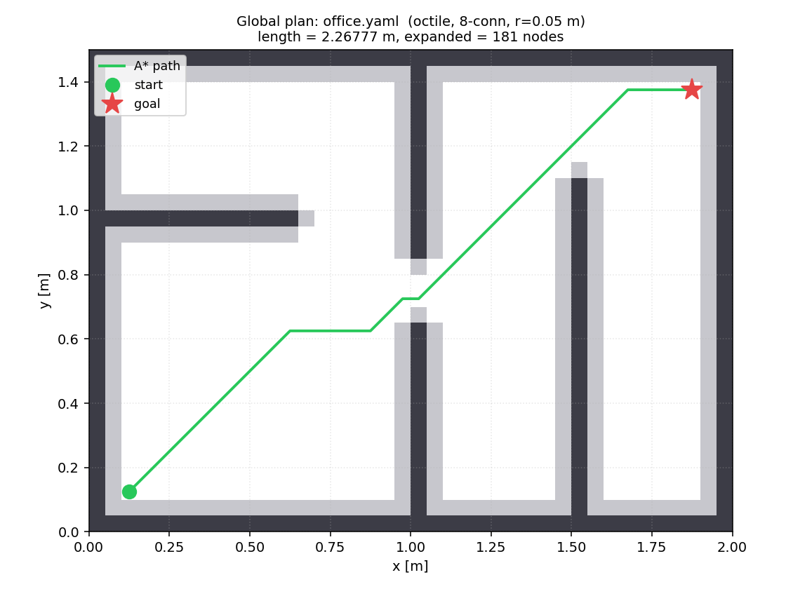
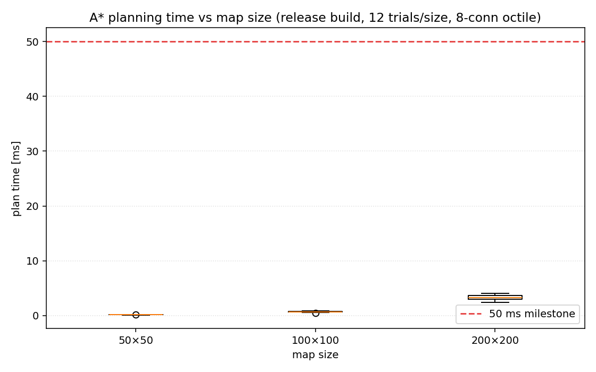
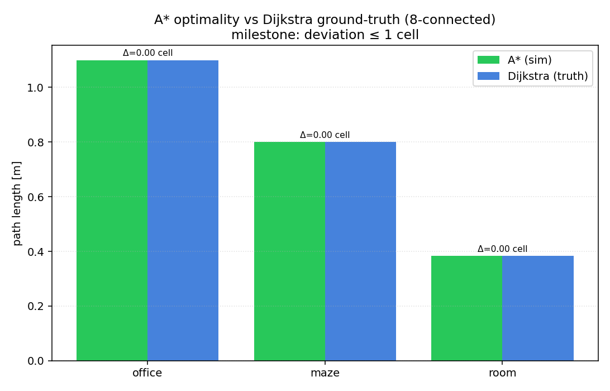

# 全局路径规划:A\* 规划耗时、最优性与确定性

> 本文是 V3 阶段的实验报告,定量评估占据栅格地图上的 A\* 全局规划器:
> **规划耗时**(对齐里程碑 200×200 ≤ 50 ms)、**路径最优性**(与 Dijkstra
> ground-truth 的偏差)、以及 A\* 作为纯确定性算法的**逐字节复现性**。
> 下文所有数字均来自本仓库的 `sim`(规划模式)与 `scripts/v3/`,可用
> [附录](#附录复现) 中的命令复现。算法与启发式的数学说明见
> [`docs/math/astar_planning.md`](../math/astar_planning.md),工程总结见 [`docs/v3_summary.md`](../v3_summary.md)。

---

## 1. 问题陈述

V2 把概率状态估计打磨完,留下一条根本性的未解问题:仅靠本体感传感(编码器 +
陀螺),位置永远不可观测,协方差沿运动方向无界增长(见
[`v2_summary.md`](../v2_summary.md) §6.4)。V3 不直接去解这条,而是先把
**地图基础设施**建起来,并在其上交付第一个完整的"我要去哪 + 怎么规划过去"的
能力:占据栅格地图 + A\* 全局规划。

本报告回答三个量化问题:

1. **够快吗?** 200×200 的地图,单次 A\* 能否在 50 ms 内(Release)规划完?
2. **够优吗?** A\* 给出的路径与已知最短路(Dijkstra/BFS ground-truth)差多少?
3. **够稳吗?** A\* 不消耗 RNG,同输入是否逐字节一致?

---

## 2. 系统与方法

- **规划器**:`mininav::planning::AStarPlanner`(扁平 `g` 表 + 二叉堆 open set,
  4/8 连通,Euclidean/Octile 启发 + 仅限 4 连通的 Manhattan(见 §4.1),tie-break
  偏向小 `h`,8 连通带防穿角)。一致启发式下首次出队目标即最优。
- **地图**:ROS `map_server` 风格的 image(PGM)+ yaml。手画测试地图见
  `maps/{office,maze,room,corridor}`;基准用 `scripts/v3/benchmark_planner.py`
  程序化生成 N×N 随机障碍地图(固定种子 + 保留 L 形安全走廊保证可达)。
- **配置**:`config/planner.yaml`(膨胀半径 / 启发式 / 连通度 / cost_weight),
  CLI flag 可逐项覆盖。
- **构建**:耗时数字来自 `clang18-release`;正确性/最优性在 debug 与 release
  下一致(A\* 无浮点不确定来源)。

演示场景(`maps/office.yaml`,40×30 @ 0.05 m,两室一门):



绿线即 A\* 路径,从左下 `start` 穿过中间墙的门洞,绕开右侧竖墙到达右上 `goal`;
浅灰是按机器人半径 + 安全裕度膨胀出的安全层(`inflation_radius = 0.05 m`),
深灰是原始障碍。

---

## 3. 规划耗时(里程碑:200×200 ≤ 50 ms,Release)

`scripts/v3/benchmark_planner.py`,每个尺寸 12 次试验,8 连通 + Octile 启发,
20% 随机障碍密度:

| 地图尺寸    | 中位数 [ms] | p95 [ms] | 最大 [ms] | 扩展节点数(典型) |
|---------|----------|----------|---------|-----------|
| 50×50   | 0.16     | 0.19     | 0.21    | ~700      |
| 100×100 | 0.69     | 0.79     | 0.85    | ~3 100    |
| 200×200 | 3.26     | **3.94** | 4.05    | ~13 100   |



**结论**:200×200 的 p95 耗时约 **3.9 ms**,比 50 ms 指标有 **~13× 余量** →
里程碑达标(PASS)。耗时随地图面积近似线性放大(扩展节点数 ∝ 自由 cell 数),
扁平 `g` 表的缓存友好访问是这个余量的主要来源。

> 注:Debug build 因 `-O0` + 边界检查会慢一个量级,**不代表**里程碑指标;
> 基准脚本默认用 `build/clang18-release/sim`,找不到才回退 debug 并在表头标注。

**自动化守护**:基准脚本是手动跑的,里程碑还需要一条单测兜底。最初的计时单测
用空地图对角线 —— 启发式在那里是精确的,A\* 只展开 200 个节点,测到的是**最好
情况**;而且断言只在 Release 生效,CI 跑的是 Debug,等于从未被执行过。现在
`planning_tests` 用一张 200×200 **蛇形迷宫**(每 3 行一道横墙、缺口左右交替,
路径被迫蛇行穿过 67 条走廊)做压力图:

| 量           | 值                                                   |
|-------------|-----------------------------------------------------|
| 展开节点数       | 26 666 / 26 866 个 free cell(99.3%,接近最坏情况)          |
| 最短路长度       | 67·(198 + √2) + 132 ≈ 13 492.75 cell(解析值,单测精确断言)     |
| 耗时(Release) | 中位数 ~2.7 ms(7 次,2.70–3.42 ms),对 50 ms 有 ~18× 余量      |

展开数是随机图的 2 倍,耗时反而更低:走廊里 open set 很窄,堆操作便宜 —— 耗时由
"展开数 × 每次堆操作的代价"共同决定。三条测试分工如下:
`MeetsTimingBudgetOnSerpentine200x200` 断言 wall-clock < 50 ms,只在 Release 执行
(Debug 下显式 skip,CI 日志可见,而不是静默通过);另两条确定性断言与构建类型、
机器负载无关,在 CI 里同样生效 —— `HeuristicFocusesSearchOnOpenMap`(空图对角线
展开数 ≤ 2n,启发式失效退化成 Dijkstra 会涨到近 n²)与
`FindsExactShortestPathThroughSerpentine200x200`(精确最短长度 + 展开数落在
[free/2, free])。

### 3.1 复杂大图案例:500×500 楼宇平面

随机障碍基准衡量的是"平均规模下的耗时",但它的地图结构单一。为检验规划器在
**真实尺度的结构化环境**下的表现,用 `scripts/v3/gen_office500.py` 程序化生成一张
500×500 @ 0.05 m = **25 m × 25 m 的楼宇平面图**:6×6 = 36 个房间,房间之间是厚墙,
每道隔墙在每个房间段开一个门洞(保证连通),房内再撒随机柱子。占据率约 17.6%,
共 250 000 个 cell(是 200×200 基准的 6.25×)。


从左下角房间规划到右上角房间(贯穿整栋楼),`config/planner.yaml` 配置
(Octile、8 连通、膨胀 0.05 m):

| 量             | 值                                  |
|---------------|------------------------------------|
| 地图规模          | 500×500(250 000 cell),25 m × 25 m  |
| 路径长度          | 34.37 m                            |
| 扩展节点数         | 39 453                             |
| 规划耗时(7 次中位数)  | **~12.4 ms**(区间 11.9–14.5 ms,Release) |
| 确定性           | 两次运行 `path.csv` 逐字节一致              |

**结论**:即便 cell 数是里程碑基准的 6.25×、且需穿过几十道门洞绕开柱子,单次 A\*
仍在 **~12 ms** 内完成(50 ms 指标仍有 ~4× 余量),扩展节点数(~3.9 万)远小于
自由 cell 总数(~20 万)—— Octile 启发式有效地把搜索"拉"向目标,而非盲目铺满。
图中绿线穿门绕柱、近似沿对角推进,直观展示了这一点。

> 该地图由固定种子程序化生成(P5 二进制 PGM,~250 KB);C++ `map_io` 与
> `scripts/v3/_mapio.py` 均支持 P2/P5。重新生成:
> `python scripts/v3/gen_office500.py`。

**搜索过程动图**:`scripts/v3/animate_search.py` 把 A* 的扩展波纹按扩展序着色
(紫→黄)逐帧渲染,末尾叠加最终路径,导出 GIF:


能直观看到 open set 从起点像波纹铺开、被墙/柱挡住绕行、在 Octile 启发牵引下
偏向目标方向延伸,最终收束到 goal。该脚本在 Python 端按与 C++ `AStarPlanner`
**一致的规则**重跑 A*(扩展节点数与 C++ 逐一对上:office500 两端都是 39 453),
因此动图忠实反映 C++ 规划器的搜索行为。

---

## 4. 路径最优性(里程碑:偏差 ≤ 1 cell)

`scripts/v3/optimality_check.py` 在 Python 端复刻 C++ 的栅格、步代价(直走 1 /
对角 √2)与 8 连通防穿角规则,跑无启发的 **Dijkstra** 拿 ground-truth 最短长度,
与 `sim` 的 A\* 实际路径长度比较(8 连通 + 显式 `--heuristic octile`,与
`config/planner.yaml` 一致;膨胀半径置 0,纯几何最短路):

| 地图     | A\* 长度 [m] | Dijkstra 长度 [m] | 偏差 [cell] | 达标 |
|--------|-----------|-----------------|-----------|----|
| office | 1.0985    | 1.0985          | 0.0000    | ✅  |
| maze   | 0.8000    | 0.8000          | 0.0000    | ✅  |
| room   | 0.3828    | 0.3828          | 0.0000    | ✅  |



**结论**:三张手画地图上 A\* 与 Dijkstra 长度**完全一致**(偏差 0 cell),远优于
"≤ 1 cell"指标。这验证了 Octile 启发式的 admissible/consistent 性质:在一致
启发式下,A\* 与无启发 Dijkstra 给出相同的最优长度,只是扩展的节点更少。

> `planning_tests` 里另有 `AStar*` 系列单测从代码侧锁住同一主张(4 连通下三种启发式、
> 8 连通下 Euclidean/Octile 给出相同最优长度,绕墙已知最短路、不可达返回 false、
> 防穿角、tie-break 确定性)。

### 4.1 启发式必须与连通度匹配

最优性保证的前提是启发式 **admissible**:从不高估剩余的真实代价。8 连通下对角
一步的真实代价是 √2,而 Manhattan 把它记为 2 —— 它会高估,A\* 退化成偏贪心的
搜索:扩展节点骤减,但路径不再保证最优。office500 上实测(8 连通、膨胀置 0、
起止点同 §3.1):

| 启发式       | 路径长度 [m]              | 扩展节点数  |
|-----------|-----------------------|--------|
| octile    | 34.1843               | 40 945 |
| euclidean | 34.1843               | 55 398 |
| manhattan | **34.2408**(+1.13 cell) | 976    |

Manhattan 的路径比最优长 1.13 个 cell,**超出** ≤ 1 cell 指标 —— 而且是悄无声息
地超出:规划成功、路径看起来也正常。因此 "manhattan + 8 连通" 被定为非法组合:
`load_planner_config` 与 `AStarPlanner` 构造都会直接报错(CLI 的 `--heuristic` /
`--connectivity` 覆盖同样经过构造期校验),`RejectsManhattanUnlessFourConnected` /
`RejectsInadmissibleManhattanUnderEightConnectivity` 两条单测锁住这条规则。上表
manhattan 一行是加入校验之前测得的。

同表还给出一个正面结论:octile 是无障碍 8 连通栅格上的**精确**剩余代价,比
euclidean 更紧,在同样最优的前提下少扩展约 26% 的节点 —— 这是 `planner.yaml`
默认选它的原因。推导见 [`docs/math/astar_planning.md`](../math/astar_planning.md)。

---

## 5. 确定性复现(A\* 无 RNG)

V3 与 V0–V2 的一个区别:A\* 是纯确定性算法,不消耗 RNG。因此规划模式的复现性
比 V1/V2 更强 —— 不依赖种子,只要 `map + start + goal + config` 相同,`path.csv`
就逐字节一致。规划模式刻意保持无 RNG:`path.csv` 里**不写**时间戳与
`plan_time_ms`(耗时是非确定量,只打到 stdout / 基准脚本),以保证字节级 diff
为空。

```
sim --map maps/office.yaml --start 0.15,0.15 --goal 1.85,1.35 --no-viz --out a.csv
sim --map maps/office.yaml --start 0.15,0.15 --goal 1.85,1.35 --no-viz --out b.csv
diff a.csv b.csv     # 空 diff ✅
```

实测两次运行 `path.csv` 逐字节一致。

---

## 6. 边界行为

- **不可达目标**:起点/目标被墙围死时,A\* 在 open set 耗尽后返回
  `success=false`(不死循环、不崩溃),`path.csv` 头记 `success = 0`、空路径体。
- **起止退化**:`start == goal`(同一 cell)返回单点路径,长度 0。
- **起止落在障碍**:直接判失败,不做就近吸附(留给上层决定如何处理)。
- **量化零头**:路径首尾 waypoint 是格心,与真实连续起止点有
  ≤ 0.5·resolution·√2 的量化偏差(office 下 ≈ 3.5 cm)。V3 不处理,V4 闭环反馈
  会吸收(见 [`v3_summary.md`](../v3_summary.md) §8.5)。

---

## 7. 结论与去向

- **耗时**:200×200 单次 A\* p95 ≈ 3.9 ms(Release),里程碑 50 ms 有 ~13× 余量;
  即便是 25 m × 25 m 的 500×500 楼宇平面(穿数十门洞)也仅 ~12 ms(§3.1)。
- **最优性**:手画地图上与 Dijkstra ground-truth 偏差 0 cell,优于 ≤ 1 cell 指标。
- **确定性**:同输入 `path.csv` 逐字节一致(A\* 无 RNG)。
- **可视化**:`sim` 规划模式把占据栅格 + 膨胀层 + 路径推到 Rerun,并写 `path.csv`;
  `scripts/v3/plot_plan.py` 出发表用静态图。

`Path` 与 `GlobalPlanner` 接口已对齐 nav2 形态,为 V4 的 Pure Pursuit 跟踪与
ROS 2 化铺好底座;`OccupancyGrid` 是未来 scan matching / 地图匹配钉住 V2 位置
漂移的地图后端。规划起点 `start` 是普通 `Pose2D`,在完整系统里即 V2 EKF 的估计
位姿 —— 这是 V2→V3 的接缝,但规划入口刻意保持无 RNG / 确定,EKF→start 的注入
留给上层(见第 5 节)。

---

## 附录:复现

```bash
# 构建(规划耗时数字需 Release)
cmake --preset clang18-release && cmake --build --preset build-release -j

# 单次规划 + 可视化 + path.csv
./build/clang18-release/sim --map maps/office.yaml --start 0.15,0.15 \
    --goal 1.85,1.35 --config config/planner.yaml --out data/path.csv

# 发表用静态图
source .venv/bin/activate
python scripts/v3/plot_plan.py --map maps/office.yaml --path data/path.csv

# 规划耗时基准(200×200 ≤ 50ms)
python scripts/v3/benchmark_planner.py --sizes 50 100 200 --trials 12

# 复杂大图案例(500×500 楼宇平面):生成 -> 规划 -> 出图
python scripts/v3/gen_office500.py
./build/clang18-release/sim --map maps/office500.yaml --start 1.175,1.175 \
    --goal 23.875,23.875 --config config/planner.yaml --out data/path500.csv
python scripts/v3/plot_plan.py --map maps/office500.yaml --path data/path500.csv

# 寻路过程动图(A* 扩展波纹 + 最终路径 -> GIF)
python scripts/v3/animate_search.py --map maps/office500.yaml \
    --start 1.175,1.175 --goal 23.875,23.875 --inflation-radius 0.05 \
    --max-frames 160 --fps 24
python scripts/v3/animate_search.py --map maps/maze.yaml --start auto --goal 0.95,0.95

# 最优性 vs Dijkstra ground-truth
python scripts/v3/optimality_check.py \
    --maps maps/office.yaml maps/maze.yaml maps/room.yaml \
    --goal-of office=1.85,1.35 maze=0.95,0.95 room=0.85,0.65 --start auto

# 确定性回归(同输入逐字节一致)
./build/clang18-release/sim --map maps/office.yaml --goal 1.85,1.35 --no-viz --out /tmp/a.csv
./build/clang18-release/sim --map maps/office.yaml --goal 1.85,1.35 --no-viz --out /tmp/b.csv
diff /tmp/a.csv /tmp/b.csv     # 应空 diff
```
