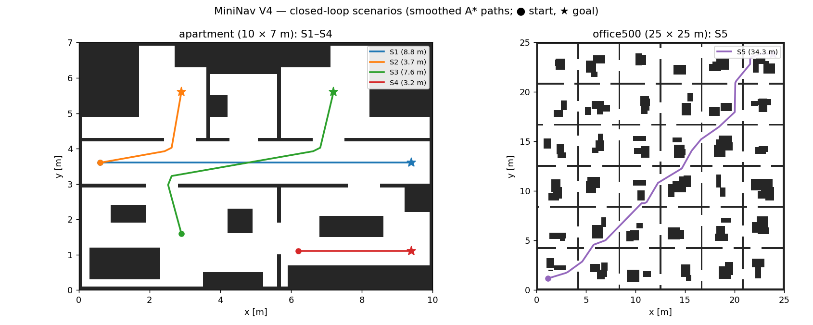
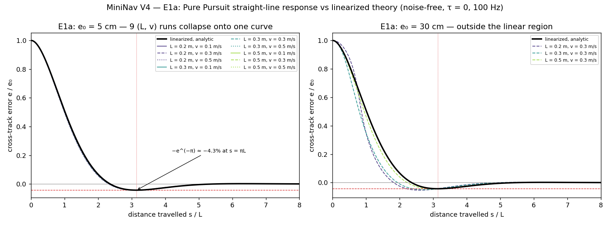
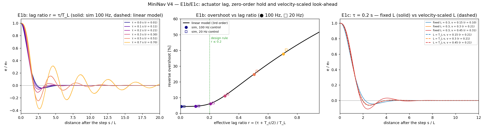
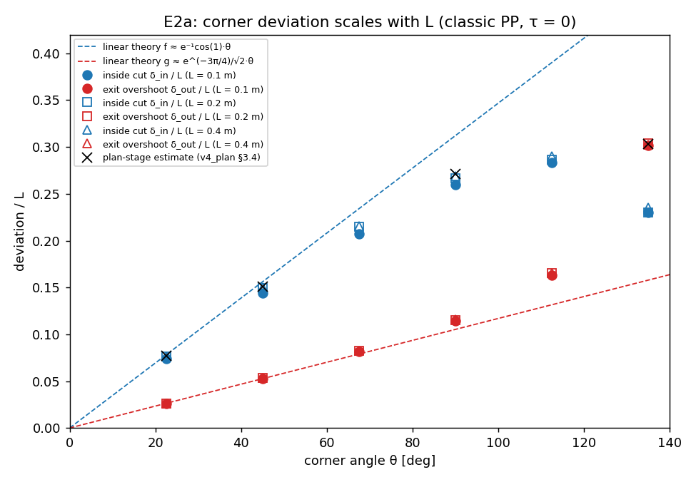
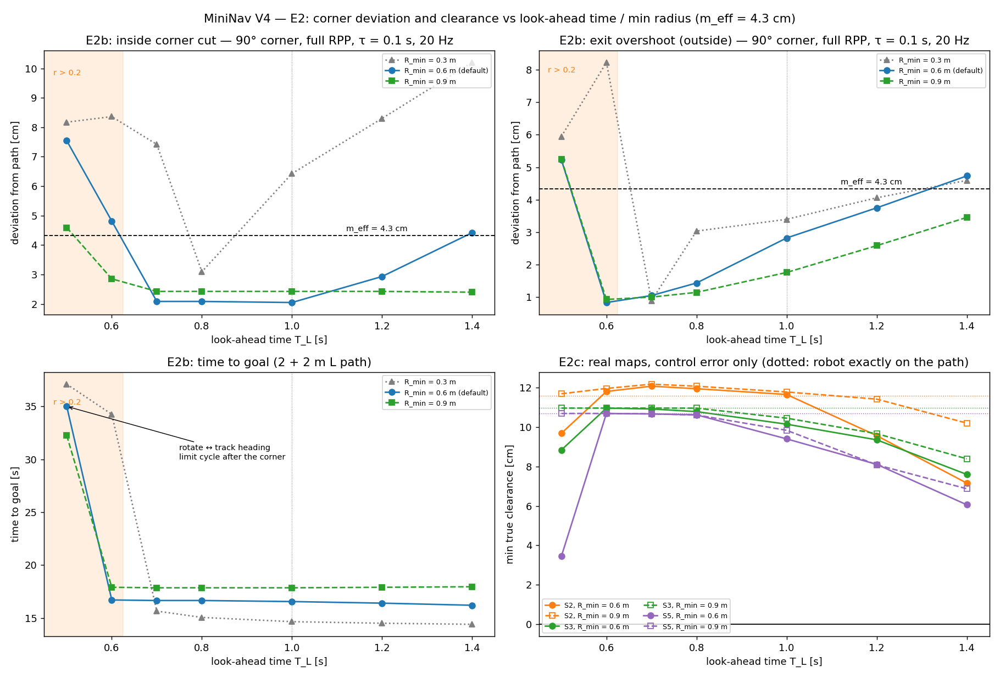
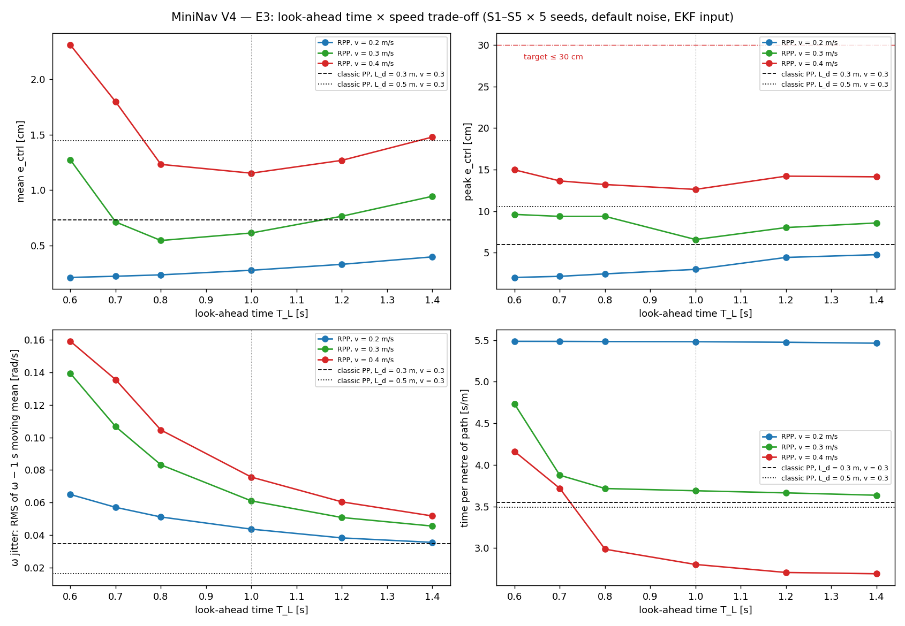
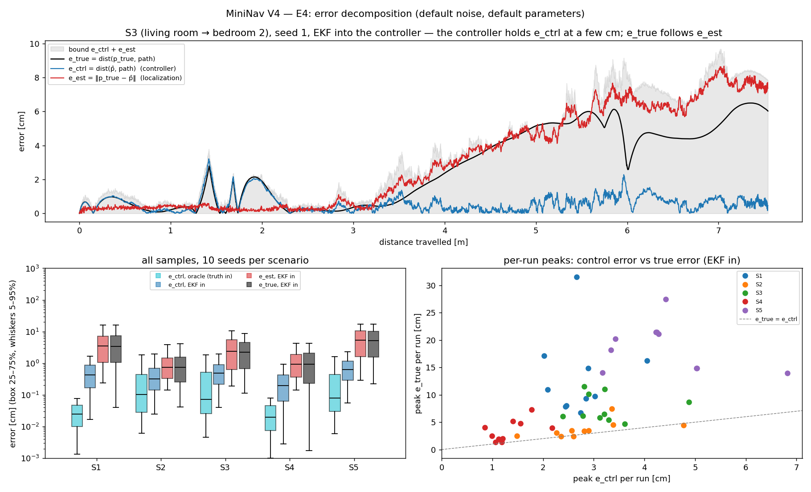
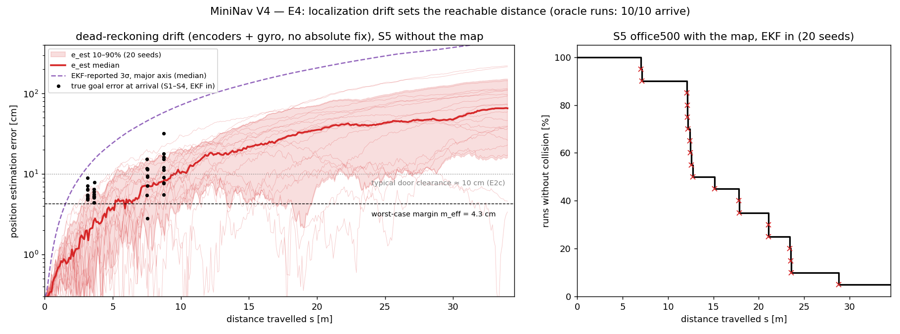
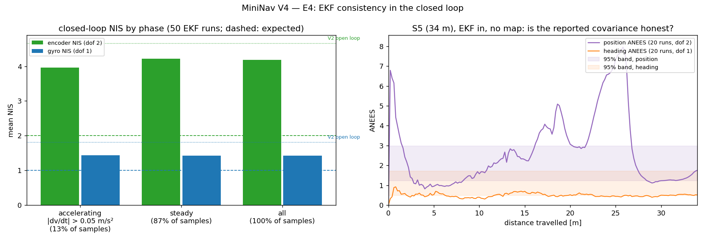

# 闭环路径跟踪:理论验证、安全裕度与误差分解

> 本文是 V4 阶段的实验报告,定量评估在确定性 C++ 仿真里闭环运行的 Regulated Pure
> Pursuit(RPP 子集)控制器:**线性化与滞后理论是否成立**(E1)、**转角切角与
> 安全裕度**(E2)、**look-ahead 时间与速度的折中**(E3),以及**真值误差里多少来自
> 控制、多少来自定位**(E4)。所有数字都来自本仓库的 `sim nav` 与 `scripts/v4/`,可用
> [附录](#附录复现) 中的命令复现;推导见 [`docs/math/pure_pursuit.md`](../math/pure_pursuit.md)。


*S3(客厅 → 两道门 → 卧室 2,7.6 m),default 噪声,EKF 估计进控制器。左:A\* 原始
台阶路径(灰)、平滑后路径(绿)、真值(黑)与 EKF 估计(红虚线)轨迹;右:控制器
视角的 1.6 m 窗口——真值车体、追踪圆弧与 look-ahead 点、EKF 位置 3σ 椭圆。*

---

## 1. 问题陈述

V2 回答了"我在哪"(6 维 EKF),V3 回答了"我要去哪"(占据栅格 + A\*)。V4 第一次把
估计、规划、控制串成闭环:`sim nav` 从 EKF 的初始估计规划,平滑路径,用 RPP 跟踪,
控制器吃的是 EKF 估计而不是真值。本报告回答四个问题:

1. **E1 理论对不对?** Pure Pursuit 的直线响应、滞后稳定性判据、零阶保持的等效延迟,
   与 [`pure_pursuit.md`](../math/pure_pursuit.md) §3–§4 的解析值差多少?
2. **E2 转角安全吗?** 切角是否满足尺度律 $\delta = f(\theta)L$?§7 的裕度预算在完整
   RPP 与真实地图上是否成立?
3. **E3 参数怎么选?** look-ahead 时间 $T_L$ 与巡航速度在切角、振荡、用时之间如何折中?
   默认值要不要改?
4. **E4 真值误差从哪来?** 控制误差 $e_\text{ctrl}$ 与定位误差 $e_\text{est}$ 各占多少?
   能走多远才必须引入绝对定位?闭环加减速会不会让 EKF 失去一致性?

里程碑指标(`docs/v4_plan.md` §0.4)只对**控制器负责的那部分误差**设门槛:
$e_\text{ctrl}$(EKF 估计位姿到路径的距离)均值 ≤ 10 cm、峰值 ≤ 30 cm;无噪声与
oracle(真值进控制器)运行零碰撞、100% 到达。定位漂移造成的真值误差如实报告,不混进
控制指标——与 V2 的"no honest single −X%"一脉相承。

---

## 2. 系统与方法

- **被控对象**(`simulation::Plant`,100 Hz):指令 → 执行器饱和(0.5 m/s、2 rad/s)
  + 一阶滞后($\tau$ = 0.10 s,精确离散化)→ 执行噪声(V1 速度运动模型)→ 真值积分
  → 编码器 / 陀螺。几何与执行器参数全部来自 `config/robot.yaml`(**占位值**,V6 实测后替换)。
- **估计**:V2 的 6 维 EKF(`EkfPipeline`),闭环时 $Q$ 额外计入平滑器允许的加减速
  ($q_{dv} = (a_\max dt)^2$,V4 PR4)。
- **控制**:`PurePursuitController`(速度自适应 look-ahead、曲率限速、接近减速、原地
  转向、$\omega$ 上限)+ `VelocitySmoother`,20 Hz 零阶保持。默认参数见 `config/nav.yaml`
  与 [`pure_pursuit.md`](../math/pure_pursuit.md) §10。
- **评估**:碰撞 = 真值车体外接圆(0.136 m)与**原始**地图(未膨胀)占据方块相交;
  净空 = 外接圆到最近占据方块的距离;$e_\text{ctrl}$ / $e_\text{true}$ 用全局投影计算
  (§6.2)。
- **合成路径**:E1 / E2 的直线、台阶、单转角路径用 `sim nav --path FILE`(对应 Nav2 的
  FollowPath)直接跟随,不规划、可不带地图。
- **确定性与 CRN**:同 seed 的 `nav.csv` 逐字节一致;各噪声源有独立的 RNG 流且每步消耗
  固定,同一 seed 下不同参数面对同一组噪声实现,参数对比用同 seed 配对差。
- **构建**:`clang18-release`(数值与 Debug 逐字节一致,只是快)。

场景(`scripts/v4/scenarios.py`):S1–S4 在 `maps/apartment`(10 × 7 m 占位平面图,
0.25 m 膨胀下连通),S5 是 V3 的 office500 长距离路线。



| 场景 | 内容 | 平滑路径 |
|---|---|---|
| S1 | 直走廊 (0.6, 3.6) → (9.4, 3.6) | 2 waypoint / 8.80 m |
| S2 | 走廊 → 过门 → 卧室 1 | 4 / 3.68 m |
| S3 | 客厅 → 两道门 → 卧室 2(起点朝北) | 6 / 7.60 m |
| S4 | 厨房中岛南侧窄道 | 2 / 3.20 m |
| S5 | office500 对角穿越 36 个房间 | 22 / 34.35 m |

---

## 3. E1:理论验证

### 3.1 直线响应:速度消失,只剩 $s/L$

理想底盘($\tau = 0$、限幅放宽)、无噪声、真值进控制器、100 Hz、经典 PP(固定 $L$)。
车从 $(0, e_0)$ 静止起步、与路径平行。线性化预测
$e(s)/e_0 = e^{-s/L}(\cos\frac{s}{L} + \sin\frac{s}{L})$,与速度无关。



| $e_0$ | 9 次运行($L$ × $v$)| 反向超调(解析 4.32%) | 极值位置(解析 $\pi L$) | 2% 调节距离(解析 4.22 $L$) |
|---|---|---|---|---|
| 5 cm | $L \in \{0.2, 0.3, 0.5\}$ m × $v \in \{0.1, 0.3, 0.5\}$ m/s | 4.33–4.35%(≤ +0.7%) | 3.08–3.14 $L$(≤ −1.8%) | 4.13–4.21 $L$(≤ −1.9%) |
| 30 cm | 同上 | 4.49–5.34%(+4% 到 +24%) | 2.58–3.01 $L$ | 3.78–4.12 $L$ |

小偏置下 9 条曲线在 $s/L$ 坐标里重合,与解析值的偏差都在 2% 以内(验收要求 ≤ 10%)。
30 cm 偏置时 $L = 0.2$ m 的运行偏差最大:$e_0 > L$,追踪点一开始就落在投影点上,
已不在线性化的适用范围内——这条曲线标出了理论的边界,不是反例。

### 3.2 执行器滞后与零阶保持

$v$ 有滞后时"静止起步"会把速度爬升混进响应,所以改为:先在 $y = 0$ 上跑 3 m 达到
稳态,再遇到 5 cm 的横向台阶。look-ahead 点越过台阶时,线性系统恰从
$(e, \psi, \omega_a) = (-h, 0, 0)$ 出发,与初始偏置响应同构。$L = 0.3$ m、$v = 0.3$ m/s
($T_L$ = 1 s),扫 $\tau$;100 Hz 与 20 Hz 控制各一组,线性模型用
$r_\text{eff} = (\tau + T_c/2)/T_L$。



| 控制频率 | $\tau$ [s] | $r_\text{eff}$ | 超调(仿真) | 超调(三阶模型) | 调节距离(仿真 / 模型) |
|---|---|---|---|---|---|
| 100 Hz | 0 | 0.005 | 4.33% | 4.32% | 4.19 / 4.20 $L$ |
| 100 Hz | 0.1 | 0.105 | 4.52% | 4.53% | 3.85 / 3.83 $L$ |
| 100 Hz | 0.2 | 0.205 | 6.10% | 6.24% | 3.44 / 3.43 $L$ |
| 100 Hz | 0.3 | 0.305 | 11.00% | 11.28% | 4.61 / 4.64 $L$ |
| 100 Hz | 0.5 | 0.505 | 24.67% | 24.97% | 9.94 / 10.05 $L$ |
| 100 Hz | 0.7 | 0.705 | 37.67% | 37.91% | 22.74 / 22.89 $L$ |
| 20 Hz | 0.1 | 0.125 | 4.55% | 4.67% | 3.76 / 3.75 $L$ |
| 20 Hz | 0.2 | 0.225 | 6.55% | 7.00% | 3.35 / 3.37 $L$ |
| 20 Hz | 0.5 | 0.525 | 26.81% | 26.33% | 10.19 / 10.33 $L$ |
| 20 Hz | 0.7 | 0.725 | 40.29% | 39.12% | 26.82 / 25.11 $L$ |

- 三阶模型 $r p^3 + p^2 + 2p + 2 = 0$ 在全部 $r$ 上与仿真的超调相差 ≤ 0.3 个百分点
  (100 Hz)。$r$ 越过 0.3 后阻尼迅速消失,与 Routh–Hurwitz 判据 $\tau < T_L$ 及
  [`pure_pursuit.md`](../math/pure_pursuit.md) §4.2 的表一致。
- 20 Hz 的点按 $\tau + T_c/2$ 折算后落回同一条曲线($r \le 0.5$ 时差 ≤ 0.5 个百分点)。
  $r = 0.7$ 时偏差变大(1.2 个百分点):阻尼很小时,延迟的高阶效应不再可忽略。
- **默认配置** $\tau = 0.1$ s、20 Hz、$T_L = 1$ s 对应 $r = 0.125$:超调 4.6%,与无滞后
  几乎相同。

### 3.3 速度自适应 look-ahead

$\tau = 0.2$ s 固定,三档速度:

| 模式 | $v$ = 0.15 m/s | 0.30 m/s | 0.45 m/s |
|---|---|---|---|
| 固定 $L$ = 0.3 m($r = \tau v/L$ 随速度变) | $r$ = 0.10,超调 4.52% | 0.21,6.10% | 0.31,11.00% |
| $L = T_L v$($T_L$ = 1 s,$r$ 恒为 0.2) | 6.17% | 6.10% | 6.09% |

固定 $L$ 的控制器在低速稳、高速振;速度自适应让三条曲线重合。这就是 Nav2 RPP
`use_velocity_scaled_lookahead_dist` 的第一性原理依据。

**E1 结论**:线性化、滞后判据与零阶保持折算全部在 2%(超调绝对差 ≤ 0.5 个百分点)
以内成立,远好于 10% 的验收线。理论可以直接用来选参数。

---

## 4. E2:切角与安全

### 4.1 尺度律与小角度理论

经典 PP、理想底盘、单转角路径(左转 $\theta$),车从转角前 $15L$ 处出发。按左右定号的
横向误差分出内侧切角 $\delta_\text{in}$ 与出弯外侧偏移 $\delta_\text{out}$。



| $\theta$ | 22.5° | 45° | 67.5° | 90° | 112.5° | 135° |
|---|---|---|---|---|---|---|
| $f = \delta_\text{in}/L$($L$ = 0.1 / 0.2 / 0.4 m) | 0.074 / 0.076 / 0.077 | 0.144 / 0.149 / 0.150 | 0.207 / 0.214 / 0.215 | 0.260 / 0.267 / 0.269 | 0.283 / 0.286 / 0.290 | 0.230 / 0.230 / 0.235 |
| 小角度理论 $0.199\,\theta$ | 0.078 | 0.156 | 0.234 | 0.312 | 0.390 | 0.468 |
| $g = \delta_\text{out}/L$($L$ = 0.4 m) | 0.026 | 0.054 | 0.083 | 0.116 | 0.165 | 0.303 |
| 小角度理论 $0.067\,\theta$ | 0.026 | 0.053 | 0.079 | 0.105 | 0.132 | 0.158 |

- **尺度律成立**:三个 $L$ 的 $f$ 相差 ≤ 4%(最小的 $L$ = 0.1 m 时 $T_L$ 只有 0.33 s,
  100 Hz 的离散化略降低切角)。
- **小角度理论**(本次新推导,[`pure_pursuit.md`](../math/pure_pursuit.md) §6.2):
  追踪点相当于把参考提前 $L$ 的"预览",斜坡输入下的闭环解给出
  $f \approx e^{-1}\cos(1)\,\theta$、$g \approx e^{-3\pi/4}\theta/\sqrt2$。45° 以内误差 ≤ 4%;
  90° 时切角被几何饱和(0.27 vs 0.31)。
- **锐角时外侧反超内侧**:135° 时 $g = 0.30 > f = 0.23$。规划阶段估的
  "$f(135°) = 0.303$"其实是两侧偏差的最大值;安全预算两侧都要算。

### 4.2 完整 RPP 的转角:内侧、出弯、用时

默认底盘($\tau$ = 0.1 s、限幅)、20 Hz、平滑器、L 形路径(2 m + 2 m,90° 左转)、
无噪声、真值进控制器。扫 $T_L \times R_\min$;$m_\text{eff}$ = 4.3 cm。



| $T_L$ [s] | $r_\text{eff}$ | 内侧切角 [cm] | 出弯外侧 [cm] | 转角速度 [m/s] | 用时 [s] |
|---|---|---|---|---|---|
| 0.5 | 0.250 | 7.54 | 5.23 | 0.033 | **35.0**(极限环) |
| 0.6 | 0.208 | 4.81 | 0.83 | 0.033 | 16.7 |
| 0.7 | 0.179 | 2.08 | 1.05 | 0.033 | 16.7 |
| 0.8 | 0.156 | 2.08 | 1.43 | 0.033 | 16.7 |
| **1.0**(默认) | 0.125 | **2.05** | **2.82** | 0.094 | 16.6 |
| 1.2 | 0.104 | 2.93 | 3.75 | 0.120 | 16.4 |
| 1.4 | 0.089 | 4.42 | 4.73 | — | 16.2 |

($R_\min$ = 0.6 m 默认;0.3 / 0.9 m 的完整结果见图与脚本输出。)

- **默认参数在预算内**:内侧 2.05 cm、出弯 2.82 cm,都小于 $m_\text{eff}$ = 4.3 cm;
  转角速度 0.094 m/s 低于 §7.2 推出的上限 0.16 m/s。
- **出弯瞬态 $\propto L$**:$T_L$ 从 1.0 降到 0.7 s,出弯偏移 2.82 → 1.05 cm,
  与 $0.322\,\psi L$ 的预测方向一致(V4 PR2 提出的假设得到确认)。$T_L \le 0.8$ s 时
  转角处 $L$ 被压到 $L_\min$,车在拐点上短暂原地转向,所以内侧切角不再随 $T_L$ 变化。
- **滞后边界在完整系统里更近**:$T_L$ = 0.5 s($r$ = 0.25,线性模型仍稳定、超调约 8%)
  时,出弯后进入"跟踪 ↔ 原地转向"的航向极限环:航向在 ±50° 间摆动、$L$ 钉在
  0.1 m,用时翻倍,但没有碰撞。速度平滑器的角加速度限幅、$L_\min$ 钳位与原地转向
  的切换都是线性模型之外的额外相位滞后。$R_\min$ = 0.3 m 时 0.6 s 就已出现。
- $R_\min$ = 0.3 m 时转角限速太弱,内侧切角多在 6–10 cm,超出 $m_\text{eff}$;
  0.9 m 时更保守(转角 0.075 m/s,内侧恒为 2.4 cm),多用 1.3 s。

### 4.3 真实地图上的净空

S2 / S3 / S5,无噪声 + 真值进控制器(只剩控制误差),$R_\min$ = 0.6 m。"路径"列是
车完全在平滑路径上时的最小净空(Python 按同一定义计算)。

| 场景 | 路径 | $T_L$ = 0.5 | 0.6 | 0.7 | 0.8 | **1.0** | 1.2 | 1.4 |
|---|---|---|---|---|---|---|---|---|
| S2 | 11.58 | 9.68 | 11.80 | 12.07 | 11.94 | **11.65** | 9.56 | 7.16 |
| S3 | 10.96 | 8.83 | 10.95 | 10.91 | 10.78 | **10.14** | 9.35 | 7.60 |
| S5 | 10.68 | 3.45 | 10.68 | 10.66 | 10.61 | **9.40** | 8.11 | 6.06 |

(单位 cm。)

- 平滑路径的实际净空约 11 cm,远大于 4.3 cm 的最坏情况——离散化的两个最坏项
  很少同时出现。
- 默认 $T_L$ = 1.0 s 时控制误差最多吃掉 1.3 cm 净空(S5);$T_L$ ≥ 1.2 s 时切角开始
  明显吃净空,$T_L$ = 0.5 s 时 S5 的极限环把净空吃到 3.5 cm。

**E2 结论**:尺度律成立,小角度理论在 45° 以内定量吻合。默认参数下控制误差只吃掉
2–3 cm 的裕度;无噪声 + oracle 运行全部到达、零碰撞。§7 预算的瓶颈不在控制项,而在
$e_\text{est}$(§6)。

---

## 5. E3:参数折中

S1–S5 × 5 seed,default 噪声,EKF 进控制器;$T_L \in \{0.6, …, 1.4\}$ s ×
$v_\text{des} \in \{0.2, 0.3, 0.4\}$ m/s,另加经典 PP(固定 $L_d$、不限速、不原地转)
对照,共 500 次运行。S5 在 E3 里不带地图、直接跟随它的平滑路径:E3 只关心控制器
负责的误差,office500 上的漂移碰撞是 E4 的题目。$\omega$ 抖动 = 减去 1 s 滑动平均后
$\omega$ 指令的 RMS(转弯本身是低频的,剩下的是对噪声 / 滞后的抖动)。



$v_\text{des}$ = 0.3 m/s(默认):

| $T_L$ [s] | 到达 | $e_\text{ctrl}$ 均值 [cm] | $e_\text{ctrl}$ 峰值 [cm] | $\omega$ 抖动 [rad/s] | 用时 [s/m] | 最小净空(S1–S4)[cm] |
|---|---|---|---|---|---|---|
| 0.6 | 24/25 | 1.27 | 9.61 | 0.139 | 4.73 | 碰撞 1 |
| 0.7 | 25/25 | 0.71 | 9.38 | 0.107 | 3.88 | 2.70 |
| 0.8 | 25/25 | 0.54 | 9.38 | 0.083 | 3.72 | 2.45 |
| **1.0** | **25/25** | 0.61 | **6.59** | 0.061 | 3.69 | 2.06 |
| 1.2 | 25/25 | 0.76 | 8.03 | 0.051 | 3.66 | 1.13 |
| 1.4 | 25/25 | 0.94 | 8.59 | 0.045 | 3.64 | 1.22 |
| 经典 PP,$L_d$ = 0.3 m | 24/25 | 0.73 | 6.02 | 0.035 | 3.55 | 碰撞 1 |
| 经典 PP,$L_d$ = 0.5 m | 23/25 | 1.45 | 10.57 | 0.016 | 3.49 | 碰撞 2 |

同 seed 配对差(相对默认 $T_L$ = 1.0 s,25 个 (场景, seed) 对,均值 ± 标准差):

| $T_L$ [s] | Δ$e_\text{ctrl}$ 均值 [mm] | Δ$e_\text{ctrl}$ 峰值 [mm] | Δ抖动 [rad/s] | Δ用时 [s/m] |
|---|---|---|---|---|
| 0.7 | +1.0 ± 4.8 | +8.1 ± 17.8 | +0.046 ± 0.024 | +0.19 ± 0.45 |
| 0.8 | −0.7 ± 1.0 | +0.4 ± 12.4 | +0.022 ± 0.010 | +0.03 ± 0.04 |
| 1.2 | +1.5 ± 1.3 | +7.3 ± 8.0 | −0.010 ± 0.007 | −0.03 ± 0.03 |
| 1.4 | +3.3 ± 2.3 | +16.9 ± 13.8 | −0.015 ± 0.008 | −0.05 ± 0.06 |

- **抖动随 $T_L$ 单调下降**(0.139 → 0.045 rad/s),从 0.6 到 1.0 s 降为 1/2.3,介于
  噪声增益 $1/T_L^2$(1/2.8)与 $1/T_L$(1/1.7)之间([`pure_pursuit.md`](../math/pure_pursuit.md) §9)。
- **峰值 $e_\text{ctrl}$ 在 1.0 s 最小**:更短的 $T_L$ 被噪声与滞后推高,更长的被切角推高。
  0.8 s 的均值略好(−0.7 mm),但抖动 +36%、峰值不更好;它在 E2 里的出弯优势(无噪声)
  被噪声敏感性抵消。
- **速度**:0.2 m/s 时全部到达、峰值 2–5 cm,但用时多 48%;0.4 m/s 时**每个** $T_L$
  都有 1 次碰撞。$T_L \ge 0.7$ s 的 5 次全是同一个 (S3, seed 2):$e_\text{ctrl}$ 峰值只有
  5.5–11 cm,$e_\text{true}$ 却到 13–21 cm——碰撞来自定位漂移,而不是跟踪。同一 seed 在
  默认参数下到达,但最小净空只剩 2.1 cm,换一条略不同的轨迹就会越界。$T_L$ = 0.6 s 时
  另有一次 S3 碰撞与一次 S5 超时(滞后边界,见 §4.2)。
- **经典 PP**:抖动最小(固定 $L$ 不随速度估计变化,0.016–0.035 rad/s),但转角不降速:
  $L_d$ = 0.5 m 时 $e_\text{ctrl}$ 峰值 10.6 cm,是 RPP 默认的 1.6 倍。它的 1–2 次碰撞同样
  发生在 S3、同样 $e_\text{true} \gg e_\text{ctrl}$(3.5–9.6 cm vs 13–17 cm)——S3 的门洞只给
  漂移留下约 2 cm,任何额外的切角都会让它越界。

**E3 结论:默认值 $T_L$ = 1.0 s、$v_\text{des}$ = 0.3 m/s 保留,`config/nav.yaml` 与
nav golden 不改。** 数据给出的折中点与 §3–§9 推导的一致;没有哪个候选在所有指标上
更好。

---

## 6. E4:误差分解

### 6.1 验收

S1–S5 × 10 seed × {EKF, oracle},default 噪声,默认参数,带地图(含碰撞判定)。

| 场景 | 输入 | 到达 | 碰撞 | $e_\text{ctrl}$ 均值 | $e_\text{ctrl}$ 峰值 | $e_\text{true}$ 峰值 | 真值到达误差 均值 / 最大 | 最小净空 |
|---|---|---|---|---|---|---|---|---|
| S1 8.8 m | EKF | 10 | 0 | 0.59 | 4.05 | 31.54 | 13.51 / 32.12 | 14.86 |
| | oracle | 10 | 0 | 0.03 | 0.18 | 0.18 | 4.89 / 4.99 | 36.40 |
| S2 3.7 m | EKF | 10 | 0 | 0.54 | 4.77 | 7.46 | 5.57 / 7.95 | 9.04 |
| | oracle | 10 | 0 | 0.39 | 3.30 | 3.30 | 4.88 / 4.98 | 10.89 |
| S3 7.6 m | EKF | 10 | 0 | 0.66 | 4.88 | 11.51 | 9.57 / 15.36 | **2.06** |
| | oracle | 10 | 0 | 0.39 | 3.81 | 3.81 | 4.85 / 4.96 | 9.88 |
| S4 3.2 m | EKF | 10 | 0 | 0.30 | 2.18 | 7.32 | 6.05 / 9.02 | 21.66 |
| | oracle | 10 | 0 | 0.03 | 0.13 | 0.13 | 4.88 / 4.98 | 26.27 |
| S5 34.4 m | EKF | **0** | **10** | 0.82 | 6.82 | 27.45 | — | 碰撞 |
| | oracle | 10 | 0 | 0.36 | 5.00 | 5.00 | 4.86 / 4.94 | 5.83 |

(单位 cm;到达误差只统计到达的运行。)

- **控制指标达标**:50 次 EKF 运行 $e_\text{ctrl}$ 均值 **0.58 cm**(目标 ≤ 10)、峰值
  **6.82 cm**(目标 ≤ 30)。
- **oracle 与无噪声达标**:oracle 50/50 到达、零碰撞,真值到达误差 ≤ 4.99 cm(容差 5 cm);
  无噪声(`--preset none`)S1–S5 × {EKF, oracle} 10/10 到达、零碰撞,到达误差 ≤ 4.96 cm,
  最小净空 9.4 cm。
- **真值误差由定位决定**:S1 是一条直线,控制器把 $e_\text{ctrl}$ 压在约 4 cm 以内,
  真值却偏出 32 cm;oracle 下同一场景的 $e_\text{true}$ 只有 1.8 mm。

### 6.2 分解:$e_\text{true} \le e_\text{ctrl} + e_\text{est}$



点到折线的距离是 1-Lipschitz 的,故 $e_\text{true} \le e_\text{ctrl} + e_\text{est}$
([`pure_pursuit.md`](../math/pure_pursuit.md) §8.2)。在 50 次 EKF 运行的 137 676 个样本上
逐点检查,$\max(e_\text{true} - e_\text{ctrl} - e_\text{est}) = 5\times10^{-8}$ m,即 CSV 的
7 位有效数字舍入。上图 S3 / seed 1:前 3 m 三条曲线贴在一起(定位误差还小,真值误差
就是控制误差);之后 $e_\text{ctrl}$ 一直在 1–2 cm,$e_\text{true}$ 跟着 $e_\text{est}$ 涨到 6 cm。
右下:每次运行的峰值 $e_\text{true}$ 都在 $e_\text{true} = e_\text{ctrl}$ 线之上,且主要由场景
长度决定(S1、S5 最高)。

### 6.3 漂移决定能走多远

S5 的同一条 34 m 路线,20 个 seed:(a) 不带地图跟随(漂移曲线延伸到终点);
(b) 带地图(第一次碰撞时走了多远)。



| 路程 | 5 m | 10 m | 20 m | 34 m |
|---|---|---|---|---|
| $e_\text{est}$ 中位数 / 90 分位 [cm] | 3.8 / 8.7 | 10.2 / 20.6 | 35.4 / 71.8 | 65.7 / 151.5 |

- **增长律 $\propto s^{3/2}$**:中位数的双对数斜率 1.49–1.52,与"航向随机游走 ⇒ 横向
  误差 $\propto s^{3/2}$"的推导一致([`pure_pursuit.md`](../math/pure_pursuit.md) §8.3)。
- **门槛路程**:90 分位在 **3.0 m** 处超过最坏裕度 $m_\text{eff}$ = 4.3 cm、在 **5.2 m**
  处超过门洞的典型净空 10 cm;中位数分别在 5.2 m 与 9.5 m。
- **碰撞**:带地图的 20 次运行中 19 次碰撞,最早 7.0 m、中位数 12.7 m;oracle 10/10
  到达。公寓场景(≤ 8.8 m)全部到达,但 S3 的最小净空已降到 2 cm。
- 黑点是 S1–S4 的真值到达误差,落在 $e_\text{est}$ 的分布带内:到达误差 ≈ 容差 + 定位误差。

### 6.4 闭环中的 EKF 一致性

`docs/v4_plan.md` §11.1 的顾虑:闭环里起步、转角降速、终点减速频繁,而 EKF 的过程模型
是恒速的。



| 工况(50 次 EKF 运行) | 样本占比 | 编码器 NIS(期望 2) | 陀螺 NIS(期望 1) | 编码器 / 陀螺落在 95% 带内 |
|---|---|---|---|---|
| 加减速($\lvert dv/dt\rvert$ > 0.05 m/s²) | 13% | 3.97 | 1.43 | 84.5% / 91.4% |
| 匀速 | 87% | 4.22 | 1.43 | 85.1% / 91.8% |
| 全部 | 100% | 4.19 | 1.43 | 85.0% / 91.7% |
| V2 开环(default,20 seed) | — | 4.66 | 1.81 | 84.7% / 88.9% |

- **加减速没有让一致性变差**:加减速段的 NIS 不高于匀速段,整体也略好于 V2 的开环
  基线。PR4 给 $Q$ 加的 $q_{dv}$ / $q_{d\omega}$ 足以覆盖平滑器允许的速度变化;§11.1 的
  "把指令作为 predict 输入"在 V4 没有必要。
- 编码器 NIS 仍约为期望的 2 倍,与 V2 §4.3 同源:恒速模型跟不上执行器每步注入的
  白噪声,速度协方差偏小。这是 V2 留下的已知过自信,不是闭环引入的。
- **位置 ANEES**(S5,20 次,不带地图):沿路程平均 2.62(期望 2,95% 区间 [1.22, 2.97]),
  只有 51% 的路程落在区间内;超出集中在起步后的 1–2 m 与 17–27 m 两段(峰值约 8)。
  S5 路径的转弯遍布全程,这两段并不比其他转弯特殊,机制尚未定位(20 次运行的平均会被
  少数大误差运行左右)。**航向 ANEES** 平均 0.49,贴着区间下沿:航向协方差偏保守约 2 倍。
  合起来:EKF 报告的位置不确定性量级大致诚实,但在部分路段过自信。

---

## 7. 里程碑验收对照(`docs/v4_plan.md` §0.4)

| 指标 | 目标 | 结果 | |
|---|---|---|---|
| 控制误差 $e_\text{ctrl}$,default,5 场景 × 10 seed | 均值 ≤ 10 cm,峰值 ≤ 30 cm | 均值 0.58 cm,峰值 6.82 cm | ✅ |
| 理论吻合(无噪声、无滞后,直线小偏置) | 超调与调节距离偏差 ≤ 10% | 超调 ≤ 0.7%,调节距离 ≤ 1.9%;滞后模型 ≤ 0.3 个百分点 | ✅ |
| 安全:无噪声与 oracle 零碰撞 | 0 | 无噪声 10 次、oracle 50 次:0 碰撞 | ✅ |
| 到达:无噪声 / oracle 100% 在 5 cm 内停车 | 100% | 60/60,最大 4.99 cm | ✅ |
| 真值到达误差(EKF 进控制器) | 只报告 | 公寓 3–9 m:均值 5.6–13.5 cm、最大 32 cm;S5 34 m:20 次中 19 次在 7–29 m 处碰撞;$e_\text{est} \propto s^{1.5}$ | 报告 |
| 确定性 | 同 seed 逐字节一致;golden 不变 | `nav.same_seed_is_byte_identical`;EKF / 规划 / nav golden 均未改动 | ✅ |

---

## 8. 结论与去向

1. **理论可以直接拿来选参数。** 线性化、滞后判据($\tau_\text{eff} < T_L$,设计取
   $r \le 0.2$)、零阶保持的 $T_c/2$ 折算、速度自适应 look-ahead 的"$r$ 与速度无关",
   在仿真里都以 2% 量级吻合。默认参数不是试出来的,是推出来的,E3 也没找到更好的。
2. **控制器做到了它负责的事。** 默认参数下 $e_\text{ctrl}$ 峰值 6.8 cm,转角的控制误差
   只吃掉 2–3 cm 裕度;无噪声与 oracle 运行 100% 到达、零碰撞。
3. **定位才是闭环的瓶颈。** 只有编码器与陀螺,位置误差按 $s^{3/2}$ 增长:约 5 m 后就
   有 10% 的运行误差超过门洞净空,office500 的 34 m 路线 95% 的运行撞墙。这给 V5 / V6
   两条直接的约束:
   - **V5 场景的单程路程 ≤ 约 5 m**(或在每段之间重新给定初始位姿),否则 Nav2 的失败
     会被定位漂移淹没,看不出集成问题;
   - **V6 必须引入绝对定位**(#80:ArUco 或 LiDAR + AMCL / slam_toolbox)。实车是 4WD
     滑移转向,打滑远大于差速仿真,漂移只会更快。
4. **完整 RPP 的稳定边界比线性理论近。** $T_L$ = 0.5 s($r$ = 0.25)时线性模型仍稳定,
   完整控制器却进入航向极限环;平滑器限幅、$L_\min$ 钳位与原地转向的切换是额外的
   相位滞后。$T_L$ 不应低于 0.7 s。

**局限(如实列出)**:

- `robot.yaml` 的外形、限幅、$\tau$ 是占位值;结论以参数化形式给出($r = \tau_\text{eff}/T_L$、
  $f(\theta)$、$m_\text{eff}$、$s^{3/2}$),V6 代入实测值即可复用。
- `maps/apartment` 是占位布局;5 个场景、每组 5–20 个 seed 只能给出量级,碰撞率曲线的
  尾部(最早 7 m)样本少。
- 仿真是差速运动学 + 白噪声执行模型,没有轮地打滑的系统性偏差,也没有动态障碍。
- EKF 的编码器 NIS 过自信(×2)与位置 NEES 在转弯后的形状失配是 V2 留下的已知问题,
  V4 只量不修。

---

## 附录:复现

```bash
# 构建(实验用 Release;数值与 Debug 逐字节一致)
cmake --preset clang18-release && cmake --build --preset build-release -j
source .venv/bin/activate

python scripts/v4/scenarios.py        # 场景清单 + results/v4/scenarios.png
python scripts/v4/step_response.py    # E1  -> results/v4/e1_*.png
python scripts/v4/corner_cutting.py   # E2  -> results/v4/e2_*.png
python scripts/v4/run_scenarios.py    # E3 / E4 批量运行(约 1 分钟,12 线程)-> data/v4/
python scripts/v4/tracking_error.py   # E3 / E4 -> results/v4/e3_*.png、e4_*.png
python scripts/v4/animate_nav.py      # results/v4/nav_s3.gif

# 单次闭环运行(Rerun 视图;--no-viz 只写 nav.csv)
./build/clang18-release/sim nav --map maps/apartment.yaml --start 2.9,1.6,1.5708 --goal 7.2,5.6 \
    --seed 1 --preset default
# oracle:真值进控制器(e_est ≡ 0)
./build/clang18-release/sim nav --map maps/apartment.yaml --start 2.9,1.6,1.5708 --goal 7.2,5.6 \
    --seed 1 --preset default --controller-input truth --no-viz
# 跟随给定路径(Nav2 FollowPath;合成路径实验用,地图可选)
./build/clang18-release/sim nav --path tests/nav/l_path.csv --preset none --controller-input truth --no-viz
```
