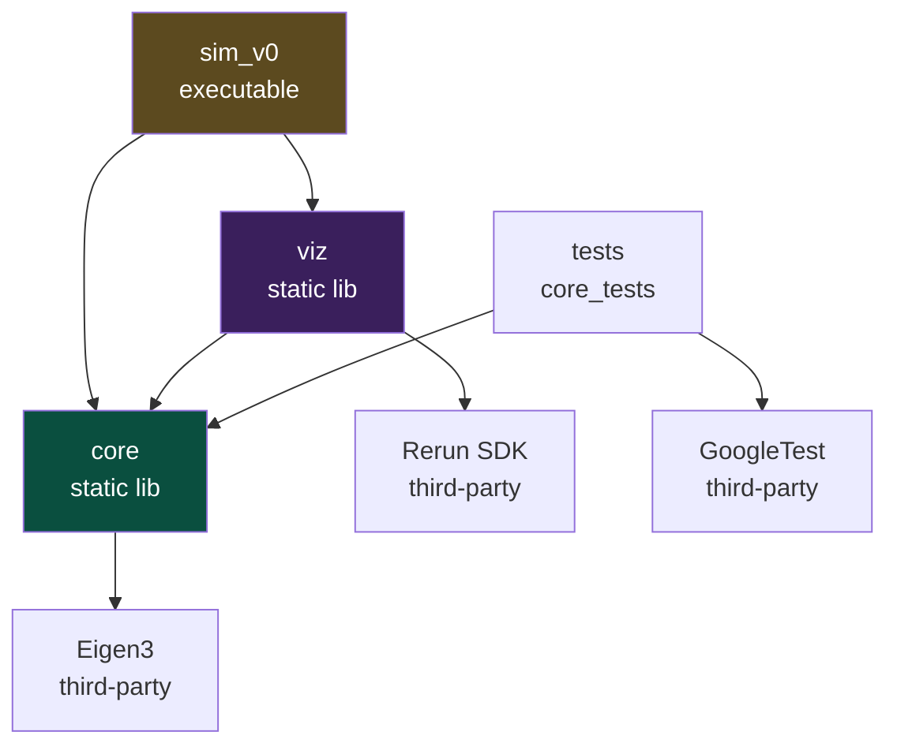
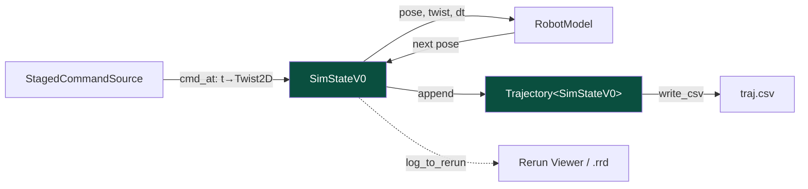

# MiniNav V0 阶段性总结

> 本文档是 MiniNav 项目 V0 阶段完成后的工程总结,记录了这一阶段的目标、
> 架构、设计决策、工具链选择、踩坑实录与后续规划。

---

## 0. 项目概述

**MiniNav** 是一个面向室内移动机器人的定位与导航系统,以现代C++为核心,
从最基础的差分驱动运动学仿真出发,**分版本**逐步扩展odom里程计、EKF多传感器融合、A\* 全局规划、Pure Pursuit路径跟踪、SLAM等。最终将在Raspberry
Pi 5 + 4WD小车上完成室内自主导航的实车闭环。

**项目动机**:这是一个个人项目,目标是通过该项目完整体验机器人开发流程、构建机器人开发完整能力栈(运动学建模 → 状态估计 → 路径规划 → 控制 → sim-to-real)。

### 0.1 版本路线图

整个项目按"每个版本解决一类问题"的思路演化,每个版本都在前一个版本的
基础上叠进行扩展。

| 版本     | 主题          | 关键产出                                            |
|--------|-------------|-------------------------------------------------|
| **V0** | 仿真基础设施      | 差分运动学 + 数据结构 + CSV / Rerun 双轨可视化 + 单元测试 + CI 雏形 |
| **V1** | 噪声 + 里程计    | 加入轮式编码器/IMU 仿真模型,带噪声的 odom 估计;暴露漂移问题            |
| **V2** | EKF 状态估计    | 融合 odom + IMU 的扩展卡尔曼滤波,量化 RMSE 减少幅度             |
| **V3** | 路径规划        | 占据栅格地图 + A\* 全局规划                               |
| **V4** | 控制 + ROS2 化 | Pure Pursuit 跟踪控制器,系统打包成 ROS2 节点                |
| **V5** | 完整仿真闭环      | 在 ROS2 内完成"给定目标点 → 规划 → 跟踪 → 到达"的端到端 demo       |
| **V6** | 实车部署        | Raspberry Pi 5 + 小车的 sim-to-real,室内导航视频         |


### 0.2 V0在整条路线中的位置

V0版本是整个项目的基础,为后续所有版本搭建可扩展、可演化、可测试、可可视化的代码骨架，包括：SimState
的版本化结构、Trajectory 模板、CSV/Rerun 双轨输出、严格警告策略等,为后续提供版本低成本迭代的前提。

### 0.3 V0版本总结

V0是MiniNav项目的"骨架版本":在没有任何噪声、估计、规划与控制的前提下,
建立起一个可演化、可测试、可可视化的差分驱动机器人仿真代码骨架,
作为后续引入 EKF / A\* / Pure Pursuit 时的基础设施层。

技术形态:**C++23 modules + Eigen3 + GoogleTest + Rerun + CMake 3.28**,
基于 WSL Ubuntu-24.04 + Clang 18 + Ninja 工具链构建。

---

## 1. 目标与边界

### 1.1 V0解决的问题

- **运动学层**:实现一个理想差分驱动机器人的一阶欧拉积分,作为后续所有运动模型的"事实参考"
- **数据层**:定义按版本演化的状态结构 `SimStateV0`,以及与之解耦的轨迹容器 `Trajectory<T>`
- **输出层**:把仿真结果同时输出为 CSV(确定性、可 diff)和 Rerun 录制(交互、可回放)
- **测试层**:对核心代码建立 GoogleTest 覆盖,作为后续重构的安全网
- **工程层**:打通从源码到可运行二进制的完整工具链链路,验证 C++23 modules 在真实工程下的可用性

### 1.2 V0不解决什么

- 完全理想化建模：目前所有运动学方程都是确定性的，没有建模任何传感器噪声、滑移、轮子打滑等非理想因素
- 无状态估计：`SimStateV0`里的pose预设真值,不存在`est_pose / true_pose`二元区分
- 无路径规划：命令源是预设的分段常值控制,不是闭环规划结果
- 无控制器：当前版本`StagedCommandSource`不读取当前位姿,纯开环，没有任何闭环反馈

---

## 2. 系统架构

### 2.1 模块依赖图



### 2.2 数据流



仿真主循环每一步做四件事:
(1) 从 `CommandSource` 取当前控制量;
(2) 把"时间 + 当前 pose + 当前 cmd"打包成 `SimStateV0` 并 append 到 trajectory;
(3) 同时通过ADL自由函数`log_to_rerun`推到 Rerun 后端;
(4) 用`RobotModel::step`推进位姿到下一步。

### 2.3 三个关键解耦点

V0 的架构里有三个可以独立讨论的解耦决策。

**a) `Trajectory<T>` 模板化**:把"时间序列容器"与"具体记录类型"解耦。 未来后续版本引入 `SimStateV1`(包含 odom + true_pose + noise covariance)等时,
`Trajectory<SimStateV1>` 直接复用,不需要重写容器。

**b) ADL自由函数 `csv_row` / `log_to_rerun`**:把"序列化格式"与"数据结构"解耦。
通过Argument-Dependent Lookup(实参依赖查找),`write_csv<T>` 在编译期通过 `T`
所在的命名空间找到对应的`csv_row(T)`重载。新增 `SimStateV1` 时只需要在它所在
命名空间提供新的`csv_row`重载,`Trajectory` 和 `write_csv`不需要任何修改。

**c) `viz`库独立**:把"可视化后端"与"业务逻辑"解耦。`viz` 通过 PIMPL
(Pointer to Implementation)隐藏 Rerun 类型,头文件不暴露 `<rerun.hpp>`,
下游目标看不到 Rerun 的任何符号。换后端只需要换 `RerunSink` 的实现,
对外接口(`log_pose / log_twist / log_scalar`)保持不变。

---

## 3. 核心设计决策

### 3.1 `Pose2D` / `Twist2D` 的 Eigen 折中策略

`Pose2D` 内部存 `Eigen::Vector2d position + double yaw`,
不统一为 `Eigen::Vector3d`。

**为什么不全 Eigen 化**:`yaw` 与 `[x, y]` 在数学上不是同质的——`yaw`
需要 `wrap_angle` 规范化到 `(-π, π]`,而位置是欧氏坐标无需规范化。把它们
塞进同一个`Vector3d`会让"位置矩阵索引[0:2]"和"角度索引[2]"的语义割裂。

**为什么不全POD化**:V2中EKF需要把 `Pose2D` 与3维状态向量互转
(`to_vector()` / `from_vector()`),纯POD实现需要在使用点反复手写转换代码。

**桥梁**:`to_vector() / from_vector()` 这两个静态方法把"语义清晰"和
"可参与矩阵运算"两个需求衔接起来。

### 3.2 `SimStateV0` 的版本化命名

仿真状态结构按版本号显式命名:`SimStateV0`、未来的 `SimStateV1`、
`SimStateV2`。不追求"一个万能 SimState 涵盖所有阶段"。

**为什么版本化**:每个 V 关心的字段不同。V0 只有 `(t, pose, twist)`;V1
会增加 `odom_pose`(带噪声的轮式里程计估计);V2 会增加 `ekf_pose` 和
`covariance` 协方差矩阵。

**为什么不用继承**:`SimState`是纯数据,没有行为。继承会引入虚表 + 多态开销而没有任何收益，使用方只需要知道是哪一个版本的快照, 而不是如何在不知道具体版本时操作它。

**配套机制**:CSV 列定义、Rerun 实体路径配置等"版本相关的输出格式"
通过 ADL 自由函数(`csv_row(SimStateV0)` / `log_to_rerun(SimStateV0, ...)`)
组织,新版本通过新增重载来扩展,不用修改旧版本代码。

### 3.3 `Trajectory<T>` 的模板化

`Trajectory` 是模板类,不是 `TrajectoryBase` + `TrajectoryV0` /
`TrajectoryV1` 这种继承结构。

**为什么模板**:Trajectory 的本质行为(reserve / append / size / iterate)
对所有 SimState 都一样,差异只在元素类型。这正是 templates 的标准用途——
"行为相同、类型不同"用模板,"行为不同、类型可能相同"才用继承。

**为什么不用 type erasure**:类型擦除会让
编译器丢失元素类型信息,迭代时需要运行时类型检查,既慢又不安全。在
非交互式仿真这种"已知类型"的场景里没有任何理由放弃静态类型。

### 3.4 `CommandSource` 抽象基类的"过早抽象"取舍

V0 阶段保留 `CommandSource` 虚函数基类 + `StagedCommandSource`唯一实现。

**为什么这是"过早抽象"**:在 V0 阶段,`CommandSource` 只有一个具体实现,
虚函数除了引入 vtable 开销外没有任何价值。更糟的是,它通过 `virtual` +
`= delete` 拷贝/移动声明了完整的"多态基类协议",但实际上没有任何代码
在用多态。

**为什么 V0 阶段保留**:V1+ 大概率会引入 `FilePlaybackCommandSource`
(从 ROS bag 回放)、`PurePursuitController`(闭环控制器)等多个实现。
V0 阶段提前把接口定义好,后续添加实现时不需要重构调用方代码。

### 3.5 可视化的双轨策略:CSV 与 Rerun **共存**

V0 同时输出 CSV 与 Rerun。

**职责分工**:

- **CSV** = **回归测试基线** + **简历素材原料**。文本格式可 `diff`,
  数据全字段精度保留(`std::scientific` + `max_digits10`),Python pandas
  可直接读取做误差分析。重构代码后跑一次 `--no-viz` 模式生成新 CSV,
  和旧版本 `diff`,空 diff 即证明无回归。
- **Rerun** = **交互式开发工具**。3D 视图能看到机器人朝向,2D 视图能
  看到轨迹覆盖,Time Series 视图能看到 v/w 曲线。开发期最快迭代手段。
- **未来:Python 脚本生成的 PNG** = **简历交付物**。简历是 PDF,无法嵌入
  Rerun,需要静态图片。`scripts/plot_trajectory.py` 从 CSV 出 PNG,与
  Rerun 形成"开发 vs 交付"的职责分工。

**为什么不能让 Rerun 替代 CSV**:`.rrd` 是二进制格式,无法在 git 中
做有意义的 diff,不能作为回归基线。

### 3.6 `viz` 库的依赖倒置

`viz` 是独立的 STATIC 库,与 `core` 平级,而不是 `core` 的
子模块或者直接作为 `sim_v0` 的源文件。

**为什么不放进 core**:核心运动学、状态结构、轨迹容器是"机器人本身"的
代码,可视化是"我们怎么观察机器人"的代码。两者抽象层次不同,一旦混在
一起,部署到树莓派(没有 Rerun)就需要 `#ifdef` 大面积污染。

**为什么不直接放进 sim_v0**:`viz` 的代码未来会可被多执行文件复用——
V1 会有 `sim_v1`,实车阶段会有 `mininav_node`(ROS2 节点),它们都需要
同一套 `RerunSink`。提前抽象成库避免后续重复代码。

**PIMPL的作用**:`rerun_sink.ixx` 头文件不 `#include <rerun.hpp>`,
只通过 `std::unique_ptr<Impl>` 前向声明持有实现。Rerun 的具体类型只
出现在 `rerun_sink.cpp` 里。这样下游目标(sim_v0)的编译时间不受 Rerun
头文件大小影响,也不会被 Rerun 的内部符号污染。

---

## 4. 工具链与构建系统

V0 阶段在工具链上做的最重要的决定是:**用 C++23 modules**。这是个
有争议的选择,值得专门说一下。

### 4.1 C++23 Modules:为什么用 + 用了之后的代价

**为什么用**:本项目以学习为目的，在构建项目过程中增加了对前沿 C++ 的了解"。
Modules 是 C++20 引入、C++23 完善的语言级特性,工业界 2024-2026 年正在逐步采纳。
在**仿真这种封闭代码库**(没有外部 import 它的库)用 modules,工具链风险可控,且能锻炼对现代 C++ 编译模型的理解。

**代价**:工具链支持仍在演进,目前的支持还不是完全完善，在构建项目时也遇到了若干个问题。
如果项目目标是"快速 ship",modules 不是合适的选择;但本项目目标是"打磨工程能力", 这个代价也是学习收益的一部分。

**遇到过的问题**:

| 问题                                | 现象                                                 | 解法                                                                     |
|-----------------------------------|----------------------------------------------------|------------------------------------------------------------------------|
| **大型 header-only 库与 modules 的配合** | 如果直接 `import <Eigen/Dense>`,扫描器要解析整个 Eigen 头,编译开销大 | 在模块**实现文件**(`module;` 之前的全局片段)里 `#include <Eigen/Core>`,模块接口只暴露薄薄的包装类型 |

### 4.2 依赖管理:三种模式的取舍

V0 引入了三个第三方库,每一个用了不同的策略——这本身是一种工程示范,
说明"依赖管理没有银弹,要看库的具体形态选模式"。

| 库              | 引入方式                                                 | 理由                                                                           |
|----------------|------------------------------------------------------|------------------------------------------------------------------------------|
| **Eigen3**     | `find_package(Eigen3 3.4 REQUIRED NO_MODULE)`        | Eigen 是 header-only 库,Linux 下 `sudo apt install libeigen3-dev` 就装好,系统级共享更高效  |
| **GoogleTest** | 纯 `FetchContent`                                     | gtest 与 C++ 编译选项强耦合(`gtest_force_shared_crt`),每个项目要用自己的编译配置编一份,系统装版会有 ABI 风险 |
| **Rerun SDK**  | `FetchContent` + `FIND_PACKAGE_ARGS` 混合(CMake 3.24+) | 本机有装好的 SDK 优先用(增量构建快),没有则自动下载预编译 zip(开箱即用)                                   |

**Rerun 引入路径里的工程细节**:

- 通过 `MININAV_RERUN_VIEWER_VERSION` cache 变量显式锚定 SDK 版本(0.31.4),
  与本机 `pip install` 的 Rerun Viewer 版本严格匹配——SDK 与 Viewer 共用
  wire format,版本错位会出现连接失败。
- 用 `SYSTEM` 关键字让 Rerun 头文件被当作系统库,**屏蔽其内部代码触发的
  `-Wconversion -Werror` 警告**。这是"对自己的代码严格、对第三方库宽容"
  的工业标准实践。
- 用 `EXCLUDE_FROM_ALL` 不把 Rerun 自带的 examples / tests target 拉进
  默认构建。

### 4.3 编译期路径注入:`PROJECT_ROOT_DIR` 与 `MININAV_RERUN_VIEWER_BIN_DIR`

V0 用了两个编译期宏注入,解决两个不同的"路径在哪"问题:

**`PROJECT_ROOT_DIR`**:CLion 默认工作目录是 `cmake-build-debug`,而我们
希望 `data/traj.csv` 落在项目中的根目录的 `data/` 下,而不是 build 目录的
`data/`。通过 `target_compile_definitions(sim_v0 PRIVATE
PROJECT_ROOT_DIR="${CMAKE_SOURCE_DIR}")` 把项目根的绝对路径注入,
代码里用 `fs::path{PROJECT_ROOT_DIR} / "data" / "traj.csv"` 拼接。

**`MININAV_RERUN_VIEWER_BIN_DIR`**:Rerun SDK 的 `spawn()` 通过 PATH
启动 Viewer 子进程。CLion 启动的子进程不读 `~/.bashrc`、不会自动激活
`.venv`,导致 PATH 里没有 `~/.local/bin` 也没有 venv 的 `bin/`,Viewer
找不到。解决方式:CMake 在 configure 阶段定位 `${CMAKE_SOURCE_DIR}/.venv/bin`,
注入为编译期常量;`RerunSink` 在 spawn 之前调一次 `::setenv` 把它前置
到 PATH。这样 IDE 启动 / 终端启动 / CI 启动都稳定工作。

**踩坑**:`setenv` 是 POSIX 函数,不在 `std::` 命名空间。要写 `::setenv` 而不是
`std::setenv`。这也意味着这套方案目前只支持 Linux/macOS,Windows 需要
改用 `_putenv_s`。

### 4.4 严格警告策略

`cmake/warnings.cmake` 对项目目标启用了:`-Wall -Wextra -Wpedantic
-Wconversion -Wsign-conversion`,Debug 模式额外加 `-Werror`。

**理由**:`-Wconversion` 和 `-Wsign-conversion` 抓的是 `int → size_t`
之类的隐式转换,这是工业代码里相当常见的潜在 bug 源头(整数环绕、
精度丢失)。早期就开启严格模式,后期不会因为"偶尔加个无害的警告"
积累成大量噪声;`-Werror` 强制每一个警告都必须处理。

**例外**:第三方库的代码不应该被这套规则约束,
所以 Rerun 用 `SYSTEM` 排除,Eigen也是system include。

---

## 5. 测试策略

V0阶段的测试策略遵循一个朴素原则:**测试存在的意义是给未来的重构提供
安全网**。所以V0只对那些"未来很可能被重构"的部分写测试,
对那些不会再进行迭代修改的部分(比如 Logger)不投入测试精力。

### 5.1 GoogleTest 集成方式

通过 `cmake/google_test.cmake` 用 `FetchContent` 拉取 GoogleTest v1.15.2,
锁定到具体 release tag。

```cmake
FetchContent_Declare(
    googletest
    GIT_REPOSITORY https://github.com/google/googletest.git
    GIT_TAG        v1.15.2
    GIT_SHALLOW    TRUE
)
```

设置 `INSTALL_GTEST=OFF` 避免 gtest 自身的 install target 污染本项目的
install 流程,设置 `gtest_force_shared_crt=ON` 确保 MSVC 平台下的运行时
库一致(虽然本项目目前只跑 Linux,但这是 GoogleTest 文档推荐做法,顺手
打开)。

### 5.2 V0 已覆盖的测试

| 测试文件                    | 覆盖内容                                              | 测试形态                 |
|-------------------------|---------------------------------------------------|----------------------|
| `math_tests.cpp`        | `wrap_angle` 边界、对称性、连续性                           | `EXPECT_NEAR` + 多组输入 |
| `types_tests.cpp`       | `Pose2D` 构造、`to_vector / from_vector` 往返一致性       | `EXPECT_DOUBLE_EQ`   |
| `kinematics_tests.cpp`  | `differential_drive_step` 直线、原地转、圆周运动             | 端点位置精确比对             |
| `robot_model_tests.cpp` | `RobotModel::step` 与 `differential_drive_step` 一致 | 同输入同输出验证             |
| `trajectory_tests.cpp`  | `reserve / append / size / records()` 行为正确        | 容器行为基础测试             |

### 5.3 哪些没测,为什么

- **`csv_format` / `write_csv`**:文本输出测试容易写脆(回车换行差异、
  浮点格式差异),且 V0 主循环每跑一次就是一次集成测试(看 CSV 文件是否
  正常生成、是否能 diff)。
- **`viz` 模块**:`RerunSink` 的行为是"把数据推到 Rerun SDK",测试它
  本质上要 mock SDK。
- **`Logger`**:V3 工程化阶段会替换为 `spdlog`。

### 5.4 与 CTest 的集成

每个测试 target 通过 `gtest_discover_tests` 自动注册到 CTest:

```cmake
include(GoogleTest)  # 提供 gtest_discover_tests
gtest_discover_tests(core_tests)
```

`gtest_discover_tests` 会在构建后扫描可执行文件中的测试用例,把每一个
`TEST(...)` 注册成一个独立的 CTest 条目。这样 `ctest -R kinematics`
之类的精细化筛选直接可用。

---

## 6. 用法

### 6.1 构建

```bash
# 第一次配置(会触发 Rerun SDK 的下载和 Apache Arrow 的构建，时间稍长)
cmake --preset clang18-debug

# 之后的增量构建
cmake --build --preset build-debug -j

# 执行单元测试
cd build/clang18-debug && ctest --output-on-failure
```

### 6.2 三种运行模式

```bash
# 模式 1: Spawn —— 自动启动 Rerun Viewer,数据通过 gRPC 流送
./build/clang18-debug/sim_v0

# 模式 2: Save —— 写入 .rrd 录制文件,事后离线打开
./build/clang18-debug/sim_v0 --rrd results/v0.rrd
rerun results/v0.rrd

# 模式 3: 关闭可视化 —— 只生成 CSV,用于回归测试和 CI
./build/clang18-debug/sim_v0 --no-viz
```

三种模式的设计目标不同:Spawn 是开发期最高频使用的模式;Save 用于
生成可分享的录制;`--no-viz` 在 CI 和"验证 CSV 是否回归"时用。

### 6.3 Rerun Viewer 配置建议

第一次打开 Rerun Viewer 时,建议手动配置以下视图(配置一次后会保存为
默认 Blueprint):

- **2D Spatial 视图**:root 选 `/world`,可看到机器人在地面平面的轨迹覆盖
- **3D Spatial 视图**:root 选 `/world`,可看到机器人朝向(yaw 通过
  Transform3D 表达)
- **Time Series 视图**:root 选 `/world/robot/cmd`,可看到 v(线速度)
  与 w(角速度)的曲线,验证 `StagedCommandSource` 的分段控制是否符合预期

### 6.4 CSV 后处理

```bash
source .venv/bin/activate
python scripts/plot_trajectory.py --input data/traj.csv --output results/traj_v0.png
```

生成的 PNG 用于简历嵌入和 README 首屏展示,与 Rerun 形成"开发用
Rerun、交付用 PNG"的职责分工。

### 6.5 CSV 回归测试流程

每次重构 `core` 模块后强制跑一次:

```bash
# 假设之前 baseline 留在 /tmp/traj_baseline.csv
./build/clang18-debug/sim_v0 --no-viz
diff /tmp/traj_baseline.csv data/traj.csv
# 期待 diff 为空。非空说明改动引入了数值回归,需要立即定位。
```

---

## 7. 已知限制 / 技术债

### 7.1 viz 模块缺乏单元测试

`RerunSink` 和 `log_to_rerun` 没有测试覆盖。要测它们就要 mock Rerun
SDK,投入产出比在 V0 阶段过低。**计划**:V3 工程化阶段引入 `Mock` 框架
后补上,届时也可以测 `--rrd` 文件的字节正确性。

### 7.2 平台限制:仅支持 Linux/macOS

`RerunSink` 用 `::setenv` 注入 venv 路径,这是 POSIX 函数。Windows
需要用 `_putenv_s`。本项目锁定 WSL Linux，因此暂不处理该问题。

### 7.3 `--rrd` 与 `--no-viz` 没做互斥检查

如果同时传两个参数,行为是 `--no-viz` 胜出,`--rrd` 被静默吞掉。
应该 fail fast 报错。

### 7.4 `RobotModel` / `CommandSource` 的过度抽象

它们目前都是无状态的,但用了 `virtual` + 删除拷贝/移动构造的"多态
基类协议"。这是为 V1+ 预留的接口,但目前没有任何派生类,所以体现为
冗余的 vtable + 冗长的 5 大特殊成员声明。

V1 引入 `NoisyRobotModel` / `FilePlaybackCommandSource` 时这些抽象
会"激活";如果到 V2 仍然只有一个实现,这块抽象需要被删除——**过早
抽象比没有抽象更糟**。

### 7.5 浮点累计误差

主循环用 `t = i * dt` 计算时间(避免 `t += dt` 的累计误差)。但
`StagedCommandSource` 的判断条件 `t < 5.0` 在 `t = 4.999...` 还是
`t = 5.000...` 的边界点上,行为依赖浮点表示——这在 V0 不重要,但 V1
做轨迹比对时可能引入微小差异。需要时可以改用 `i * dt < 5.0 / dt` 的整数
比较。

### 7.6 没有 CI

代码里的"绿色测试"目前只在本机运行。**计划**:V3 阶段引入 GitHub
Actions,跑 ubuntu-24.04 + clang-18 的矩阵。

---

## 8. 下一步:V1 路线

V0 已经把"理想差分驱动 + 数据/可视化基础设施"打磨到了可演化的状态。
V1 要在这个基础上引入**第一个真正的机器人问题:不确定性**。

V1 计划做三件事:

1. **传感器仿真模型**:轮式编码器(wheel encoder)+ IMU 的简化模型,
   每一步在真实控制量上叠加可配置的高斯噪声,得到"机器人观测到的"
   控制量与角速度。
2. **里程计估计 (`OdometryEstimator`)**:积分带噪声的传感器读数,
   得到 `odom_pose`。这就是后续 EKF 要"修正"的那个有漂移的估计。
3. **`SimStateV1`**:在 V0 的字段基础上新增 `odom_pose` 字段,新增
   对应的 `csv_row(SimStateV1)` 和 `log_to_rerun(SimStateV1, ...)`
   重载。

V0 的哪些设计**为 V1 做了准备**:

- `Trajectory<T>` 模板化 → 直接 `Trajectory<SimStateV1>` 复用
- `csv_format` ADL 自由函数 → 加重载即可,不动旧代码
- `differential_drive_step` 自由函数 → `NoisyRobotModel` 复用同一运动学
- `viz` 库的 `log_pose / log_twist` 接口 → 直接 log `odom_pose` 到
  `/world/robot/odom`,Viewer 里能并排看到 true_pose 和 odom_pose 的
  漂移差异

V1 阶段产出的"看得见的差异"是:Rerun Viewer 的 2D 视图里,真值轨迹
与 odom 估计轨迹会渐渐分开——**这就是为什么 V2 需要 EKF**。这条
"问题→解决方案"的叙事链是面试时最值钱的素材。

---

## 9. 个人成长:从 V0 学到了什么

### 9.1 "过早抽象"是真实存在的陷阱

V0 第一稿(改造前)有 5 个模块:`CommandSource` / `Trajectory` /
`CsvWriter` / `Logger` / `RobotModel`——架子搭得很漂亮,但真正负担
机器人核心逻辑(运动学积分)的代码只有几行。重构时回头看,
`CsvWriter` 作为一个 class 完全没必要,应该是自由函数;
`Trajectory` 不应该绑死 `StateRecord` 类型,应该是模板。

**收获**:**抽象不是免费的**。每个 class、每个虚函数都在向未来的
读者承诺"这里有一个值得关注的边界",如果这个边界其实并不存在,
代码就在欺骗读者。**该写自由函数就写自由函数,该写模板就写模板,
不要为了"看起来面向对象"而写 class**。

### 9.2 ADL 是"扩展点"的优雅实现

最初想用"`SimStateV0` 自带 `csv_header / csv_row` 方法"来组织 CSV
序列化,后来选择了"独立的 `csv_format` 模块 + ADL 自由函数"。
这个选择的核心收益不是"性能"或"代码量",而是**未来扩展时不需要
回头改旧代码**——`SimStateV1` 在新文件里加一个新重载,旧的 V0
代码原封不动。

**收获**:好的设计的标志是**"扩展时不需要修改"**(Open/Closed
Principle 的真实含义),而不是"现在看起来层次清晰"。ADL 是 C++
里实现这个原则最优雅的工具之一。

### 9.3 工具链的坑值得花时间,但不应该太多时间

V0 阶段在 CMake 3.28 modules、Clang 18、CLion 工作目录、Rerun
SDK 版本对齐、WSL PATH 继承等问题上花了相当多的时间。

这些时间**算法深度维度没有直接价值**,但它们打磨
了一些隐性能力:阅读 GCC/Clang 报错、理解链接器、理解 CMake 的
configure / generate / build 三阶段、理解 POSIX vs ISO C 的边界。

### 9.4 "同时支持开发和交付"的双轨策略

V0 阶段最值得的工程决策之一是:**让 CSV 与 Rerun 共存**,而不是
让一个替代另一个。背后的认识是:**不同的输出有不同的"读者"**。

**收获**:**写代码不是只在写代码**,还在写"我希望我的代码以什么
形式被消费"。一个产出物的格式决定了它能走到哪、被谁看到、能不能
被验证。

### 9.5 知识层面的具体新增

| 概念                                  | 在 V0 的什么地方第一次真正用到                          |
|-------------------------------------|--------------------------------------------|
| **Argument-Dependent Lookup (ADL)** | `csv_row` / `log_to_rerun` 自由函数的扩展点机制      |
| **PIMPL**                           | `RerunSink::Impl` 隐藏 Rerun SDK 类型,头文件不污染   |
| **CMake `FIND_PACKAGE_ARGS` 混合模式**  | Rerun SDK 的"先 find 后 fetch"引入              |
| **C++23 Modules + 全局片段**            | `module;` 之前 `#include <Eigen/Core>` 的隔离技巧 |
| **POSIX vs ISO C 在 std:: 中的边界**     | `std::getenv` 合法但 `std::setenv` 不合法        |
| **依赖倒置原则的具体落地**                     | `viz` 库与 `core` 的解耦关系                      |

---

## 附录 A:文件清单

V0 阶段的代码组织如下：

```
src/
├── core/                          # 核心库,与 Rerun 无关
│   ├── types.{ixx,cpp}            # Pose2D, Twist2D, SimStateV0
│   ├── math.ixx                   # wrap_angle, kPi
│   ├── kinematics.{ixx,cpp}       # differential_drive_step
│   ├── robot_model.{ixx,cpp}      # RobotModel(对运动学的薄包装)
│   ├── command_source.ixx +       # CommandSource 基类 +
│   │   staged_command_source.cpp  # StagedCommandSource 实现
│   ├── trajectory.ixx             # Trajectory<T> 模板
│   ├── csv_format.{ixx,cpp}       # csv_header / csv_row(SimStateV0)
│   ├── csv_writer.ixx             # write_csv<T> 模板
│   └── logger.ixx                 # 简单 stdout/stderr logger
├── viz/                           # 可视化层,依赖 Rerun
│   ├── rerun_sink.{ixx,cpp}       # RerunSink + venv PATH 注入
│   └── sim_state_log.{ixx,cpp}    # log_to_rerun(SimStateV0, ...)
└── apps/
    └── sim_v0_main.cpp            # CLI 解析 + 主循环

tests/
└── core/
    ├── math_tests.cpp
    ├── types_tests.cpp
    ├── kinematics_tests.cpp
    ├── robot_model_tests.cpp
    └── trajectory_tests.cpp

cmake/
├── warnings.cmake                 # 严格警告策略
├── google_test.cmake              # GoogleTest 引入
└── rerun.cmake                    # Rerun SDK 混合模式引入

docs/
├── project-overview.md            # 项目总愿景与 V0-V7 规划
└── v0_summary.md                  # 本文档

scripts/
└── plot_trajectory.py             # CSV → PNG 离线出图

results/
└── traj_v0.png                    
```

---

## 附录 B:关键命令速查

```bash
# 构建
cmake --preset clang18-debug && cmake --build --preset build-debug -j

# 运行(三种模式)
./build/clang18-debug/sim_v0                    # Spawn
./build/clang18-debug/sim_v0 --rrd results/v0.rrd  # Save
./build/clang18-debug/sim_v0 --no-viz           # 仅 CSV

# 查看 .rrd 录制
rerun results/v0.rrd

# 跑测试
cd build/clang18-debug && ctest --output-on-failure

# Python 后处理(需先 source venv)
source .venv/bin/activate
python scripts/plot_trajectory.py --input data/traj.csv --output results/traj_v0.png

# CSV 回归 diff
diff /tmp/traj_baseline.csv data/traj.csv
```

---
