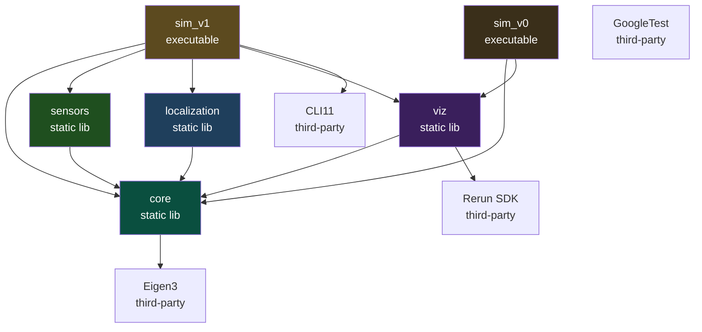
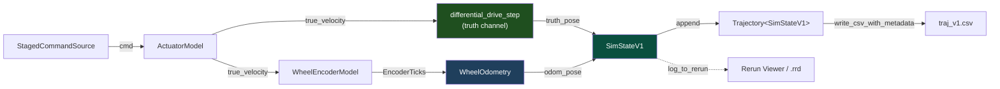

# MiniNav V1 阶段性总结

> 本文档是 MiniNav 项目 V1 阶段完成后的工程总结,记录了在该阶段
> 引入不确定性过程中的目标、架构、数学建模、关键设计决策与后续规划。

---

## 0. 项目概述

上一个版本V0为MiniNav项目提供了科演化的"骨架"。V1在这个光加上引入了更加实际的不确定性
，机器人的执行不再是精确的,传感器传输的值带有噪声。由于噪声的出现里程计估计器由传感器读数重建位姿将会随时间累计漂移。
这条由于噪声产生的偏差、漂移将是在下一个版本V2引入的EKF修正的对象。

### 0.1 版本路线图

| 版本     | 主题          | 关键产出                                            |
|--------|-------------|-------------------------------------------------|
| **V0** | 仿真基础设施      | 差分运动学 + 数据结构 + CSV / Rerun 双轨可视化 + 单元测试 + CI 雏形 |
| **V1** | 噪声 + 里程计    | 工业级 actuator + encoder 噪声模型,带漂移的 odom 估计;暴露漂移问题 |
| **V2** | EKF 状态估计    | 引入 IMU,融合 odom + IMU 的扩展卡尔曼滤波,量化 RMSE 减少幅度      |
| **V3** | 路径规划        | 占据栅格地图 + A\* 全局规划                               |
| **V4** | 控制 + ROS2 化 | Pure Pursuit 跟踪控制器,系统打包成 ROS2 节点                |
| **V5** | 完整仿真闭环      | 在 ROS2 内完成"给定目标点 → 规划 → 跟踪 → 到达"的端到端 demo       |
| **V6** | 实车部署        | Raspberry Pi 5 + 小车的 sim-to-real,室内导航视频         |

### 0.2 V1 版本总结

V0 是"骨架版本",V1 是**第一个有故事的版本**。

在V0阶段，代码全部都是确定性的：机器人完美执行命令、并且能够确定自己的位置，
这在现实中并不存在，只是作为项目的启动阶段用于验证工具链环境并为后续升级提供基础骨架。
V1 在 V0 的基础上引入了两条独立的不完美链路：在执行通道引入
Velocity Motion Model描述命令与真实速度的偏差,观测通道引入
"打滑 + 量化"双噪声并维护累计弧长以正确处理低速量化欠采样。
里程计估计器 `WheelOdometry` 完全依赖倒置,只通过 `EncoderTicks`
类型与传感器层接触，在 V6 实车阶段无需修改一行就可以接入
Pi 5 GPIO 中断累加的真实 ticks。

技术形态:在 V0 (**C++23 modules + Eigen3 + GoogleTest + Rerun**) 的基础上,
新增 `mininav_sensors` 和 `mininav_localization` 两个静态库,引入
CLI11处理命令行选项;主循环 `sim_v1` 与 `sim_v0` 并存,两者
共享 `core` 与 `viz` 库。
---

## 1. 目标与边界

### 1.1 V1 解决的问题

- **执行噪声层**:应用 Thrun *Probabilistic Robotics* §5.3 的 Velocity
  Motion Model 把命令 twist 映射为带噪声的真实速度。方差与
  $(v^2, \omega^2)$ 关联,保证静止命令下方差为零(无静止漂移)。
- **观测噪声层**:用"先打滑(乘性高斯)后量化(整数 tick)"的物理
  因果序模拟轮式编码器;通过累计弧长 + 差分输出的模式正确处理低速
  量化欠采样。
- **估计器层**:用 `WheelOdometry` 把 `EncoderTicks` 反解为
  `(v̂, ω̂)`,再调用与真值通道**同一个** `differential_drive_step`
  推进 `odom_pose`。两条通道的数学路径对称,差异完全来自输入。
- **可复现性层**:`RngFactory` 通过 FNV-1a tag 哈希派生独立子种子,
  保证每个噪声源各自独立、跨 PR 添加新噪声源不扰动已有序列、`--seed`
  完全控制实验复现。
- **集成与交付层**:`sim_v1` 主循环把上述四层组装成可执行档;三档
  preset (`low-noise` / `default` / `high-noise`) 一键切换噪声水平;
  Rerun 里三条轨迹 (`cmd_traj` / `truth` / `odom`) 同框显示;Python
  脚本 `analyze_v1_drift.py` 从 CSV 算出 RMSE 与漂移曲线。

### 1.2 V1 不解决什么

- **不引入 IMU**。IMU 的接口形态强烈受 EKF 需要驱动 (state vector
  里有没有 bias、要不要四元数姿态等),V1 没有真正的消费者,过早设计
  IMU 接口几乎一定会在 V2 重构。这是 V0 §3.4 反思过的"过早抽象"
  陷阱,V1 拒绝重蹈。
- **不做任何状态融合**。`odom_pose` 是开环估计,V1 不修正它的漂移。
  量化漂移本身就是 V1 的核心交付，它是 V2 EKF 性能评估的基线。
- **不引入闭环控制**。命令源仍然是 V0 留下的开环 `StagedCommandSource`,
  Pure Pursuit 等控制器将在 V4 中加入。
- **不引入参数文件 / YAML**。V1 用 CLI + 硬编码 preset 已经够用;
  yaml-cpp 在 V3 引入地图配置或 V4 引入控制器调参时才有真实价值。
- **不替换欧拉积分器**。圆周运动一圈累积 ~10 cm 量级误差是 V0 留下
  的已知系统误差,V1 不在这个维度优化,等到积分精度真正限制下游
  (例如 V2 协方差传播)再升级到 RK4。

---

## 2. 系统架构

### 2.1 模块依赖图



**关键关系**:`sensors` 和 `localization` 是 V1 新增的两个独立静态库,
**互不依赖**,只通过 `core::EncoderTicks` 这个 plain struct 在 `sim_v1`
主循环里间接耦合。

`sim_v0` 与 `sim_v1` 并存——V0 的可执行档保留作为回归基线,
不被 V1 替换。

### 2.2 数据流(V1 主循环)



V1 主循环执行步骤

1. 从 `CommandSource` 获取当前命令 `cmd`
2. **ActuatorModel** 把 `cmd` 转成带执行噪声的 `true_velocity`
3. 用 `true_velocity` 推进 `truth_pose`(真值通道)
4. **WheelEncoderModel** 把 `true_velocity` 转成带打滑+量化的 `EncoderTicks`
5. **WheelOdometry** 把 `EncoderTicks` 转成 `odom_pose`(估计通道)
6. 打包 `SimStateV1` → `Trajectory::append` + `log_to_rerun`


### 2.3 两条独立链路的解耦设计

V1 的架构核心是把"机器人物理"和"机器人感知"清晰分开:

**真值通道(truth channel)**:
```
cmd ──► ActuatorModel ──► true_velocity ──► differential_drive_step ──► truth_pose
```

**估计通道(estimation channel)**:
```
EncoderTicks ──► forward_kinematics ──► (v̂, ŵ) ──► differential_drive_step ──► odom_pose
```

`differential_drive_step` 是
V0 中的欧拉一阶积分自由函数。真值通道为"带执行噪声的速度",
估计通道为"传感器解码出来的速度",积分代码完全一样。这种对称性意味着
两条通道的轨迹差异**必然完全来自输入差异**,不会有"积分算法不一致
导致虚假漂移"这种。

`WheelOdometry::update`的接口签名只接受 `EncoderTicks` 和 `dt`,它不知道 ticks 的来源和`truth_pose`。
这是依赖倒置原则的具体落地实车阶段,Pi 5 通过 GPIO 中断累加真实编码器 tick,只要交给 `WheelOdometry`
同一类型的 `EncoderTicks`,估计器代码不需要改。

把这个解耦实际兑现到 CMake 层面就是 `mininav_sensors` 和
`mininav_localization` 互不链接,各自只链接 `mininav_core`。

---

## 3. 核心设计决策


### 3.1 `RngFactory` 的 per-tag 稳定性

V1 至少有 3 个独立噪声源:actuator、encoder slip 左、encoder slip 右。
工业级仿真要求:

1. **可复现**，同 master seed 下输出完全确定
2. **独立性**，各噪声源使用独立 RNG,避免序列相关性
3. **稳定性**，增加新噪声源不影响已有噪声源的随机序列

直接共用一个 `std::mt19937` 同时违反 (2) 和 (3)。`RngFactory` 通过
FNV-1a 64-bit 字符串哈希派生 `seed_seq`,保证不同 tag 得到的引擎状态空间独立。

### 3.2 σ=0 时跳过 RNG 的稳定性约定

`ActuatorModel::apply` 和 `WheelEncoderModel::measure` 在内部都
计算噪声标准差;当 σ == 0 时(因为 cmd=(0,0) 或 noise 参数为 0),
代码**显式跳过 `std::normal_distribution` 的采样调用**,而不是让
`normal_distribution(0, 0)` 持续消耗RNG状态。用于与跨场景的回归测试稳定性。

### 3.3 Velocity Motion Model 而非加性高斯

最直观的"加噪声"方式是 `v_noisy = v + N(0, σ²)`——加性高斯白噪声,
仅使用一个常数 σ 但V1选择了 Thrun *Probabilistic Robotics*
§5.3 的 Velocity Motion Model:

$$
\hat{v} = v + \mathcal{N}(0,\; \alpha_1 v^2 + \alpha_2 \omega^2)
$$

即噪声方差与命令速度的平方相关。

加性高斯在 cmd=(0,0) 时仍然有非零方差,意味着
机器人**静止时也会漂移**——违反物理。Velocity Motion Model 让方差
随速度归零,符合"打滑只在运动时发生、电机响应误差与目标速度成比例"
的物理直觉。

**四个 α 的物理含义**:

| 参数 | 物理意义                          |
|----|-------------------------------|
| α₁ | 线速度自身导致的线速度方差(电机响应不线性)        |
| α₂ | 角速度耦合到线速度的方差(转弯打滑导致前向偏差)      |
| α₃ | 线速度耦合到角速度的方差(前进时左右轮不对称导致航向漂移) |
| α₄ | 角速度自身导致的角速度方差(转弯响应不准)         |

实际上这四个 α 通过对"已知 ground truth 的轨迹"做最小二乘拟合
得出。V1 仿真里它们是配置参数。

### 3.4 编码器的"先打滑后量化"因果序

`WheelEncoderModel` 一步处理的代码顺序是:**逆运动学 → 打滑(乘性
高斯) → 累计弧长 → 量化(round 到 tick) → 差分输出**。

打滑发生在**轮地接触面**(物理世界),决定轮子真正转了多少弧度;
量化发生在**编码器电路**(传感器层面),把连续弧度
采样为整数 ticks。这是真实的因果链:**先有物理打滑、后有电路量化**。

### 3.5 编码器的累计-差分语义

V1 编码器的另一个关键设计是**持有累计真实弧长**:

```
s_left_accum  += v_left_meas  * dt
s_right_accum += v_right_meas * dt
ticks_total    = round(s_accum / Δs_tick)
Δticks         = ticks_total - ticks_prev
```

**累计差分的选择原因：**:

考虑 v=0.001 m/s 的低速。单 tick 弧长约 $\Delta s_{\text{tick}} =
2\pi \cdot 0.032 / 1024 \approx 1.96 \times 10^{-4}$ m。单步 dt=0.01s
对应弧长 $v \cdot dt = 10^{-5}$ m,**小于半 tick**。如果每步独立
量化 `Δticks = round(v*dt / Δs_tick)`,每步都 round 到 0——编码器
永远不动,但车实际在缓慢前进。

正确的"累计-差分"模式自然处理低速:累计满半 tick 后,下一步差分
吐出一个 tick。这与真实增量编码器的硬件行为一致。

`LowSpeedAccumulatesCorrectlyDespiteRoundingToZero` 这条单元测试
直接验证这个性质。

### 3.6 `WheelOdometry` 的依赖倒置

`WheelOdometry::update` 的接口签名:

```cpp
Pose2D update(const EncoderTicks& dticks, double dt);
```

接口里没有任何关于ticks来源的信息。它消费 `core::EncoderTicks`
这个 plain struct,完全不知道 ticks 是来自仿真模型还是来自 Pi 5
GPIO 中断累加。

构造参数同样反映这个原则`WheelOdometryParams` 接受
`distance_per_tick`(单 tick 弧长)和 `wheel_base`,不接受
`wheel_radius` 或 `ticks_per_rev`。后两者是传感器层的物理细节,
估计器不应当知道。这种"接收派生量、不接收原始量"的接口风格,在 V6
实车阶段最有用同款编码器换不同减速比时,`distance_per_tick`
由标定脚本算出,估计器无需修改。

### 3.7 sensors 与 localization 互不依赖

V1 新增的两个静态库 `mininav_sensors` 与 `mininav_localization` 在
CMake 里**各自只链接 `mininav_core`**,互相不链接对方。

它们如何通信:**通过 `core::EncoderTicks` 这个数据类型**,在
`sim_v1_main` 主循环里间接耦合。

`sensors` 模型的是"现实世界 → 传感器
读数"这个物理映射;`localization` 模型的是"传感器读数 → 位姿估计"
这个推理过程。两者的演化频率不同——V6 实车阶段,sensors 整个被替换
为真实硬件驱动,而 localization 保持不变。**让演化频率不同的代码处于
不同库**,是 SOLID 中"单一职责原则"在 CMake 层面的具体落地。

### 3.9 IMU 推迟到 V2 的判断

IMU 接口的形态强烈受**消费者**驱动，V1 阶段还没有真正的消费者,
凭想象设计一个通用IMU接口,V2以及后续可能需要进行重构：

- V2 EKF 状态向量是 `[x, y, θ]ᵀ`,IMU 只需要提供 ω 测量
- 如果状态向量是 `[x, y, θ, v, ω, b_ω]ᵀ`(含 IMU bias 估计),
  IMU 接口需要暴露 `current_bias` 等方法
- 如果 V6 实车换 BNO055(带板载融合输出四元数),接口可能需要变化

---

## 4. 工具链补充

V1 在 V0 的工具链基础上,引入了 **CLI11**(命令行解析)没有别的新依赖。本节主要记录与 V0 不同的部分。

### 4.1 CLI11 的引入

CLI11 集成方式与 Rerun 一致(`cmake/cli11.cmake`,FetchContent +
`FIND_PACKAGE_ARGS` 混合模式)。**值得记录的几个细节**:

- 设置 `CLI11_PRECOMPILED=OFF` 强制 header-only,避免构建编译单元
- 设置 `CLI11_BUILD_TESTS=OFF` 和 `CLI11_BUILD_EXAMPLES=OFF` 跳过
  上游 tests/examples,减少首次构建时间
- 用 `EXCLUDE_FROM_ALL` + `SYSTEM` 关键字,延续 V0 处理第三方库的
  "下游禁用上游不需要 + 不让上游警告污染自己"惯例

CLI11 比 cxxopts 优雅的几处:**原生支持 `std::optional<T>`**(命令行
未传时 `has_value() == false`),互斥选项直接 `->excludes(opt)`,
`->check(CLI::IsMember({...}))` 做参数白名单验证。

---

## 5. 测试策略

V1 引入了 16 个新单元测试,分布在三个测试 executable 里:

| 测试目标                    | 测试文件                                   | 关键覆盖                                 |
|-------------------------|----------------------------------------|--------------------------------------|
| `core_tests`(扩展)        | `random_tests.cpp`                     | RNG 工厂的可复现性、tag 派生独立性、stability 属性   |
|                         | `inverse_forward_kinematics_tests.cpp` | 逆/正运动学 round-trip、直行/原地转的特解          |
|                         | `types_v1_tests.cpp`                   | `EncoderTicks` / `SimStateV1` 字段锁定   |
| `sensors_tests`(新)      | `actuator_model_tests.cpp`             | 零参数等价于理想执行、零命令零输出、统计性质验证、RNG 序列稳定性   |
|                         | `wheel_encoder_tests.cpp`              | 静止零 ticks、量化-差分语义、低速正确累积、零 σ 不消耗 RNG |
| `localization_tests`(新) | `wheel_odometry_tests.cpp`             | 零噪声端到端与真值一致、圆周运动、累积一致性               |

V1 的测试设计延续 V0 §5 的原则**为未来重构提供安全网**,
不追求 100% 覆盖率,但**每一个非平凡的工程约定都要有一条测试固化**。

### 5.1 V1 的测试可视为"工程意图的可执行规约"

| 测试名                                                 | 它固化了哪条工程意图                           |
|-----------------------------------------------------|--------------------------------------|
| `AddingNewTagDoesNotPerturbExistingTags`            | RngFactory 的稳定性 (§3.1)               |
| `ZeroCommandDoesNotConsumeRng`                      | actuator σ=0 不消耗 RNG (§3.2)          |
| `ZeroCommandProducesZeroOutputEvenWithNoise`        | Velocity Motion Model 在静止时无漂移 (§3.3) |
| `ZeroVelocityProducesZeroTicks`                     | 编码器静止时硬性输出 0 (§3.4)                  |
| `LowSpeedAccumulatesCorrectlyDespiteRoundingToZero` | 累计-差分的核心约定 (§3.5)                    |
| `ZeroNoiseInputMatchesGroundTruthTrajectory`        | 估计器在零噪声下与真值一致 (§3.6)                 |
| `ZeroSlipSigmaDoesNotConsumeRng`                    | encoder σ=0 不消耗 RNG (§3.2)           |

每个测试名都是一句**英文的工程主张**——这是 GoogleTest 这种命名风格
的最大价值。如果某条主张被违反,失败测试名直接告诉你违反了哪条工程
原则。

### 5.2 完全可复现的端到端验证

V1 的最高级别测试是**主程序输出层面的可复现性**,在验证清单里:

```bash
./build/clang18-debug/sim_v1 --no-viz --seed 42 --preset default
cp data/traj_v1.csv /tmp/run_a.csv
./build/clang18-debug/sim_v1 --no-viz --seed 42 --preset default
diff <(grep -v '^# generated_at' /tmp/run_a.csv) \
     <(grep -v '^# generated_at' data/traj_v1.csv)  # 应空 diff
```

这条 diff **同时检验**:RNG 工厂稳定性、所有 σ=0 跳过 RNG 的约定、
估计器纯函数性、主循环没有任何隐式状态。**任何一处违反都会让 diff
非空**。

---

## 6. 用法

### 6.1 V1 的运行模式

V1 沿用 V0 的"三模式"约定,加上 `--seed` 和 `--preset` 两个新选项:

```bash
# Spawn 模式:自动启动 Rerun Viewer,数据通过 gRPC 流送
./build/clang18-debug/sim_v1

# Save 模式:写入 .rrd 录制文件
./build/clang18-debug/sim_v1 --rrd results/v1.rrd

# CSV-only 模式:CI / 回归测试
./build/clang18-debug/sim_v1 --no-viz

# 完全可复现的运行
./build/clang18-debug/sim_v1 --seed 12345 --preset default

# 高噪声参数,看夸张的漂移
./build/clang18-debug/sim_v1 --preset high-noise

# 查看用法
./build/clang18-debug/sim_v1 --help
```

`--seed` 与 `--preset` 之外,`--rrd` 和 `--no-viz` 互斥,CLI11 在
parse 时直接报错。未传 `--seed` 时从 `std::random_device` 取一个,
**打印到 stdout**——任何"有趣"的运行都可以通过把 stdout 里那个数字
传回 `--seed` 来复现。

### 7.2 三档 Preset

| Preset       | α₁   | α₂    | α₃    | α₄   | σ_slip | 预期 20s 后漂移量级 |
|--------------|------|-------|-------|------|--------|--------------|
| `low-noise`  | 0.01 | 0.005 | 0.005 | 0.01 | 0.005  | 几 cm         |
| `default`    | 0.05 | 0.02  | 0.02  | 0.05 | 0.02   | 0.2~0.6 m    |
| `high-noise` | 0.15 | 0.08  | 0.08  | 0.15 | 0.05   | 1 m 以上       |

`default` 是为了"在 Rerun Viewer 里能清晰看到漂移但不至于失真"的
工程合理值,不来自具体硬件标定。V6 阶段会用实车 ground truth 对这些
参数做最小二乘拟合,得到一组"对应这台 Adeept 4WD 实测"的实际数值。

### 6.3 Rerun Viewer 三轨迹视图

V1 在 Rerun 里同时显示三条轨迹:

| Entity Path                   | 含义                        |
|-------------------------------|---------------------------|
| `/world/robot/cmd_traj/trail` | 假设完美执行 cmd 走到哪(等价于 V0 路径) |
| `/world/robot/truth/trail`    | 实际真值轨迹(带 actuator 噪声)     |
| `/world/robot/odom/trail`     | 编码器+里程计的估计轨迹(带传感器全链路噪声)   |

第一次启动 Viewer 时,建议给三条轨迹**手动配置不同颜色**(建议绿/蓝/橙)
并保存为 default blueprint,后续启动自动应用。

除了三条轨迹,V1 还 log 了:

- `/world/robot/cmd/{v,w}`:原始命令时序图(诊断 `StagedCommandSource`)
- `/world/robot/true_velocity/{v,w}`:actuator 后真实速度时序图
- `/world/robot/encoder/dticks/{l,r}`:编码器增量 ticks 时序
- `/world/robot/error/{position,yaw}`:漂移量直接量化输出(标量时序)


### 6.4 漂移分析脚本

```bash
source .venv/bin/activate
python scripts/analyze_v1_drift.py
```

脚本会:

1. 读取 `data/traj_v1.csv`(含 metadata 注释)
2. 输出 `results/v1_trajectory.png`:truth vs odom 2D 轨迹
3. 输出 `results/v1_drift_over_time.png`:位置误差 / yaw 误差时间曲线
4. 在 stdout 打印 final position error / peak position error / final yaw error / total truth distance

### 6.5 CSV Metadata Header

V1 的 `traj_v1.csv` 文件**头部带注释行**:

```
# MiniNav V1 trajectory
# seed = 12345
# preset = default
# dt = 0.01
# duration = 20
# generated_at = 2026-05-08T14:23:11Z
t,cmd_v,cmd_w,true_v,true_w,truth_x,truth_y,truth_yaw,enc_dl,enc_dr,odom_x,odom_y,odom_yaw
0.0,...
```

任何 CSV 都自包含地说明"是哪次实验"。pandas 用 `comment="#"` 跳过
注释行,Python 端要拿 metadata 用专门的 `parse_metadata` helper。

---

## 7. 已知限制 / 技术债

### 7.1 累计弧长在长时间运行下的精度

`WheelEncoderModel` 持有 `s_left_accum` 与 `s_right_accum` 作为
`double` 累计真实弧长。V1 仿真规模(20-60 秒、车速 < 1 m/s)下精度
完全够,但 V6 实车长时间运行(数十分钟)时累计弧长可能逼近 `double`
有效精度边缘。**计划**:V6 阶段切换为"累计 ticks 作为状态、内部
存 ticks 而非 distance",避免 `double` 累计。

### 7.2 欧拉积分的圆周运动系统误差

V0 的 `differential_drive_step` 是一阶欧拉,圆周运动一圈累积约 10 cm
量级**系统误差**,这与 V1 的噪声引入的统计漂移**叠加**了。V1 的
`CircularMotionReturnsNearStart` 测试容差就是为这个误差给的(并不是
odometry 实现的问题)。

**计划**:V2 引入 EKF 时切换到 RK2 或 RK4,
让协方差传播的预测雅可比更准。

### 7.3 编码器没有建模"反向运动死区"

真实的小车在停止后被反向命令驱动时,电机有死区(反向克服静摩擦的
最小命令幅度)。V1 编码器模型没建这个,V1 的 `StagedCommandSource`
也没用到反向运动,所以暂时没暴露。

**计划**:V6 实车标定时如果发现
sim-to-real gap,在 `WheelEncoderParams` 里加入死区参数。

### 7.4 编码器没有建模噪声偏置(bias)

V1 的打滑噪声是零均值高斯,真实编码器可能有系统性偏置(例如轮径
标定误差导致左右轮 distance_per_tick 略不同)。**这是 V2 EKF
专门要解决的问题**——bias 是 EKF 状态向量的扩展维度。V1 不引入
bias 模型是为了让 V2 的"扩状态包含 bias"看起来有真实动机。

---

## 8. 下一版本 V2 路线

V1 已经把"两条独立链路 + 可复现实验框架"打磨完。V2 要解决 V1 留下
的核心问题让估计 pose 接近真实 pose。

V2 计划做四件事:

1. **EKF 预测方程 + 雅可比矩阵**:V2-PR1。手推
   $\mathbf{x}_{k+1} = f(\mathbf{x}_k, \mathbf{u}_k)$ 的 Jacobian
   $F = \partial f / \partial \mathbf{x}$,在 `tests` 中用有限差分
   数值验证。这一步先不引入观测更新,纯预测——看 EKF 退化为
   带协方差的 odom 是什么效果。

2. **IMU 仿真模型**:V2-PR2。在 V1 留出的"无 IMU"空白上,引入
   IMU 的角速度测量模型,带白噪声 + 慢漂 bias。**接口设计被 EKF
   消费者驱动**——这是 §3.9 推迟决策的兑现。

3. **第一个观测更新**:把 IMU ω 作为 EKF 第一个观测量,
   完成一次完整的 predict-update 周期。这里第一次能在 Rerun 里看到
   "EKF 估计明显比纯 odom 准"。

4. **RMSE 量化**:V2-PR4。Python 脚本扩展到三轨迹对比(truth /
   odom / ekf),计算 RMSE 减少幅度。

**V1 为 V2 准备了什么**:

- 完全可复现的实验框架 → V2 RMSE 对比有稳定基线
- `SimStateV1` 的版本化结构 → `SimStateV2` 在新文件加 `ekf_pose`
  和 `covariance` 字段,V1 代码不动
- `csv_format` 函数重载多态 → `csv_header(SimStateV2)` /
  `csv_row(SimStateV2)` 加重载即可
- `RngFactory` 的 tag 派生 → 给 IMU 加一个 `make_engine("imu_noise")`
  不影响 V1 已有序列

---

## 附录 A:V1 阶段文件清单

V1 在 V0 基础上**新增**的文件(不修改 V0 主循环):

```
src/
├── core/                          # 扩展 (新增内容)
│   ├── types.{ixx,cpp}            # + EncoderTicks, SimStateV1
│   ├── kinematics.{ixx,cpp}       # + inverse_kinematics, forward_kinematics
│   ├── csv_format.{ixx,cpp}       # + csv_header(SimStateV1), csv_row(SimStateV1)
│   └── random.ixx                 # ★ 新文件: RngFactory + FNV-1a
├── sensors/                       # ★ 新静态库
│   ├── CMakeLists.txt
│   ├── actuator_model.{ixx,cpp}   # ActuatorModel + Velocity Motion Model
│   └── wheel_encoder.{ixx,cpp}    # WheelEncoderModel + 量化-差分
├── localization/                  # ★ 启用 V0 留下的空目录
│   ├── CMakeLists.txt
│   └── wheel_odometry.{ixx,cpp}   # WheelOdometry (依赖倒置,只吃 EncoderTicks)
├── viz/                           # 扩展
│   ├── rerun_sink.cpp             # 修复 trail 隔离 bug (unordered_map by entity)
│   ├── sim_state_log.ixx          # + log_to_rerun(SimStateV1, ...) 声明
│   └── sim_state_log.cpp          # + log_to_rerun(SimStateV1, ...) 实现
└── apps/
    └── sim_v1_main.cpp            # ★ V1 主循环,与 sim_v0_main.cpp 并存

tests/
├── core/                          # 扩展
│   ├── random_tests.cpp                          # ★ RngFactory 测试
│   ├── inverse_forward_kinematics_tests.cpp      # ★ 逆/正运动学
│   └── types_v1_tests.cpp                        # ★ EncoderTicks, SimStateV1
├── sensors/                       # ★ 新测试目录
│   ├── actuator_model_tests.cpp
│   └── wheel_encoder_tests.cpp
└── localization/                  # ★ 新测试目录
    └── wheel_odometry_tests.cpp

cmake/
└── cli11.cmake                    # ★ CLI11 引入

scripts/
└── analyze_v1_drift.py            # ★ truth vs odom 漂移分析,出 PNG

data/
└── traj_v1.csv                    # V1 CSV (含 metadata header)

results/
├── v1_trajectory.png              # 三轨迹对比图
└── v1_drift_over_time.png         # 漂移时间曲线
```

---

## 附录 B:V1 关键命令速查

```bash
# 构建
cmake --preset clang18-debug && cmake --build --preset build-debug -j

# 运行 (新增 --seed / --preset 选项)
./build/clang18-debug/sim_v1                                # 默认 preset, 随机 seed
./build/clang18-debug/sim_v1 --seed 42 --preset default     # 可复现
./build/clang18-debug/sim_v1 --preset high-noise            # 高噪声
./build/clang18-debug/sim_v1 --rrd results/v1.rrd           # Save 模式
./build/clang18-debug/sim_v1 --no-viz --seed 42             # CI / 回归

# 看帮助
./build/clang18-debug/sim_v1 --help

# 跑测试 (V1 后新增三个 executable: sensors_tests, localization_tests, core_tests)
ctest --preset test-debug --output-on-failure
ctest --preset test-debug -R sensors --output-on-failure
ctest --preset test-debug -R localization --output-on-failure

# V0 + V1 双轨道回归测试
./build/clang18-debug/sim_v0 --no-viz
diff /tmp/traj_baseline.csv data/traj.csv                    # V0 不退化

# V1 可复现性回归 (核心证据,§6.2)
./build/clang18-debug/sim_v1 --no-viz --seed 42 --preset default
cp data/traj_v1.csv /tmp/run_a.csv
./build/clang18-debug/sim_v1 --no-viz --seed 42 --preset default
diff <(grep -v '^# generated_at' /tmp/run_a.csv) \
     <(grep -v '^# generated_at' data/traj_v1.csv)           # 应空 diff

# Python 后处理
source .venv/bin/activate
python scripts/analyze_v1_drift.py

# 三档 preset 横向对比
for p in low-noise default high-noise; do
    ./build/clang18-debug/sim_v1 --no-viz --seed 42 --preset $p
    cp data/traj_v1.csv data/traj_v1_$p.csv
done
```

---
