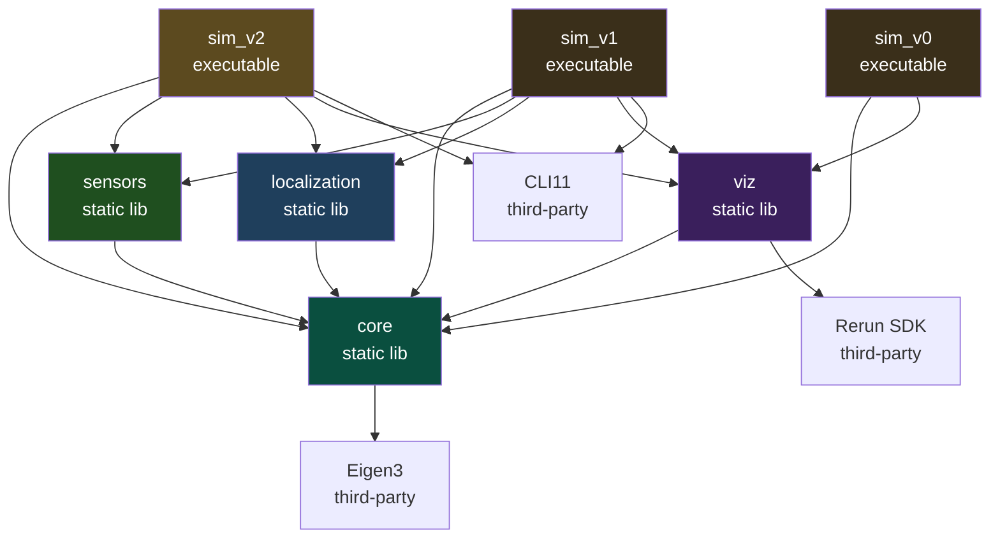
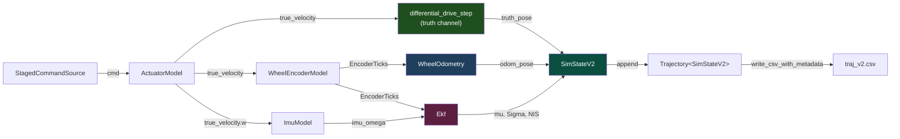

# MiniNav V2 阶段性总结

> 本文档是 MiniNav 项目 V2 阶段完成后的工程总结,记录了在该阶段引入
> EKF 传感器融合过程中的目标、架构、数学建模、关键设计决策、实验结论
> 与后续规划。定量实验报告见
> [`docs/experiments/v2_ekf_fusion.md`](experiments/v2_ekf_fusion.md);
> 数学推导见 [`docs/math/EKF_Foundations.md`](math/EKF_Foundations.md) 与
> [`docs/math/runge_kutta_integration.md`](math/runge_kutta_integration.md)。

---

## 0. 项目概述

V1 把"两条独立的不完美链路"打磨完整,并暴露了核心问题:开环轮式里程计
随时间无界漂移。V2 不再只是**测量**漂移,而是开始**对抗**它——引入第二个
传感器(陀螺仪)与一个概率融合框架(扩展卡尔曼滤波器,EKF),把编码器与
陀螺的读数融合成一个带不确定性的状态估计,并在线估计陀螺零偏(gyro bias)。

### 0.1 版本路线图

| 版本     | 主题          | 关键产出                                                                           |
|--------|-------------|--------------------------------------------------------------------------------|
| **V0** | 仿真基础设施      | 差分运动学 + 数据结构 + CSV / Rerun 双轨可视化 + 单元测试 + CI 雏形                                |
| **V1** | 噪声 + 里程计    | 工业级 actuator + encoder 噪声模型,带漂移的 odom 估计;暴露漂移问题                                |
| **V2** | EKF 状态估计    | 引入 IMU,6 维 EKF 融合 encoder + gyro,在线 bias 估计,RK4 过程模型,NIS 一致性诊断,20-seed RMSE 量化 |
| **V3** | 路径规划        | 占据栅格地图 + A\* 全局规划                                                              |
| **V4** | 控制 + ROS2 化 | Pure Pursuit 跟踪控制器,系统打包成 ROS2 节点                                               |
| **V5** | 完整仿真闭环      | 在 ROS2 内完成"给定目标点 → 规划 → 跟踪 → 到达"的端到端 demo                                      |
| **V6** | 实车部署        | Raspberry Pi 5 + 小车的 sim-to-real,室内导航视频                                        |

### 0.2 V2 版本总结

V0 是"骨架版本",V1 是"第一个有故事的版本",V2 是**第一个有答案、并且
诚实地说明答案边界的版本**。

V1 留下的漂移问题有了第一个解法:6 维状态 `[p_x, p_y, θ, v, ω, b_ω]` 的 EKF,
每步执行 `predict → update_encoder → update_imu` 三阶段,把编码器(观测
`v, ω`)与陀螺(观测 `ω + b_ω`)作为对隐状态的**两个独立观测**融合进来。
新增的 `b_ω` 维度让 filter 能在线估计陀螺零偏,而不是把一个有偏的陀螺读数
当成真实角速度。

V2 最重要的工程结论**不是**"融合降低了误差"(它确实降低了),而是:
**在线 bias 估计是档位相关的,且在高噪声下可能造成失稳**。这条"更具表达力
的模型只在新增状态足够可观测时才更好"的教训,是 V2 区别于一篇教科书 EKF
练习的地方——所有头条结论都是 20-seed 聚合值,而非挑出来的好看单次运行。

技术形态:在 V1 的工具链(**C++23 modules + Eigen3 + GoogleTest + Rerun +
CLI11**)上**没有新增任何第三方依赖**;`mininav_localization` 库新增 `Ekf`,
`mininav_sensors` 库新增 `ImuModel`;主循环 `sim_v2` 与 `sim_v0`/`sim_v1`
并存,三者共享 `core` 与 `viz`。

---

## 1. 目标与边界

### 1.1 V2 解决的问题

- **概率状态估计层**:用 EKF 替代 V1 的开环里程计。状态从 V1 隐含的
  `[x, y, θ]` 扩展为 6 维 `[p_x, p_y, θ, v, ω, b_ω]`,既估计位姿、也估计
  车体 twist 与陀螺零偏,并维护一个 6×6 协方差 Σ 描述估计的不确定性。
- **第二传感器层**:在 V1 留出的"无 IMU"空白上引入陀螺 `ImuModel`,
  测量模型 `ω_imu = ω_true + b_ω + N(0, σ_ω²)`,带白噪声与可漂移 bias。
- **观测建模层**:编码器与陀螺都被建模为**对隐状态的观测**而非控制输入。
  编码器观测 `(v, ω)`,陀螺观测 `ω + b_ω`;两者**分开做 update**。
- **在线 bias 估计层**:陀螺观测在 bias 列上耦合一个 `1`,使 bias 在编码器
  独立约束 `ω` 之后变得**联合可观测**;`q_bias_omega` 既是 bias 随机游走
  的过程噪声,也是在线学习的开关。
- **过程模型精度层**:把 V0 的一阶欧拉积分升级为可选的 RK4,补上 V1 §7.2
  欠下的技术债;RK4 解析 Jacobian 逐列与有限差分校验。
- **诊断与可复现层**:NIS(Normalized Innovation Squared)一致性诊断、
  `--q-scale`/`--r-scale` 调参旋钮、按版本组织的 Python 分析脚本,以及一份
  20-seed × 3-preset 的定量实验报告。

### 1.2 V2 不解决什么

- **不引入外感(exteroceptive)传感**。EKF 只融合本体感(proprioceptive)
  传感器(编码器 + 陀螺),位置从未被直接观测,其不确定性**沿运动方向
  无界增长**(见 §6.4)。这是融合的根本局限,不是调参问题,要等 V3+ 的
  地图 / scan matching 来解。
- **不做 bias 估计的门控**。V2 的在线 bias 估计是"无条件常开"(除非
  `--no-bias`)。高噪声下它会失稳——把这个失败如实暴露,是 V2 的教学价值;
  把它门控在可观测性检查之上是 V3+ 的工作(§7.1)。
- **不把 Q 拟合到诊断好看**。报告里 NIS 偏高(filter 轻微过自信)是被
  如实记录的,Q/R 用的是**物理推导值**,只用 `--q-scale`/`--r-scale` 做
  敏感性分析,不做自适应调参。
- **不引入闭环控制**。命令源仍是 V0 的开环 `StagedCommandSource`,Pure
  Pursuit 在 V4。
- **不引入参数文件 / YAML**。三档 preset 仍是硬编码 + CLI,与 V1 一致;
  YAML 在 V3 地图配置 / V4 控制器调参时才有真实价值。

---

## 2. 系统架构

### 2.1 模块依赖图



**关键关系**:V2 **没有新增库**,而是在 V1 的两个静态库里**加代码**:
`mininav_sensors` 新增 `ImuModel`,`mininav_localization` 新增 `Ekf` 与
`encoder_observation`。两库延续 V1 的"互不依赖"约定,只通过 plain struct
(`EncoderTicks` + 标量陀螺读数)在 `sim_v2` 主循环里间接耦合。

`Ekf` 与 V1 的 `WheelOdometry` **同处 `localization` 库**:`sim_v2` 让两者
**并排运行**,EKF 与里程计基线在**同一条 truth、同一组传感器流**上对比打分。
`sim_v0`/`sim_v1` 保留作为回归基线,不被 V2 替换。

### 2.2 数据流(V2 主循环)



V2 主循环每步执行:

1. 从 `CommandSource` 取当前命令 `cmd`
2. **ActuatorModel** 把 `cmd` 转成带执行噪声的 `true_velocity`(真值通道)
3. **WheelEncoderModel** 把 `true_velocity` 转成带打滑 + 量化的 `EncoderTicks`
4. **ImuModel** 把 `true_velocity.w()` 转成带白噪声 + bias 的 `imu_omega`
5. 记录本步**开始时**的 belief 快照(`ekf.mu()` / `ekf.Sigma()`,沿用
   V1 odom 的 "log-then-update" 约定)
6. 推进真值与里程计基线(`truth_pose`、`odom_pose`)
7. **EKF 三阶段**:`predict(dt)` → `update_encoder(z_enc, R_enc)` →
   `update_imu(imu_omega, R_imu)`,两次 update 各回填一个 NIS
8. 打包 `SimStateV2`(prior belief + 本步 NIS)→ `Trajectory::append`

### 2.3 三个估计器并存的对比设计

V2 的实验框架同时维护**三个估计器**,在同一条 truth 上打分:

| 标签                | 含义                                            | 隔离出的价值            |
|-------------------|-----------------------------------------------|-------------------|
| `odom`            | V1 轮式里程计(仅编码器,开环)                             | 基线                |
| `ekf (no bias)`   | 融合 encoder + gyro,**关闭 bias 估计**(`--no-bias`) | **传感器融合本身**的价值    |
| `ekf (with bias)` | 融合 encoder + gyro,**开启在线 bias 估计**(生产缺省)      | **在线 bias 估计**的价值 |

`odom` 与 `ekf (no bias)` 的差距 = 融合本身;`ekf (no bias)` 与
`ekf (with bias)` 的差距 = state augmentation。这种"逐层隔离"的设计让
"EKF 好在哪、好多少"成为一个可归因的问题,而不是一个笼统的 "−X %"。

---

## 3. 核心设计决策

### 3.1 6 维状态:为什么是这五个量 + bias

状态 `x = [p_x, p_y, θ, v, ω, b_ω]^T` 采用**常速(constant-velocity)**
过程模型:位置积分车体 twist `(v, ω)`,而 `(v, ω, b_ω)` 建模为随机游走。

- 把 `(v, ω)` 放进状态(而非当作控制输入),是因为 V2 把编码器视为**观测**——
  传感器速率不同、分开 update 容错更好,这要求隐状态里有"被观测的量"。
- `θ` 的推进 `θ + ω·dt` 是精确的,wrap 到 `(-π, π]` 留给 `predict()`。
- `b_ω` 是为"陀螺零偏"预留的维度——这正是 V1 §7.4 故意不建模 bias、好让
  V2 的扩状态"看起来有真实动机"的兑现。

### 3.2 编码器与陀螺:观测,而非控制输入

最直观的 EKF 写法是把里程计速度当控制输入 `u`,在 predict 里直接用。
V2 没有这么做,而是把编码器与陀螺**都建模为对隐状态的观测**:

| 传感器  | 观测量          | H 行                              |
|------|--------------|----------------------------------|
| 编码器  | `(v, ω)`     | 选取 `v, ω` 两行                     |
| 陀螺仪  | `ω + b_ω`    | 选取 `ω` **以及** `b_ω`              |

两个理由:

1. **传感器速率不同**。真实系统里编码器与 IMU 的采样率往往不一致;把它们
   作为独立观测,各自在到达时做一次 update,比硬塞进同一个 `u` 自然得多。
2. **容错**。分开 update 意味着某一路传感器异常时,可以单独门控/丢弃那一路,
   而不污染另一路。

### 3.3 在线 bias 的可观测性——V2 的头条工程教训

陀螺观测在 bias 列放了一个 `1`(`H_imu = [0,0,0,0,1,1]`)。**正是这处耦合**
让 bias 变得可观测:

- 仅靠陀螺,`z_imu = ω + b_ω` 无法把 `ω` 和 `b_ω` 分开——它们在一个方程里
  二选一不定。
- 编码器独立提供一个**不含 bias** 的 `ω` 约束后,`b_ω = z_imu − ω_enc` 才
  可辨识。这就是经典的传感器融合可观测性论点。

`ekf_bias_observability_tests.cpp` 用两条测试把这件事**可执行地**固化:
双传感器在场时 bias 在 5s 内收敛到真值附近(`GyroBiasIsLearnedWithinFiveSeconds`);
仅编码器时 bias 估计停在初值、`Σ_bb` 不收缩(`GyroBiasIsUnobservableFromEncoderAlone`)。

**但可观测 ≠ 总是该开。** 实验(§6.2)发现:当编码器与陀螺**两个通道都重度
含噪**时,可观测性赖以成立的"差" `z_imu − ω_enc` 被噪声主导,bias 变得
弱可观测,于是它充当了一个"噪声吸收池",把随机波动吸进一个游走的 heading 里。
`high-noise` 下 20 个 seed 有 19 个发散。这条**操作工作域(operating envelope)**
是 V2 最重要的结论:更具表达力的模型,只有在新增状态足够可观测、能被钉住时
才更好。

### 3.4 `q_bias_omega` 作为"开关 + 旋钮"的双重角色

`q_bias_omega` 是 bias 随机游走的单步方差 `(rad/s)²`,但它同时是在线 bias
学习的**开关**:

- `> 0`:filter 给 bias 留出过程噪声余量,在线估计/跟踪 bias(生产缺省)。
- `= 0`(`--no-bias`):`update_imu` 退化为 `z = ω` 的 5D 兼容行为,bias
  状态不再吸收陀螺白噪声——这正是 `ekf (no bias)` 基线。

把"是否在线估计 bias"编码成"过程噪声是否为零",而不是一个独立的 `bool`,
是因为这两件事在数学上本来就是一回事:没有过程噪声的状态维度就是一个常数,
不会被 update 推动。

### 3.5 Q 来自 actuator、R 来自 encoder——噪声的物理同源

EKF 的两个噪声矩阵都**从 V1 的物理参数推导**,而不是手调:

- **过程噪声 Q**:`Q_vv = α₁v² + α₂ω²`,`Q_ωω = α₃v² + α₄ω²`,与 V1
  `ActuatorModel` 用的是**同一组** Velocity Motion Model 的 α(Thrun §5.3);
  `Q_bb = q_bias_omega`。
- **观测噪声 R**:编码器的 2×2 `R` 由乘性打滑方差 `v_wheel²·σ_slip²` 加上
  量化 floor `Δ²/12/dt²`,经 `forward_kinematics` 的 Jacobian 传播得到
  (`encoder_observation.cpp`);量化 floor 既物理真实,又防止 `v=ω=0` 时
  `R=0` 退化。陀螺的 `R = σ_ω²`。

`--q-scale` / `--r-scale` 只**整体缩放**这些物理推导值做敏感性分析,缺省
`1.0` 即物理值。关键细节:`q_scale` 只乘进**EKF 的 Q**,上面 `ActuatorModel`
用的仍是未缩放的 `preset.alpha*`——**真实噪声不变,被缩放的只是滤波器对
模型的信任**。这样 `q_scale` 是一个纯粹的"调参旋钮",而不会偷偷改动真值。

### 3.6 数值稳定:Joseph form + 强制对称

协方差 update 用 **Joseph form** `Σ = (I−KH)Σ̄(I−KH)ᵀ + KRKᵀ` 而非简化的
`(I−KH)Σ̄`。Joseph form 对 Kalman 增益误差更鲁棒,且**结构上保证对称半正定**。
此外每步还显式强制 `Σ = ½(Σ + Σᵀ)`。`is_symmetric_positive_definite`
(对称性 + Cholesky 成功)是测试里反复检查的健康判据。

`update_imu` 是标量观测,本可以走通用 6×6 流程,但 V2 用 `Hᵀ = e_ω + e_b`
把它写成只取两列的标量形式;测试 `ekf_imu_update_tests` 验证它与通用 Joseph
流程**逐位相等**(bit-equal),确保优化没有引入数值差异。

### 3.7 RK4 过程模型 + 解析 Jacobian:正确,但不撬动这个基准

V1 §7.2 欠下的技术债——欧拉积分的圆周运动系统误差——在 V2 用可选的 RK4
偿还。一步内 `(v, ω)` 为常量时,RK4 塌缩为 Simpson 求积:

```
px += (dt/6)·v·[cosθ + 4·cos(θ+½ωdt) + cos(θ+ωdt)]   (py 用 sin)
```

只有 `px, py` 两行随积分器变化,其余为单位行。RK4 相对欧拉在 Jacobian 上
**新增了 `∂px/∂ω`、`∂py/∂ω` 的 `O(dt²)` 耦合项**(欧拉下这两项为 0)。

诚实的结论(§6.5):在 `dt = 0.01s` 且每步都有观测时,RK4 相对欧拉的精度
增益与零在统计上不可区分(+0.28% ± 1.43%,30 seed)。**RK4 之所以保留为
生产缺省,是因为它正确、且在此处零成本,而非因为它能撬动这个基准。** 这是
一个被如实报告的 null result。

### 3.8 解析 Jacobian 对两条积分路径都做有限差分校验

EKF 的协方差传播依赖解析 Jacobian `G = ∂g/∂x`。手推的 Jacobian 极易出错,
因此 `ekf_jacobian_finite_diff_tests.cpp` 用中心差分对 **Euler 和 RK4 两条
路径**都逐列校验解析值。这条测试是任何 EKF 改动的安全网——它把"我推的
Jacobian 对不对"变成一个可执行的判定,而不是一次纸面验算。

### 3.9 NIS:让"filter 是否自洽"成为一个可测量的量

`update_encoder` / `update_imu` 各返回本次更新的 NIS `= yᵀS⁻¹y`,理论上服从
自由度等于观测维度的 χ² 分布(编码器 2,陀螺 1),期望均值约为 2 与 1。
把它落进 CSV,就能事后检查 filter 的**一致性**:NIS 系统性偏高 = filter
过自信(报告的协方差小于实际 innovation 散布)。`ekf_nis_tests` 用二次型
性质守护它的计算。实验显示编码器 NIS 始终高于 2(§6.3)——这是被诊断出来、
而非被掩盖的过自信。

---

## 4. 工具链补充

V2 在工具链上的最大特点是:**没有引入任何新的第三方依赖**。EKF 全部用
已有的 Eigen3 实现,IMU 模型复用 V1 的 `RngFactory`。本节只记录与 V1 不同
的工程组织。

### 4.1 按版本组织 scripts/ 与 results/

V2 把 Python 分析脚本与产出图**按版本重组**:V1 的 `scripts/analyze_v1_drift.py`
迁为 `scripts/v1/analyze_drift.py`,产图迁入 `results/v1/`;V2 的脚本进
`scripts/v2/`,产图进 `results/v2/`。四个 V2 脚本各司其职:

| 脚本                      | 职责                                        | 产出                                                                                                   |
|-------------------------|-------------------------------------------|------------------------------------------------------------------------------------------------------|
| `analyze_ekf.py`        | mode-aware 主分析(读 CSV 的 `# mode` 头自动选图)    | `fusion_trajectory` / `fusion_rmse_over_time` / `nis_consistency` / `state_errors` / `bias_learning` |
| `analyze_covariance.py` | 位置协方差 3σ 椭圆随时间的演化                         | `covariance_ellipses` / `covariance_geometry` / `covariance_evolution.gif`                           |
| `analyze_integrator.py` | 单 seed 对的 RK4-vs-Euler 归因                 | `integrator_rmse`                                                                                    |
| `sweep_integrator.py`   | 多 seed 平均的 RK4-vs-Euler 归因(自己驱动 `sim_v2`) | `integrator_sweep`                                                                                   |

`analyze_integrator.py` / `sweep_integrator.py` 的可归因性依赖一个关键事实:
**EKF 不消耗 RNG**,所以同 seed 的 euler 与 rk4 两次运行共享逐位相同的
truth / encoder / IMU 流,估计差异只来自积分器。

### 4.2 CSV schema 扩展到 28 列

`SimStateV2` 的 CSV = V1 的 13 列 + `imu_omega` + 6 列 EKF 均值 + 7 列协方差
(含位置块 `xx, xy, yy` 供椭圆分析、以及 `θθ, vv, ωω, bb`)+ 2 列 NIS = 28 列。
CSV 头部注释在 V1 的 `seed`/`preset`/`dt`/`duration` 之外,额外嵌入 `mode` /
`integrator` / `q_scale` / `r_scale` / `bias`——任何一次 V2 运行都自包含地
说明"是哪次实验、用了什么旋钮",可精确重放。

---

## 5. 测试策略

V2 延续 V1 "每一个非平凡的工程约定都要有一条测试固化"的原则。EKF 是
V2 的数学核心,测试覆盖也最厚:

| 测试文件                                   | 关键覆盖                                                      |
|----------------------------------------|-----------------------------------------------------------|
| `ekf_predict_tests.cpp`                | predict 步的均值推进与协方差增长;θ 的 wrap                             |
| `ekf_jacobian_finite_diff_tests.cpp`   | 解析 Jacobian 对 **Euler 和 RK4 两条路径**逐列与中心差分一致(§3.8)         |
| `ekf_encoder_update_tests.cpp`         | 编码器 2D 观测的 Kalman update;Joseph form 的对称半正定               |
| `ekf_imu_update_tests.cpp`             | 陀螺标量 update 与通用 5×5 Joseph 流程**逐位相等**(§3.6)               |
| `ekf_bias_observability_tests.cpp`     | 双传感器下 bias 5s 内可学;仅编码器时 bias 不可观测(§3.3)                   |
| `ekf_integrator_consistency_tests.cpp` | EKF 的 RK4 与仿真真值 `differential_drive_step` 共用同一 `rk4_step` |
| `ekf_nis_tests.cpp`                    | NIS 二次型 `yᵀS⁻¹y` 的计算正确性(§3.9)                             |
| `ekf_fusion_rmse_tests.cpp`            | 融合估计相对纯编码器的 RMSE 比值落在阈值内(回归护栏)                            |
| `encoder_observation_tests.cpp`        | `decode_encoder` / `encoder_noise_covariance` 的解码与 R 推导   |
| `imu_model_tests.cpp`(sensors)         | 白噪声/ bias 随机游走的统计性质;σ=0 / rw=0 不消耗 RNG                    |

### 5.1 测试名即"工程主张"

延续 V1 的命名风格,几条测试名本身就是一句英文的工程断言:

| 测试名                                      | 它固化了哪条工程意图                |
|------------------------------------------|---------------------------|
| `GyroBiasIsLearnedWithinFiveSeconds`     | 双传感器下 bias 可观测、可学习(§3.3)  |
| `GyroBiasIsUnobservableFromEncoderAlone` | bias 可观测性依赖编码器的独立 ω(§3.3) |
| (jacobian 参数化测试,跨两个 integrator)          | 解析 Jacobian 正确性(§3.8)     |
| (imu update 逐位相等测试)                      | 标量优化未引入数值差异(§3.6)         |

如果某条断言被违反,失败测试名直接指出违反了哪条原则。

### 5.2 可复现性回归仍然成立

V1 §6.2 的"主程序输出层面可复现"在 V2 依然有效,且因 EKF 不消耗 RNG 而
更强:同 seed/preset 下两次 `sim_v2 --no-viz` 的 CSV(去掉 `generated_at`)
应空 diff。这条 diff 同时检验 RNG 工厂稳定性、所有 σ=0 跳过 RNG 的约定、
EKF 的纯函数性,以及主循环无隐式状态。

---

## 6. 关键实验结论

完整报告见 [`docs/experiments/v2_ekf_fusion.md`](experiments/v2_ekf_fusion.md)。
所有头条数字都是 **20-seed 聚合值**(每个 preset × 估计器),而非单次运行。
三档 preset 的真实陀螺 bias 分别为 0.01 / 0.02 / 0.03 rad/s。

### 6.1 融合降低误差,但幅度档位相关

Position RMSE [m](均值)与 heading RMSE [deg]:

| preset       | `odom` pos | `ekf nb` pos | `ekf +bias` pos | `odom` yaw | `ekf +bias` yaw |
|--------------|-----------:|-------------:|----------------:|-----------:|----------------:|
| low-noise    |      0.557 |        1.171 |       **0.285** |      2.31° |       **1.65°** |
| default      |      2.267 |        2.337 |       **2.078** |      9.36° |          11.95° |
| high-noise   |      5.724 |    **3.472** |          17.663 |     24.69° |          80.51° |

诚实的总结**不是**单一的 "−X %":`low-noise` 下完整 EKF 决定性胜出
(position 相对 odom **−48.9%**);`default` 下只小幅胜出(**−8.3%**)且
seed 间方差很大;`high-noise` 下完整 EKF 反而**比 odom 更差**,而 *no-bias*
EKF 好 −39%。

### 6.2 在线 bias 估计的工作域(operating envelope)

V2 最重要的结论:最佳估计器**随噪声档位改变**。

| preset     | 最佳估计器             | bias 估计裁决                               |
|------------|-------------------|-----------------------------------------|
| low-noise  | `ekf (with bias)` | **不可或缺**——bias 是主导误差源                   |
| default    | `ekf (with bias)` | 略有帮助(相对 no-bias −11%)                   |
| high-noise | `ekf (no bias)`   | **有害**——把 heading RMSE 从 19.6° 吹到 80.5° |

机理见 §3.3:高噪声下 bias 弱可观测,沦为噪声吸收池,20 seed 里 19 个发散。
成熟系统会把这类 state augmentation **门控在可观测性之上**,而非无条件常开。

### 6.3 Filter 轻微过自信(NIS)

编码器 NIS 均值始终高于期望的 2(low/default/high 分别约 4.16 / 4.66 / 9.45),
落在 95% 带内的比例低于 95%:filter 报告的协方差小于实际 innovation 散布,
即 Q 被略微低估。根因是常速过程模型无法表征仿真 actuator 每步注入的白噪声
(速度维度尤其过自信)。它在 pose 上仍一致,可用 `--q-scale > 1` 修正;
报告里给的是**未调**的物理值。

### 6.4 位置不可观测——融合也救不了

把 2 维位置协方差块画成 3σ 椭圆:一次 20s `default` 运行里椭圆面积增长
约 **1.9×10⁵×**,长半轴到 4.13 m、各向异性约 9.8,长轴方向追随 heading。
位置从未被直接观测,编码器 + 陀螺只约束 `(v, ω, b_ω)`,所以即便完整融合,
位置不确定性仍**沿运动方向无界增长**。这干净地说明了为什么 V3+ 需要一个
定位模态(地图 / GPS / scan matching)——这不是 EKF 调参问题。

---

## 7. 用法

### 7.1 运行 sim_v2

```bash
# 默认:随机 seed,default preset,RK4 积分器,在线 bias 估计
./build/clang18-debug/sim_v2

# 完全可复现(未传 --seed 时其值打印到 stdout)
./build/clang18-debug/sim_v2 --seed 42 --preset default

# 关闭在线 bias 估计(写独立文件,避免覆盖上面的 with-bias 运行)
./build/clang18-debug/sim_v2 --seed 42 --preset default --no-bias --out data/traj_v2_nobias.csv

# 敏感性旋钮:只缩放 EKF 的 Q / R(真值/测量不变)
./build/clang18-debug/sim_v2 --q-scale 2.0      # 更不信任运动模型
./build/clang18-debug/sim_v2 --r-scale 0.5      # 更信任传感器

# RK4-vs-Euler 归因:同 seed/preset,仅积分器不同
./build/clang18-debug/sim_v2 --integrator euler --out data/traj_v2_euler.csv
./build/clang18-debug/sim_v2 --integrator rk4   --out data/traj_v2_rk4.csv

# Headless / CI:仅写 data/traj_v2.csv
./build/clang18-debug/sim_v2 --no-viz
```

### 7.2 Rerun 视图

`sim_v2` 复用 V1 的三轨迹(`cmd_traj` / `truth` / `odom`)并叠加 EKF:

| Entity Path               | 含义                                      |
|---------------------------|-----------------------------------------|
| `/world/robot/ekf`        | EKF 融合位姿估计(trail 在 `/world/trails/ekf`) |
| `/plots/bias_omega/ekf`   | 在线陀螺 bias **估计** `b_ω` 随时间              |
| `/plots/bias_omega/truth` | 仿真器的**真** bias,直接对照                     |

`bias_omega` 这对曲线是 V2 最直观的演示:在 Time Series 视图里能看到 `b_ω`
从 0 启动、几秒内收敛到真值附近——state augmentation 的回报,以及(在
`high-noise` 下)它无法稳定下来的失败现场。

### 7.3 生成实验图

```bash
source .venv/bin/activate

# per-run 诊断(读上面两次运行):三轨迹、累积 RMSE、NIS、3σ 状态误差、bias
python scripts/v2/analyze_ekf.py --input data/traj_v2.csv --ekf-no-bias data/traj_v2_nobias.csv

# 位置协方差 3σ 椭圆演化(静态 + 几何 + 动画 GIF)
python scripts/v2/analyze_covariance.py --input data/traj_v2.csv

# RK4-vs-Euler 归因:单 seed 对 / 多 seed 平均
python scripts/v2/analyze_integrator.py --euler data/traj_v2_euler.csv --rk4 data/traj_v2_rk4.csv
python scripts/v2/sweep_integrator.py --n-seeds 30 --preset default
```

---

## 8. 已知限制 / 技术债

### 8.1 在线 bias 估计未门控

V2 的 bias 估计无条件常开(除非 `--no-bias`),`high-noise` 下会发散(§6.2)。
**计划**:V3+ 把 bias 估计门控在一个可观测性或 innovation 幅度检查上——
当两通道差被噪声主导时自动退回 no-bias 行为。

### 8.2 Q 被略微低估,filter 过自信

编码器 NIS 系统性高于 2(§6.3)。**计划**:加入轻量 Q 调参(或自适应 Q),
把 NIS 拉向理论值;V2 选择如实报告未调值而非把 Q 拟合到诊断好看。

### 8.3 位置漂移是根本性的

仅靠本体感传感,位置不确定性沿运动方向无界增长(§6.4)。这**不是** EKF
能解决的问题。**计划**:V3+ 引入外感传感 / 建图(地图匹配 / scan matching)
作为定位模态。

### 8.4 常速模型不表征逐步 actuator 白噪声

过程模型假设 `v, ω` 缓变,但仿真 actuator 每步注入新白噪声,导致速度维度
严重过自信(真实速度常落在 filter 紧致的速度协方差之外)。对 pose 影响不大
(编码器每步重新锚定速度),但它是编码器 NIS 高于 2 的诚实根因。

---

## 9. 下一版本 V3 路线

V2 把"概率状态估计 + 诚实的实验框架"打磨完。V2 留下的核心问题——**位置
不可观测**——是 V3 的直接动机。

V3 计划做几件事:

1. **占据栅格地图(Occupancy Grid)**:把环境建模成可查询的栅格,为规划与
   未来的 scan matching 提供地图表示。
2. **A\* 全局规划**:在栅格图上做"起点 → 目标"的全局路径搜索,产出一条
   可跟踪的几何路径。
3. **(铺垫)外感定位模态**:V2 已经证明本体感融合无法约束位置;V3+ 的地图
   一旦就位,scan matching / 地图匹配就能给 EKF 提供第一个**直接观测位置**
   的更新,把 §6.4 的无界椭圆钉住。

**V2 为 V3 准备了什么**:

- 6 维 EKF + 协方差传播框架 → 新增一个"位置观测" update 只是再加一对
  `(z, R)` 与对应 `H` 行,predict/Joseph 流程不动。
- `update_*` 的"传感器无关"接口(只吃 `z, R`)→ scan matching 解出的
  位姿观测可以直接喂进同一套 update。
- 按版本组织的 `scripts/v2/` / `results/v2/` 与 mode-aware 分析脚本 →
  `scripts/v3/` 直接照搬这套组织方式。
- NIS 诊断 → V3 引入新观测后,一致性是否仍成立可立即量化。

---

## 附录 A:V2 阶段文件清单

V2 在 V1 基础上**新增 / 扩展**的文件(不修改 V0/V1 主循环):

```
src/
├── core/                              # 扩展
│   ├── types.{ixx,cpp}                # + SimStateV2 (含 ekf_mean/ekf_cov/imu_omega/nis_*)
│   └── csv_format.{ixx,cpp}           # + csv_header/csv_row(SimStateV2),28 列
├── sensors/                           # 扩展
│   └── imu_model.{ixx,cpp}            # ★ ImuModel:gyro 白噪声 + 可漂移 bias
├── localization/                      # 扩展
│   ├── ekf_state.ixx                  # ★ Vec6/Mat6, StateIdx, EkfState6
│   ├── ekf.{ixx,cpp}                  # ★ Ekf:predict + update_encoder + update_imu
│   └── encoder_observation.{ixx,cpp}  # ★ decode_encoder + encoder_noise_covariance
├── viz/                               # 扩展
│   └── sim_state_log.{ixx,cpp}        # + log_to_rerun(SimStateV2, ...);EKF pose + bias 曲线
└── apps/
    └── sim_v2_main.cpp                # ★ V2 主循环,与 sim_v0/sim_v1 并存

tests/
├── sensors/
│   └── imu_model_tests.cpp            # ★
└── localization/                      # ★ 8 个 EKF 测试 + encoder_observation
    ├── ekf_predict_tests.cpp
    ├── ekf_jacobian_finite_diff_tests.cpp
    ├── ekf_encoder_update_tests.cpp
    ├── ekf_imu_update_tests.cpp
    ├── ekf_bias_observability_tests.cpp
    ├── ekf_integrator_consistency_tests.cpp
    ├── ekf_nis_tests.cpp
    ├── ekf_fusion_rmse_tests.cpp
    └── encoder_observation_tests.cpp

scripts/v2/                            # ★ 按版本组织
├── analyze_ekf.py
├── analyze_covariance.py
├── analyze_integrator.py
└── sweep_integrator.py

docs/
├── math/
│   ├── EKF_Foundations.md             # ★ EKF predict/update、Jacobian、Joseph form
│   └── runge_kutta_integration.md     # ★ RK4 过程积分及其解析 Jacobian
├── experiments/
│   └── v2_ekf_fusion.md               # ★ 20-seed 定量实验报告
└── v2_summary.md                      # 本文档

results/v2/                            # ★ 全部 V2 产出图 + covariance_evolution.gif
```

---

## 附录 B:V2 关键命令速查

```bash
# 构建
cmake --preset clang18-debug && cmake --build --preset build-debug -j

# 运行
./build/clang18-debug/sim_v2                                   # 默认,随机 seed
./build/clang18-debug/sim_v2 --seed 42 --preset default        # 可复现
./build/clang18-debug/sim_v2 --seed 42 --preset default --no-bias --out data/traj_v2_nobias.csv
./build/clang18-debug/sim_v2 --integrator euler --out data/traj_v2_euler.csv
./build/clang18-debug/sim_v2 --integrator rk4   --out data/traj_v2_rk4.csv
./build/clang18-debug/sim_v2 --no-viz                          # CI / 回归

# 看帮助
./build/clang18-debug/sim_v2 --help

# 跑测试(localization 标签覆盖全部 EKF 测试)
ctest --preset test-debug --output-on-failure
ctest --preset test-debug -L localization --output-on-failure
ctest --preset test-debug -R Ekf --output-on-failure

# 可复现性回归(核心证据;EKF 不消耗 RNG)
./build/clang18-debug/sim_v2 --no-viz --seed 42 --preset default
cp data/traj_v2.csv /tmp/run_a.csv
./build/clang18-debug/sim_v2 --no-viz --seed 42 --preset default
diff <(grep -v '^# generated_at' /tmp/run_a.csv) \
     <(grep -v '^# generated_at' data/traj_v2.csv)             # 应空 diff

# Python 后处理
source .venv/bin/activate
python scripts/v2/analyze_ekf.py --input data/traj_v2.csv --ekf-no-bias data/traj_v2_nobias.csv
python scripts/v2/analyze_covariance.py --input data/traj_v2.csv
python scripts/v2/sweep_integrator.py --n-seeds 30 --preset default
```

---
