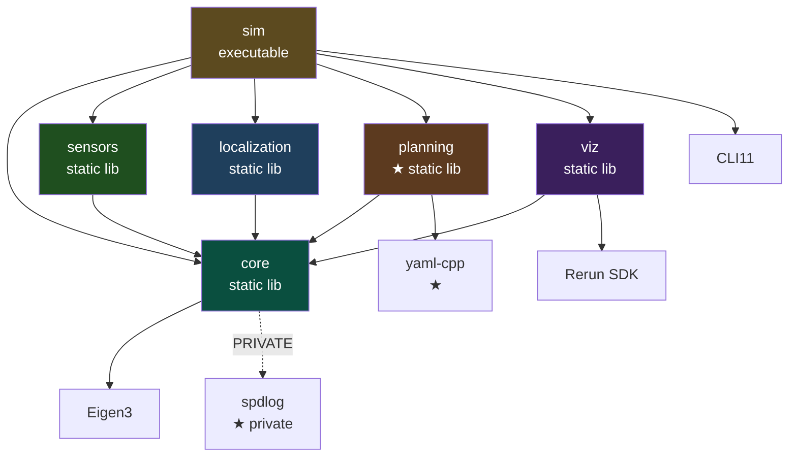
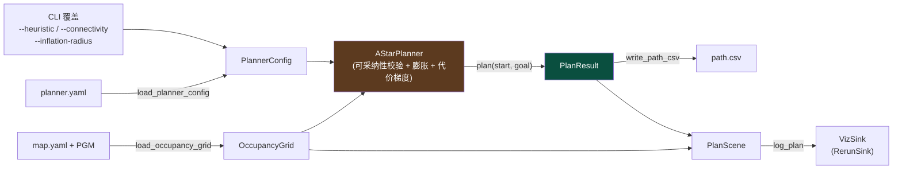
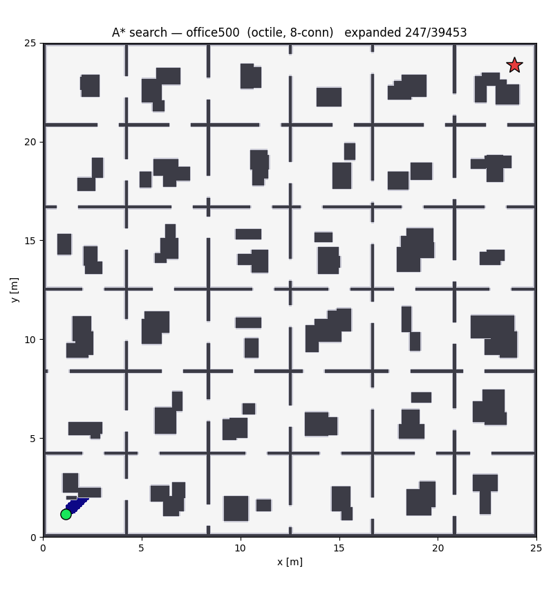

# MiniNav V3 阶段性总结

> 本文档是 MiniNav 项目 V3 阶段完成后的工程总结,记录了在该阶段引入占据栅格
> 地图与 A\* 全局规划过程中的目标、架构、关键设计决策、测试策略、实验结论与
> 后续规划。定量实验报告见
> [`docs/experiments/v3_planning.md`](experiments/v3_planning.md);
> 数学推导见 [`docs/math/astar_planning.md`](math/astar_planning.md)。

---

## 0. 项目概述

V2 把"概率状态估计 + 诚实的实验框架"打磨完,同时留下一个根本性问题:仅靠
本体感传感(编码器 + 陀螺),**位置永远不可观测**,协方差沿运动方向无界增长。
这不是调参能解决的,需要来自环境的外感信息。V3 没有直接去钉住这条漂移
(那需要 scan matching / 地图匹配),而是先建起**地图**这件基础设施,并在其上
交付第一个完整的"我要去哪、怎么规划过去"的能力:占据栅格地图 + A\* 全局规划。

### 0.1 版本路线图

| 版本     | 主题          | 关键产出                                                                                  |
|--------|-------------|---------------------------------------------------------------------------------------|
| **V0** | 仿真基础设施      | 差分运动学 + 数据结构 + CSV / Rerun 双轨可视化 + 单元测试 + CI 雏形                                       |
| **V1** | 噪声 + 里程计    | 工业级 actuator + encoder 噪声模型,带漂移的 odom 估计;暴露漂移问题                                       |
| **V2** | EKF 状态估计    | 6 维 EKF 融合 encoder + gyro,在线 bias 估计,RK4 过程模型,NIS 一致性诊断,20-seed RMSE 量化               |
| **V3** | 全局路径规划      | 占据栅格(PGM + map.yaml)、欧氏距离膨胀、A\*(4/8 连通,可采纳性校验)、YAML 配置、spdlog / gmock、`sim --map` 规划模式 |
| **V4** | 闭环路径跟踪      | Regulated Pure Pursuit 在纯 C++ 仿真里沿 A\* 路径闭环(控制器输入 EKF 估计),控制误差与定位误差分开量化 |
| **V5** | ROS 2 + Nav2 集成 | 仿真 / EKF 节点(标准消息)、A\* 与 Pure Pursuit 做成 Nav2 插件,RViz2 点目标导航 |
| **V6** | 实车部署        | Raspberry Pi 5 + 小车的 sim-to-real,室内导航视频                                               |

> 2026-09-28 调整:V4 / V5 重新划分——V4 只在纯 C++ 仿真里完成闭环路径跟踪,
> ROS 2 + Nav2 集成整体移到 V5(理由见 [`project_overview.md`](project_overview.md)
> §6 V4)。上表的 V4 / V5 两行已按调整后的计划更新,§9 同。

### 0.2 V3 版本总结

V0 是"骨架版本",V1 是"第一个有故事的版本",V2 是"第一个有答案、并诚实说明
答案边界的版本"。V3 是**第一个把环境纳入模型的版本**:机器人不再只关心自己
走了多远,而是开始回答"周围哪里能走、到目标的最短路是什么"。

里程碑指标全部达标:

| 指标    | 目标                   | 结果                                            |
|-------|----------------------|-----------------------------------------------|
| 规划耗时  | 200×200 单次 ≤ 50 ms(Release) | p95 **3.94 ms**(随机障碍);蛇形迷宫近似最坏情况中位 ~2.7 ms |
| 路径最优性 | 与最短路偏差 ≤ 1 cell      | 三张手画地图偏差 **0 cell**;蛇形迷宫上精确等于解析最短长度          |
| 可达性   | 不可达返回失败,不死循环         | ✅ 单测守护                                        |
| 确定性   | 同输入 `path.csv` 逐字节一致 | ✅ A\* 不消耗 RNG                                  |
| 单元测试  | `planning` 标签全绿       | ✅ 62 条(全套 184 条)                              |

V3 最重要的两条工程结论都**不是**"A\* 很快"(它确实很快):

1. **最优性保证是有条件的。** A\* 的"首次出队即最优"建立在启发式一致的前提上,
   而一致性取决于启发式与连通度的**搭配**。Manhattan 在 8 连通下高估对角步,
   office500 上路径比最优长 1.13 cell——超出指标,却没有任何报错。V3 把这条
   规则收进类型层(`is_admissible`),由配置解析和规划器构造两处把关(§3.5)。
2. **测试要测对的东西。** 最初的 200×200 计时单测用空地图对角线——启发式在那里
   是精确的,只展开 200 个节点,测的是**最好情况**;而且断言只在 Release 下生效,
   CI 跑的却是 Debug,等于从未执行过。V3 用一张蛇形迷宫作为压力图,并补了
   与构建类型无关的确定性断言(§5.2)。

技术形态:V3 新增 `planning` 静态库——这是 V1 之后第一次加库;引入三个第三方
依赖(yaml-cpp、spdlog、gmock);单一 `sim` 二进制演进出 `--map` 规划模式,而不是
另起一个 `sim_v3`(§2.3)。

V3 的 PR 序列:

| PR       | 内容                                              |
|----------|-------------------------------------------------|
| PR0 #67  | `planning` 库骨架 + 几何类型 + yaml-cpp                |
| PR1 #68  | `OccupancyGrid` 核心 + world/grid 变换               |
| PR2 #69  | PGM(P2/P5)+ `map.yaml` 地图加载                     |
| PR3 #70  | 欧氏距离变换 + 障碍物膨胀                                  |
| PR4 #71  | A\* + `GlobalPlanner` 门面 + 代价梯度                  |
| PR-Infra #72 | spdlog 日志后端 + `VizSink` 接口 + gmock 测试            |
| PR5 #73  | `sim --map` 集成 + Rerun 规划视图 + 实验脚本与报告 + 可采纳性校验 + 压力测试 |
| 收尾 #74   | 本文档、`docs/math/astar_planning.md`、README / CHANGELOG 等 |

---

## 1. 目标与边界

### 1.1 V3 解决的问题

- **地图表示层**:`OccupancyGrid`——二维占据栅格,三值占据(free / occupied /
  unknown),从 ROS `map_server` 风格的 PGM + `map.yaml` 加载,提供 world↔grid
  变换、边界检查与占据查询。
- **代价层**:障碍物膨胀。多源欧氏距离变换算出每个 cell 到最近障碍的距离,
  半径内的 cell 标为占据,把"机器人有半径"编码进地图;同一张距离场还驱动可选的
  代价梯度。
- **全局规划层**:`AStarPlanner`——4/8 连通,Manhattan / Euclidean / Octile 三种
  启发式,tie-break,8 连通防穿角,以及启发式与连通度的可采纳性校验。
- **规划器门面层**:`GlobalPlanner` 抽象基类,签名形态对齐
  `nav2_core::GlobalPlanner`(用项目自己的 `Pose2D` / `Path`,不依赖 ROS 类型)。
- **外部配置层**:引入 yaml-cpp,把膨胀半径、启发式、连通度、`allow_unknown`、
  `cost_weight` 从硬编码搬进 `config/planner.yaml`,CLI 可逐项覆盖。这是 V1/V2
  一直推迟、到 V3 才有真实价值的能力。
- **工程升级层**:spdlog 替换内置 logger(接口不变);抽出 `VizSink` 接口,用
  gmock 给 viz 层补上不依赖 Rerun Viewer 的单测。
- **可视化与实验层**:`sim --map` 把地图、膨胀层、路径、起止点推到 Rerun,并写
  逐字节确定的 `path.csv`;`scripts/v3/` 产出耗时基准、最优性对比、规划总览图和
  A\* 搜索过程动画。

### 1.2 V3 不解决什么

- **不做路径跟踪 / 闭环控制**。V3 只产出一条几何路径,怎么沿它走是 V4 Pure
  Pursuit 的事。
- **不做动态障碍 / 重规划**。地图静态,规划是一次性的;局部规划器与周期重规划
  属于 V5+。
- **不把地图反馈进 EKF**。V3 建立了地图表示,但没有用它做 scan matching /
  地图匹配来钉住 V2 的位置漂移(§8.4)。
- **不做路径平滑**。8 连通栅格路径是带台阶的折线(§8.1)。
- **不引入 ROS 2**。`GlobalPlanner` 只在接口形态上对齐 nav2,代码仍是纯 C++ 库。
- **不在规划入口里跑 EKF**。规划起点 `start` 是一个普通 `Pose2D`,完整系统里它
  就是 EKF 的估计位姿;但规划入口刻意保持无 RNG、逐字节确定,EKF → start 的
  注入留给机器人重新动起来的 V4/V5(§3.8)。

---

## 2. 系统架构

### 2.1 模块依赖图



**关键关系**:

- `planning` 只依赖 `core`(`Pose2D` 等几何类型)与 yaml-cpp。它**不知道**地图
  从哪来、路径给谁用:`OccupancyGrid` 进、`Path` 出。它与 `sensors` /
  `localization` 没有编译期依赖,延续"层与层之间只通过 plain 类型耦合"的约定。
  将来 SLAM 产出的栅格地图、实车的起点位姿,都能不改一行地喂给同一个规划器。
- `viz` **不依赖** `planning`:可视化只认纯几何(`PlanScene` 里只有
  `Eigen::Vector2d` 与 `Pose2D`),把栅格与路径转成点集是 app 的职责(§3.9)。
- spdlog 以 **PRIVATE** 方式链接进 `core`:`logger.ixx` 的对外接口不暴露任何
  spdlog 类型,下游看不到它。
- gmock 只进测试(`viz_tests`),不进任何产品库。

### 2.2 数据流(规划模式)



规划模式的一次运行:

1. `--map` 指向 `map.yaml`,`load_occupancy_grid` 读 YAML、解析 PGM、三值化并做
   $y$ 翻转,得到 `OccupancyGrid`。
2. 配置:有 `--config` 就读 `planner.yaml`,否则用 `PlannerConfig{}` 默认值;
   `--heuristic` / `--connectivity` / `--inflation-radius` 逐项覆盖。
3. 起止点:`--goal` 必填,`--start` 缺省为栅格中心,都是 world 坐标(米)。
4. `AStarPlanner{grid, cfg}`:先校验启发式与连通度的组合(§3.5),再按
   `inflation_radius` 在内部膨胀,`cost_weight > 0` 时预算代价梯度场。
5. `plan(start, goal)` 返回 `PlanResult`(`path` / `success` / `expanded_nodes` /
   `plan_time_ms`),指标打到 stdout。
6. 写 `path.csv`(确定性产出,不含耗时,§4.3)。
7. 可视化:`build_plan_scene` 把原始障碍、膨胀新增的 cell、路径转成点集,
   `log_plan` 按约定的实体树推到 `VizSink`(§7.2)。

与 V0–V2 逐时间步的 `SimState` + `Trajectory<T>` 不同,规划的产出是一次性的
"地图 + 一条路径 + 一组指标",所以 V3 没有硬套 per-step 状态流,而是定义了独立的
`PlanResult` 与 `path.csv`。per-step 模式会在 V4 机器人重新运动时自然回归。

### 2.3 一个 `sim`,两种模式

V3 **演进**了现有的 `sim`,而不是并排新增一个 `sim_v3`:

- 不带 `--map`:V2 的 EKF 运动仿真,主循环代码未改动;
- 带 `--map`:一次性、无 RNG 的全局规划,在构造任何仿真组件之前就分流返回。

这是 V2 收尾后确立的版本策略的直接应用:`main` 只保留当前最佳设计,每个里程碑
由 git tag(V3 = `v0.4.0`)+ 回顾文档保存,回归保护靠测试与确定性输出,而不是
让旧二进制并存。

---

## 3. 核心设计决策

### 3.1 坐标约定:origin 是左下角

`origin` 取栅格**左下角**的 world 坐标(对齐 ROS `map_server`),cell 中心为
`origin + (c + 0.5)·resolution`,`world_to_grid` 用 floor。这修正了规划草案里
"origin = cell (0,0) 中心"的写法,让 PGM 加载与 ROS 地图可以直接对接。三个配套
约定:

- 格心往返一致(`RoundTripCellCenterIsStable`);
- 负坐标也按 floor 落进正确的 cell(`WorldToGridHandlesNegativeWorldCoords`);
- `at()` 对越界返回占据——等价于地图外围一圈墙,A\* 的邻居生成因此无需边界
  判断(`OutOfBoundsReadsAsOccupied`)。

### 3.2 地图 IO:只做 PGM,零新依赖

地图 = PGM 灰度图 + `map.yaml`(`image` / `resolution` / `origin` 必填,
`occupied_thresh` / `free_thresh` / `negate` 可选,缺省取 ROS 默认值)。决策是
**只支持 PGM(P2 与 P5)**,解析器自己写:

- P2 是 ASCII,手画的小测试地图可以直接 diff、直接审;
- P5 是二进制,程序化生成的大图(office500,约 250 KB)用它;
- PNG 需要引入图像库(哪怕是 header-only 的 stb_image),V3 不需要它。

三值化沿用 ROS 语义:`occ = negate ? p/max : 1 − p/max`,超过 `occupied_thresh`
为占据,低于 `free_thresh` 为空闲,其余为未知。图像行自上而下、world 的 y 轴向上,
加载时做 y 翻转(`CorridorYAxisIsFlippedOnLoad` 用一个非对称的柱子锁住方向)。
缺文件、缺字段、magic 错误、像素数不符,都抛带路径的清晰异常。

### 3.3 膨胀:欧氏距离变换,而不是 BFS 阶梯

`obstacle_distance_cells` 采用 ROS `costmap_2d` 膨胀层的做法:最小堆按距离出队,
每个 cell 记住自己的"最近障碍源"并传给 8 邻居,邻居的距离是到该源的**直线
距离**。结果是(近似)精确的欧氏距离,而不是 BFS 的 Manhattan / Chebyshev 阶梯
——后者会让膨胀出的"圆"变成菱形或方形。`inflate` 把距离 ≤ `r / resolution` 的
cell 标为占据;半径内的 unknown 也保守地变为占据。

这张距离场是一个可复用的底座:`inflate` 用它做布尔膨胀,A\* 的代价梯度也用它
(§3.6)。PR3 只暴露距离场这个原语,没有预先设计一个投机性的 `Costmap` 类型。

### 3.4 A\*:扁平表 + 二叉堆 + 惰性删除

- `g` / `parent` / `closed` 是三张长度 `width × height` 的扁平数组,按行主序
  索引——连续内存、缓存友好,没有哈希表的开销;
- open 集是 `std::priority_queue`。它不支持 decrease-key,所以 `g` 变小时直接压入
  新条目,出队时用 closed 表跳过过期条目(惰性删除);
- 目标首次出队即返回。这在一致启发式下是最优的(证明见
  [`astar_planning.md`](math/astar_planning.md) §4.3),也是 closed 节点永不重开
  的前提;
- 起止点在界外或障碍上直接判失败,**不做就近吸附**——吸附策略是上层的决定;
- 回溯出 cell 序列后转成 world waypoint,`yaw` 取指向下一个点的方向,末点沿用
  前一段方向。

### 3.5 启发式与连通度必须配对——V3 的头条工程教训

A\* 的最优性依赖启发式**一致**(因而可采纳):不高估剩余代价。在无障碍栅格上:

- 4 连通的精确代价是 Manhattan 距离 $\Delta x + \Delta y$;
- 8 连通的精确代价是 Octile 距离 $(\Delta x + \Delta y) + (\sqrt2 - 2)\min(\Delta x, \Delta y)$。

两者有障碍时都是真实代价的下界,且一致;Euclidean 在两种连通度下都可采纳但偏松。
唯一出问题的组合是 **Manhattan + 8 连通**:对角一步的真实代价是 √2,Manhattan
记为 2,它高估了。office500 上实测(8 连通、膨胀 0):

| 启发式       | 路径长度 [m]              | 扩展节点   |
|-----------|-----------------------|--------|
| octile    | 34.1843               | 40 945 |
| euclidean | 34.1843               | 55 398 |
| manhattan | **34.2408**(+1.13 cell) | 976    |

Manhattan 的搜索变得贪心:扩展节点骤减 97%,路径却比最优长 1.13 cell——超出指标,
而且**悄无声息**:规划成功,路径看起来也正常。数学上它等价于膨胀系数 √2 的加权
A\*,只保留 $C \le \sqrt2\,C^*$ 的宽松界,不再保证最优(推导见
[`astar_planning.md`](math/astar_planning.md) §5.3)。

处理方式是把规则放进**类型层**,只写一次:`grid_types.ixx` 导出
`constexpr is_admissible(Heuristic, Connectivity)`,由两个入口共用——

- `parse_planner_config` / `load_planner_config`:配置文件里的非法组合抛
  `std::runtime_error`。注意 `connectivity` 缺省为 8,所以只写一行
  `heuristic: manhattan` 同样会被拒绝;
- `AStarPlanner` 构造:抛 `std::invalid_argument`。CLI 的 `--heuristic` /
  `--connectivity` 覆盖是在配置加载**之后**逐项改字段的,只有构造期检查能拦住
  它们,所以这一处是不可省的最后防线。

Python 侧的两个脚本执行同一条规则:`animate_search.py` 自己复刻 A\*,
`optimality_check.py` 驱动 `sim`。另一个副产品:`optimality_check.py` 之前没有传 `--heuristic`,实际跑的是
`PlannerConfig{}` 默认的 Euclidean,报告却写"验证了 Octile"。现在启发式显式
传入(默认 Octile,与 `planner.yaml` 一致),重跑后数字不变,但结论与实验终于
对得上了。

### 3.6 代价梯度:opt-in 的"离障碍远一点"

`cost_weight = w > 0` 时,进入 cell $m$ 的代价额外加上
$w \cdot \min(1, e^{-(d(m) - 1)})$,$d$ 是到最近障碍的距离(cell)。紧贴障碍附加
$w$,每远离一个 cell 衰减为 $1/e$。因为代价只增不减,原来的启发式仍然一致,
A\* 依旧给出(新代价意义下的)最优路径——只是"最优"的含义从"最短"变成了
"长度与贴近障碍程度的折中"。默认 $w = 0$,保持纯最短路,让最优性指标可以直接
和 Dijkstra 比对。`CostGradientPrefersClearanceAtEqualLength` 锁住它在等长路径中
选中线的行为。

"距离 → 代价"的映射属于规划器的策略,放在 `astar.cpp`;`inflation` 只提供距离场
这个原语。

### 3.7 `GlobalPlanner` 门面对齐 nav2

```cpp
class GlobalPlanner {
public:
    virtual ~GlobalPlanner() = default;
    [[nodiscard]] virtual PlanResult plan(const Pose2D& start, const Pose2D& goal) const = 0;
};
class AStarPlanner final : public GlobalPlanner { ... };
```

签名形态对齐 `nav2_core::GlobalPlanner::createPlan(start, goal)`,但只用项目自己的
`Pose2D` / `Path`,不引入任何 ROS 消息类型。V5 接入 Nav2 时,只需要一层把
`nav_msgs::msg::Path` ↔ `Path` 互转的薄适配器;将来换 Theta\* 或 Hybrid A\*,
调用方也不用改。

### 3.8 规划入口保持无 RNG、逐字节确定

A\* 本身不消耗随机数,所以规划模式的复现性比 V1/V2 更强:**不依赖种子**,只要
`map + start + goal + config` 相同,`path.csv` 就逐字节一致。为守住这一点:

- 规划分支不构造任何 RNG,也不运行会消耗 RNG 的 EKF;
- `path.csv` 不写时间戳,也不写 `plan_time_ms`——耗时是非确定量,只打到 stdout
  和基准脚本里。

`start` 是一个普通 `Pose2D`。在完整系统里,它就是 V2 EKF 的估计位姿——这是
V2 → V3 的接缝。V3 刻意没有在规划入口里把两者接起来:那需要跑一段带噪声的运动
仿真,会破坏逐字节确定性。这个注入留给机器人重新动起来的 V4/V5。

### 3.9 viz 不依赖 planning

`VizSink` 新增两个与后端无关的静态原语:

```cpp
virtual void log_points_static(std::string_view entity_path,
                               const std::vector<Eigen::Vector2d>& points,
                               std::array<std::uint8_t, 3> color, float radius) = 0;
virtual void log_line_strip_static(std::string_view entity_path,
                                   const std::vector<Eigen::Vector2d>& points,
                                   std::array<std::uint8_t, 3> color) = 0;
```

它们只认 `Eigen::Vector2d` 和颜色,不认任何 planning 类型。`plan_log` 模块的
`PlanScene` 是一次规划的**纯几何快照**(障碍 cell 中心、膨胀新增的 cell 中心、
路径 waypoint、起止位姿),`log_plan` 负责把它按约定的实体树推给 `VizSink`。
把 `OccupancyGrid` 转成点集的 `build_plan_scene` 留在 app 里。于是 `viz` 与
`planning` 之间没有依赖边,两者都能被 gmock 单独测试。

一次性场景全部用 static log,在 Rerun 的任意时间游标下都可见。

---

## 4. 工具链补充

### 4.1 三个新依赖:yaml-cpp / spdlog / gmock

| 依赖       | 版本            | 引入方式                                        | 链接到                   |
|----------|---------------|---------------------------------------------|-----------------------|
| yaml-cpp | 0.8.0         | `FetchContent` + `FIND_PACKAGE_ARGS` + `SYSTEM` | `planning`            |
| spdlog   | 1.15.3(内置 fmt) | 同上                                          | `core`(**PRIVATE**)   |
| gmock    | 随 GoogleTest   | 纯 FetchContent(沿用 GoogleTest)              | `viz_tests`(仅测试)      |

- yaml-cpp 与 spdlog 沿用 CLI11 / Rerun 的**混合模式**:本机装了走
  `find_package`,否则 fetch;头文件标为 `SYSTEM`,严格警告不波及第三方代码。
  `<yaml-cpp/yaml.h>` 只出现在 `.cpp` 的全局模块片段里,不会泄漏到模块接口。
- spdlog 替换了手写的 iostream logger,但 `mininav.core.logger` 的接口
  (`LogLevel` + `log/info/warning/error`)一字未改,调用方零改动。消息以 `"{}"`
  参数传入,而不是当作格式串,避免花括号注入;异常在内部吞掉,以守住 `noexcept`
  契约。
- gmock 的前提是可 mock 的接口:PR-Infra 把 `RerunSink` 改为
  `final : public VizSink`,`sim_state_log` 的自由函数改收 `VizSink&`。"能 mock"
  本身就验证了 Rerun 后端确实被接口隔离干净了。

### 4.2 `scripts/v3/` 与 `results/v3/`

沿用 V2 按版本组织的方式:

| 脚本                     | 职责                                           | 产出                          |
|------------------------|----------------------------------------------|-----------------------------|
| `plot_plan.py`         | 读 `path.csv` + 地图,画障碍 + 膨胀层 + 路径              | `plan_<map>.png`            |
| `benchmark_planner.py` | 程序化 N×N 随机障碍地图,反复驱动 `sim` 计时                 | `planner_timing.png`        |
| `optimality_check.py`  | Python Dijkstra 作 ground-truth,与 `sim` 的 A\* 比对 | `optimality.png`            |
| `animate_search.py`    | 按 C++ 规则重跑 A\*,把扩展序渲染成动画                    | `search_<map>.gif`          |
| `gen_office500.py`     | 固定种子生成 500×500 楼宇平面                          | `maps/office500.{pgm,yaml}` |
| `_mapio.py`            | 共享的 PGM / map.yaml / path.csv 读取              | —                           |

出图文件名跟随地图名(`plan_<map>.png`、`search_<map>.gif`),多张地图的产出
不会互相覆盖——之前 `plot_plan.py` 写死了 `plan_overview.png`,office500 那次
运行覆盖了 office 的图,导致实验报告里一张图丢失。

### 4.3 `path.csv` 格式

```
# MiniNav global plan
# map = maps/office.yaml
# start = 0.15,0.15
# goal = 1.85,1.35
# heuristic = octile
# connectivity = 8
# inflation_radius = 0.05
# success = 1
# expanded_nodes = 181
# path_length_m = 2.26777
idx,x,y,yaw
0,0.125,0.125,0.785398
...
```

头部注释把一次规划的全部输入与结果写进文件本身——拿到任何一份 `path.csv`,
都能精确重放。与 V1/V2 的 `traj.csv` 不同,这里连 `generated_at` 都没有:文件
本身就逐字节确定。

### 4.4 测试地图集

| 地图          | 规模                             | 格式      | 用途                         |
|-------------|--------------------------------|---------|----------------------------|
| `corridor`  | 7×5                            | P2 手画   | 逐 cell 断言加载与 y 翻转          |
| `room`      | 10×8                           | P2 手画   | 加载冒烟 + 最优性对比               |
| `maze`      | 11×11                          | P2 手画   | 加载冒烟 + 最优性对比 + 搜索动画         |
| `office`    | 40×30 @ 0.05 m(2.0 × 1.5 m)    | P2 手画   | 两室一门的演示场景                  |
| `office500` | 500×500 @ 0.05 m(25 × 25 m)    | P5 程序生成 | 36 个房间 + 门洞 + 柱子的楼宇平面,大图耗时 |

---

## 5. 测试策略

V3 延续"每一个非平凡的工程约定都要有一条测试固化"的原则。`planning_tests`
接入 CTest `planning` 标签,`viz_tests` 接入 `viz` 标签:

| 测试文件                          | 条数 | 关键覆盖                                                        |
|-------------------------------|----|-------------------------------------------------------------|
| `grid_types_tests.cpp`        | 5  | `GridCoord` 相等性、`Path::length` 语义                           |
| `occupancy_grid_tests.cpp`    | 11 | 构造校验、格心往返、floor 语义、越界视为占据                                   |
| `map_io_tests.cpp`            | 12 | 逐 cell 分类、y 翻转、origin / resolution、`negate`、五类错误路径          |
| `inflation_tests.cpp`         | 10 | r ≤ 0 恒等、正交 vs 对角半径、分辨率换算、unknown 吞并、欧氏距离正确性                 |
| `astar_tests.cpp`             | 17 | 最优长度、三种启发式、可采纳性拒绝、不可达、退化起止点、防穿角、确定性、代价梯度、规模与耗时             |
| `planner_config_tests.cpp`    | 7  | 解析、缺省回退、YAML round-trip、拼错的 key、非法取值与非法组合                          |
| `viz_sink_log_tests.cpp`(viz) | 6  | gmock 断言 `sim_state_log` 与 `log_plan` 的实体路径与调用契约            |

全套测试从 V3 开始前的 116 条增加到 **184 条**(planning 62 条、viz 6 条)。

### 5.1 测试名即"工程主张"

| 测试名                                                   | 它固化了哪条工程意图                  |
|-------------------------------------------------------|-----------------------------|
| `RejectsInadmissibleManhattanUnderEightConnectivity`  | 最优性保证的前提写进构造期检查(§3.5)       |
| `FindsExactShortestPathThroughSerpentine200x200`      | 大图上的精确最优 + 防穿角在门洞处的效果(§5.2)  |
| `HeuristicFocusesSearchOnOpenMap`                     | 启发式确实在收束搜索(展开数 ≤ 2n)         |
| `DiagonalBlockedAtObstacleCorner`                     | 8 连通不从障碍角上擦过去               |
| `CorridorYAxisIsFlippedOnLoad`                        | 图像行序与 world 坐标系的约定(§3.2)     |
| `SwallowsUnknownWithinRadiusButKeepsItOutside`        | unknown 的保守处理只作用于半径内         |
| `LogPlanRoutesSceneChannelsToExpectedEntities`        | 规划场景的实体树布局(§7.2),不起 Viewer  |

### 5.2 计时测试的教训:别测最好情况

PR4 的 `MeetsTimingBudgetOn200x200` 在一张**空**的 200×200 地图上从一角规划到
对角。问题有两个:

1. 空图对角线上 Octile 启发式是**精确**的:只有对角线上的节点满足 $f = C^*$,
   偏离一步 $f$ 就大出 $2 - \sqrt2$,A\* 恰好展开 200 个节点(实测)。它测的是
   最好情况。
2. `< 50 ms` 的断言包在 `#ifdef NDEBUG` 里,而 CI 跑的是 Debug preset——这条
   断言在 CI 里从未执行过。

现在它被拆成三条各司其职的测试:

| 测试                                               | 断言                                     | 何时执行            |
|--------------------------------------------------|----------------------------------------|-----------------|
| `HeuristicFocusesSearchOnOpenMap`                | 空图对角线展开数 ≤ 2n(退化成 Dijkstra 会涨到近 n²) | 所有构建,含 CI       |
| `FindsExactShortestPathThroughSerpentine200x200` | 蛇形迷宫精确最短长度 $67(198+\sqrt2)+132$;展开数 ∈ [free/2, free] | 所有构建,含 CI       |
| `MeetsTimingBudgetOnSerpentine200x200`           | wall-clock < 50 ms                     | 仅 Release;Debug 下显式 `GTEST_SKIP` |

蛇形迷宫每 3 行一道横墙、缺口左右交替,路径被迫蛇行穿过 67 条走廊。Octile 启发式
一直指向右上角,对这种来回折返的结构几乎失效:A\* 展开 26 666 / 26 866 个 free
cell(99.3%),接近最坏情况。Release 下中位耗时约 2.7 ms。Debug 下计时测试显式
跳过,CI 日志里显示为 Skipped,而不是静默通过。前两条确定性断言与构建类型、
机器负载无关,在 CI 里守护算法的工作量。

### 5.3 可复现性:比 V1/V2 更强

V1/V2 的复现性靠种子:同 seed 两次运行的 CSV 去掉 `generated_at` 后应为空 diff。
V3 的规划模式不需要种子:同 `map + start + goal + config`,`path.csv` 直接逐字节
一致(`DeterministicAcrossRuns` 从代码侧锁住,实验报告 §5 从产出侧验证)。

---

## 6. 关键实验结论

完整报告见 [`docs/experiments/v3_planning.md`](experiments/v3_planning.md)。耗时数字
均来自 `clang18-release`。

### 6.1 耗时

| 场景                     | 规模                  | 结果                                      |
|------------------------|---------------------|-----------------------------------------|
| 20% 随机障碍(12 次/尺寸)      | 200×200             | 中位 3.26 ms,**p95 3.94 ms**,对 50 ms 有 ~13× 余量 |
| 蛇形迷宫(近似最坏情况)           | 200×200             | 展开 26 666 节点,中位 ~2.7 ms                 |
| office500 楼宇平面         | 500×500(25 × 25 m) | 穿过数十个门洞,展开 39 453 节点,~12 ms            |

耗时随地图面积近似线性增长。蛇形迷宫展开的节点是随机图的 2 倍,耗时反而更短:
走廊里 open 集很窄,堆操作几乎是常数时间——耗时由"展开数 × 每次堆操作的代价"
共同决定。

### 6.2 最优性

- office / maze / room 三张手画地图上,A\*(Octile)与 Python Dijkstra 的长度偏差
  **0 cell**;
- 200×200 蛇形迷宫上,A\* 长度与解析最短长度 $67(198+\sqrt2)+132$ 精确一致;
- Manhattan + 8 连通会超标 1.13 cell,因此被禁用(§3.5)。

### 6.3 更紧的启发式,更少的展开

同样最优的前提下,office500 上 Octile 比 Euclidean 少扩展约 26%(40 945 对
55 398)。Octile 是无障碍 8 连通栅格上的**精确**剩余代价,Euclidean 只是下界——
这正是"更紧的一致启发式扩展的节点集是子集"这条定理的实测体现,也是
`planner.yaml` 默认 Octile 的原因。

### 6.4 搜索过程可视化

`animate_search.py` 按与 C++ 相同的规则重跑 A\*,把扩展序渲染成动画(扩展节点数
与 C++ 逐一对得上:office500 两端都是 39 453)。动图直观展示了 open 集从起点像
波纹一样铺开、被墙挡住后绕行、在启发式牵引下偏向目标、最终收束的过程:



---

## 7. 用法

### 7.1 规划模式

```bash
# 单次规划 + Rerun 可视化 + path.csv(--start 缺省为栅格中心,--goal 必填)
./build/clang18-debug/sim --map maps/office.yaml --start 0.15,0.15 --goal 1.85,1.35 \
    --config config/planner.yaml

# CLI 逐项覆盖 planner.yaml
./build/clang18-debug/sim --map maps/maze.yaml --goal 0.95,0.95 --heuristic euclidean

# Manhattan 只能配 4 连通(与 8 连通搭配会被拒绝)
./build/clang18-debug/sim --map maps/office.yaml --goal 1.85,1.35 \
    --heuristic manhattan --connectivity 4

# Headless:只写 path.csv
./build/clang18-debug/sim --map maps/office.yaml --goal 1.85,1.35 --no-viz --out data/path.csv

# 大图(耗时数字请用 Release)
./build/clang18-release/sim --map maps/office500.yaml --start 1.175,1.175 \
    --goal 23.875,23.875 --config config/planner.yaml --out data/path500.csv
```

### 7.2 Rerun 视图

`log_plan(sink, scene, "/world")` 的实体树:

| Entity Path                  | 含义                                 |
|------------------------------|------------------------------------|
| `/world/map`                 | 原始占据 cell(深灰)                      |
| `/world/map/inflated`        | 膨胀新增的安全裕度(浅灰)                      |
| `/world/plan/path`           | 最终路径折线(绿)                          |
| `/world/plan/path/waypoints` | 路径 waypoint                        |
| `/world/robot/start`         | 起点位姿与坐标轴                           |
| `/world/robot/goal`          | 目标位姿与坐标轴                           |
| `/world/plan/expansion`      | 预留:A\* 扩展序列(C++ 侧尚未填充,见 §8.7)      |

### 7.3 生成实验图

```bash
source .venv/bin/activate

python scripts/v3/plot_plan.py --map maps/office.yaml --path data/path.csv        # plan_office.png
python scripts/v3/benchmark_planner.py --sizes 50 100 200 --trials 12              # planner_timing.png
python scripts/v3/optimality_check.py --maps maps/office.yaml maps/maze.yaml maps/room.yaml \
    --goal-of office=1.85,1.35 maze=0.95,0.95 room=0.85,0.65 --start auto          # optimality.png
python scripts/v3/animate_search.py --map maps/maze.yaml --start auto --goal 0.95,0.95   # search_maze.gif
```

---

## 8. 已知限制 / 技术债

每条都带**触发条件**,对应 `project_management.md` 的 tech-debt 约定。

### 8.1 路径未平滑

8 连通栅格路径是带固定角度台阶的折线,最多比平面上的真实最短路长约 8.2%(在
22.5° 方向,推导见 [`astar_planning.md`](math/astar_planning.md) §9)。**触发**:V4
Pure Pursuit 跟踪时台阶引发 look-ahead 抖动或多余转向。**计划**:string-pulling /
样条平滑后处理,或 any-angle 规划(Theta\*)。

### 8.2 静态地图,无重规划

规划是一次性的,地图假定静态。**触发**:V5 闭环中出现动态障碍。**计划**:局部
规划器(DWA / TEB)或周期重规划。

### 8.3 地图来源是手画或程序生成的

还没有真实环境地图。**触发**:V6/V7 上实车。**计划**:V7 用 slam_toolbox 在实车上
建图,产出的栅格地图直接喂给同一套 `OccupancyGrid` / `AStarPlanner`——接口不变,
这正是 V3 抽象的回报。

### 8.4 地图尚未反馈进 EKF

V3 建好了地图,但位置仍然不可观测,V2 的无界协方差椭圆依旧存在。**触发**:长程
任务里位置漂移不可接受。**计划**:用地图匹配 / scan matching 给 EKF 增加一个
直接观测位置的 update。得益于 V2 "只吃 `(z, R)`" 的 update 接口,这只是再加一对
`(z, R)` 和对应的 `H` 行。

### 8.5 路径首尾是格心,而非真实起止点

起止点被量化到 cell 中心,与真实连续位姿有 ≤ $\frac{\sqrt2}{2}\,$resolution 的
零头(0.05 m 分辨率下约 3.5 cm)。**触发**:V4/V5 对到达精度的要求高于这个零头。
**计划**:把首尾 waypoint 替换成真实的起点与目标,可以和 §8.1 的平滑一起做。

### 8.6 膨胀半径小于车体

`planner.yaml` 的 `inflation_radius = 0.05 m`,小于半轮距 0.075 m
(`kWheelBase = 0.150 m`),更不用说车体外接圆。对验证算法无碍,但在演示地图上,
规划出的路径会穿过真实车体过不去的窄门。**触发**:V4 开始让车真正沿路径行驶。
**计划**:由底盘外形推导 `inflation_radius`(外接圆半径 + 安全裕度),必要时同步
加宽演示地图的门洞。

### 8.7 Python 复刻 A\*;C++ 不导出扩展序列

搜索动画与最优性检查在 Python 端按 C++ 规则重跑 A\*,一致性目前靠人工核对扩展
节点数。`PlanScene::expansion` 在 C++ 侧从未填充,Rerun 的 `/world/plan/expansion`
通道处于闲置状态。**触发**:C++ 的 A\* 规则(tie-break、代价)发生改动。**计划**:
让 `AStarPlanner` 可选地记录扩展序列(例如 `--dump-expansion`),Python 只负责
渲染,Rerun 通道也随之激活。

### 8.8 wall-clock 断言只在 Release 执行

CI 只跑 Debug,`MeetsTimingBudgetOnSerpentine200x200` 在 CI 中显示为 Skipped;CI
里守护性能的只有确定性的展开数断言(§5.2)。**触发**:出现"展开数不变、单次展开
变慢"的回归(例如把扁平表换成哈希表)。**计划**:给 CI 加一个 Release 测试 job。

### 8.9 仓库缺少 `.gitattributes`

在 `core.autocrlf=true` 的环境(例如这台 WSL 开发机)里,检出的文本文件会变成
CRLF;PGM 解析器能容忍 `\r`,所以目前没有问题。**触发**:开始提交 golden CSV
做逐字节回归——CRLF 的检出版本会与程序输出的 LF 文件整片 diff。**计划**:加
`.gitattributes`(`* text=auto eol=lf`,`*.pgm` / `*.png` / `*.gif` 标为
`binary`),开发机改用 `core.autocrlf input`。

---

## 9. 下一版本 V4 路线

> 2026-09-28 调整:本节原计划 V4 = "Pure Pursuit + ROS 2 节点化"(`mininav_msgs` /
> `_sim` / `_localization` / `_planning` / `_control` 五个包)。控制与 ROS 化是互不
> 依赖的两类风险,而在异步、按墙钟运行的 ROS 2 里调控制器会让实验不可复现,
> 所以 V4 只在确定性的纯 C++ 仿真里完成闭环,ROS 2 + Nav2 集成整体移到 V5
> (见 [`project_overview.md`](project_overview.md) §6)。

V3 交付了"我要去哪、怎么规划过去",V4 回答"怎么走过去"。

1. **Pure Pursuit 跟踪控制器**(Regulated Pure Pursuit 子集):`Controller` /
   `GoalChecker` / `ProgressChecker` 对齐 `nav2_core`,输入 EKF 估计位姿与 `Path`,
   输出 `Twist2D (v, ω)`。它是纯 C++ 库,在 `sim` 里闭环验证(EKF 位姿 → A\* 路径 →
   Pure Pursuit → 机器人运动)。
2. **被控对象真实化与误差分解**:机器人参数单一来源(由底盘外形推导膨胀半径,
   §8.6)、执行器饱和与一阶滞后;控制误差(估计位姿到路径)与定位误差分开量化。
3. **补齐 V3 留给 V4 的接缝**:EKF 估计位姿接入规划起点(§3.8);路径首尾替换与
   视线捷径平滑(§8.1、§8.5);golden CSV 回归与 `.gitattributes`(§8.9)。

ROS 2 节点化移到 V5,且改用标准消息 + Nav2 插件,不再自建消息包与状态机。

**V3 为 V4 准备了什么**:

- `Path` + `GlobalPlanner`(nav2 形态)→ Pure Pursuit 直接消费 `Path`,V5 接入 Nav2
  只需薄适配器;
- `planner.yaml` + yaml-cpp 的配置模式 → 控制器参数(look-ahead、限速)直接照搬;
- `VizSink` + gmock → V4 的可视化逻辑同样可以不起 Viewer 做单测;
- `OccupancyGrid` → 将来 scan matching / 地图匹配的地图后端,也是 V7 slam_toolbox
  地图的接入点。

---

## 附录 A:V3 阶段文件清单

V3 在 V2 基础上**新增 / 扩展**的文件:

```
cmake/
├── yaml_cpp.cmake                     # ★ yaml-cpp 混合模式引入
└── spdlog.cmake                       # ★ spdlog 混合模式引入
config/
└── planner.yaml                       # ★ 规划器配置
maps/                                  # ★ PGM + map.yaml
├── corridor / room / maze             #   手画 P2
├── office                             #   手画 P2,演示场景
└── office500                          #   程序生成 P5
src/
├── core/
│   └── logger.cpp                     # 改:后端切到 spdlog,接口不变
├── planning/                          # ★ 新增静态库
│   ├── grid_types.{ixx,cpp}           #   GridCoord / Path / Heuristic / Connectivity /
│   │                                  #   PlannerConfig / is_admissible
│   ├── planner_config.{ixx,cpp}       #   planner.yaml 解析 / 序列化 + 组合校验
│   ├── occupancy_grid.{ixx,cpp}       #   OccupancyGrid + world/grid 变换
│   ├── map_io.{ixx,cpp}               #   PGM(P2/P5)+ map.yaml 加载
│   ├── inflation.{ixx,cpp}            #   欧氏距离变换 + 膨胀
│   └── astar.{ixx,cpp}                #   GlobalPlanner / AStarPlanner / PlanResult
├── viz/
│   ├── viz_sink.{ixx,cpp}             # ★ VizSink 接口(+ 静态几何原语)
│   ├── rerun_sink.{ixx,cpp}           # 改:final : public VizSink
│   ├── sim_state_log.{ixx,cpp}        # 改:改收 VizSink&
│   └── plan_log.{ixx,cpp}             # ★ PlanScene + log_plan
└── apps/
    └── sim_main.cpp                   # 改:--map 规划模式
tests/
├── planning/                          # ★ 6 个测试文件,62 条
└── viz/
    └── viz_sink_log_tests.cpp         # ★ gmock
scripts/v3/                            # ★ 6 个脚本
docs/
├── math/astar_planning.md             # ★
├── experiments/v3_planning.md         # ★
└── v3_summary.md                      # 本文档
results/v3/                            # ★ 规划总览、耗时、最优性、搜索动画
```

---

## 附录 B:V3 关键命令速查

```bash
# 构建(耗时数字需 Release)
cmake --preset clang18-debug   && cmake --build --preset build-debug -j
cmake --preset clang18-release && cmake --build --preset build-release -j

# 测试
ctest --preset test-debug --output-on-failure
ctest --preset test-debug -L planning --output-on-failure
ctest --preset test-debug -R AStar --output-on-failure
./build/clang18-release/tests/planning_tests --gtest_filter='AStar.*'   # 含 50 ms 断言

# 规划
./build/clang18-debug/sim --map maps/office.yaml --start 0.15,0.15 --goal 1.85,1.35
./build/clang18-debug/sim --map maps/office.yaml --goal 1.85,1.35 --no-viz --out data/path.csv
./build/clang18-debug/sim --help

# 确定性回归(A* 无 RNG:同输入逐字节一致,无需过滤任何行)
./build/clang18-release/sim --map maps/office.yaml --goal 1.85,1.35 --no-viz --out /tmp/a.csv
./build/clang18-release/sim --map maps/office.yaml --goal 1.85,1.35 --no-viz --out /tmp/b.csv
diff /tmp/a.csv /tmp/b.csv

# Python 后处理
source .venv/bin/activate
python scripts/v3/plot_plan.py --map maps/office.yaml --path data/path.csv
python scripts/v3/benchmark_planner.py --sizes 50 100 200 --trials 12
python scripts/v3/gen_office500.py
```

---
