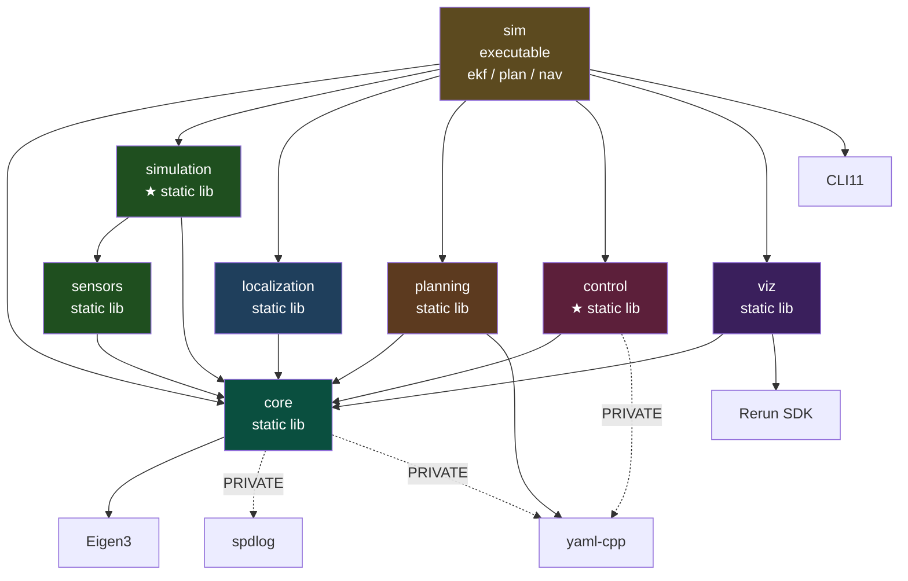

# MiniNav V4 阶段性总结

> 本文档是 MiniNav 项目 V4 阶段完成后的工程总结,记录了在确定性 C++ 仿真里第一次
> 闭合"估计 → 规划 → 跟踪"回路的目标、架构、关键设计决策、测试策略、实验结论与
> 后续规划。定量实验报告见
> [`docs/experiments/v4_control.md`](experiments/v4_control.md);
> 数学推导见 [`docs/math/pure_pursuit.md`](math/pure_pursuit.md)。

---

## 0. 项目概述

V2 回答了"我在哪"(6 维 EKF),V3 回答了"我要去哪、怎么规划过去"(占据栅格 + A\*)。
但到 V3 为止,这两条能力线从未在同一个循环里运行:EKF 模式开的是写死的指令剖面,
规划模式只输出一条静态路径,车从不沿路径行驶。V4 回答第三个问题——**"我怎么走
过去"**——并第一次把估计、规划、控制串成闭环:控制器吃的是 EKF 的估计,而不是真值。

### 0.1 版本路线图

| 版本     | 主题              | 关键产出                                                                                                   |
|--------|-----------------|--------------------------------------------------------------------------------------------------------|
| **V0** | 仿真基础设施          | 差分运动学 + 数据结构 + CSV / Rerun 双轨可视化 + 单元测试 + CI 雏形                                                      |
| **V1** | 噪声 + 里程计        | 工业级 actuator + encoder 噪声模型,带漂移的 odom 估计;暴露漂移问题                                                      |
| **V2** | EKF 状态估计        | 6 维 EKF 融合 encoder + gyro,在线 bias 估计,RK4 过程模型,NIS 一致性诊断,20-seed RMSE 量化                              |
| **V3** | 全局路径规划          | 占据栅格(PGM + map.yaml)、欧氏距离膨胀、A\*(可采纳性校验)、YAML 配置、spdlog / gmock、规划模式                              |
| **V4** | 闭环路径跟踪          | Regulated Pure Pursuit 在纯 C++ 仿真里沿平滑后的 A\* 路径闭环(控制器输入 EKF 估计);被控对象真实化;控制误差与定位误差分开量化 |
| **V5** | ROS 2 + Nav2 集成 | 仿真 / EKF 节点(标准消息)、A\* 与 Pure Pursuit 做成 Nav2 插件,RViz2 点目标导航                                         |
| **V6** | 实车部署            | Raspberry Pi 5 + 4WD 小车的 sim-to-real,绝对定位,室内导航视频                                                     |

> 2026-09-28 调整:原 V4 是"控制 + ROS 2",原 V5 是"在 ROS 2 里完成端到端闭环"。
> 新算法(控制)与新框架(ROS 2)是两类互不依赖的风险,而且在异步、按墙钟运行的
> ROS 2 里调控制器,实验不可复现。所以 V4 只在确定性的 C++ 仿真里闭环,ROS 2 +
> Nav2 整体移到 V5(理由见 [`project_overview.md`](project_overview.md) §6 V4)。

### 0.2 V4 版本总结

V0 是"骨架版本",V1 是"第一个有故事的版本",V2 是"第一个有答案、并诚实说明答案
边界的版本",V3 是"第一个把环境纳入模型的版本"。V4 是**第一个闭环的版本**:机器人
第一次沿着自己规划的路径、凭自己的估计开到终点——也第一次让"定位不准"变成看得见的
后果(撞墙)。

里程碑指标全部达标:

| 指标 | 目标 | 结果 |
|---|---|---|
| 控制误差 $e_\text{ctrl}$(EKF 估计位姿到路径),default 噪声,5 场景 × 10 seed | 均值 ≤ 10 cm,峰值 ≤ 30 cm | 均值 **0.58 cm**,峰值 **6.82 cm** |
| 理论吻合(无噪声、无滞后、直线小偏置) | 超调与调节距离偏差 ≤ 10% | 超调 ≤ 0.7%,调节距离 ≤ 1.9%;滞后模型 ≤ 0.3 个百分点 |
| 安全:无噪声与 oracle(真值进控制器) | 零碰撞 | 60 次运行 0 碰撞 |
| 到达:无噪声与 oracle | 100% 在 5 cm 内停车 | 60/60,最大 4.99 cm |
| 真值到达误差(EKF 进控制器) | 只报告 | 公寓 3–9 m:均值 5.6–13.5 cm;34 m 长路线 20 次中 19 次碰撞 |
| 确定性 | 同 seed 逐字节一致;EKF / 规划 golden 不变 | ✅(golden 回归进 CI) |
| 单元测试 | 新标签全绿 | ✅ 349 条(V3 结束时 184 条) |

V4 最重要的三条工程结论:

1. **参数是推出来的,不是试出来的。** Pure Pursuit 直线附近线性化后阻尼比固定为
   $1/\sqrt2$,响应只取决于走过的距离与 look-ahead 之比;执行器滞后下的稳定条件是
   $\tau_\text{eff} < T_L$。由此推出的默认值($T_L$ = 1.0 s、$L_\min$ = 0.10 m、
   $R_\min$ = 0.60 m)在仿真里以 2% 量级吻合理论,E3 的 500 次配对实验也没有找到
   更好的组合(§6)。
2. **控制器只对它看得见的误差负责。** 点到路径的距离是 1-Lipschitz 的,所以真值误差
   $\le$ 控制误差 + 定位误差。V4 把三者分开量:控制误差压在几厘米;真值误差几乎全部
   来自航位推算的漂移,按 $s^{3/2}$ 增长,约 5 m 后就会吃掉门洞的净空。这条曲线直接
   定下了 V5 的场景路程上限和 V6 必须引入绝对定位(§6.4、§9)。
3. **先拆边界,再闭环。** V4 的前两个 PR 不加功能:先把 golden CSV 回归护栏建起来,
   再在它的保护下把 `sim` 拆成被控对象 `Plant` 与估计管线 `EkfPipeline`。这两个类
   正是 V5 仿真节点与 EKF 节点的边界;`control` 库只依赖 `core`,V5 只需写薄薄的
   Nav2 插件适配(§3.1、§4.1)。

技术形态:V4 新增 `simulation` 与 `control` 两个静态库;`Path` 从 `planning` 迁入
`core`;机器人参数第一次有了单一来源 `config/robot.yaml`;单一 `sim` 从"flag 切换模式"
改为 `ekf / plan / nav` 三个 CLI11 子命令。

V4 的 PR 序列:

| PR | 内容 |
|---|---|
| PR-Roadmap | 公开文档对齐新的 V4 / V5 划分(`c1379a5`,直接推送) |
| PR0 #81 | golden CSV 回归护栏(`csv_compare` + CTest fixture)、`.gitattributes`、CI 加 Release |
| PR1 #82 | `Path` 迁入 `core` + 折线几何、`robot.yaml`、`simulation` 库(`Plant`)、`EkfPipeline`、`sim` 子命令 |
| PR2 #83 | `control` 库:RPP 子集、速度平滑器、到达 / 卡住判定、分段配置解析 |
| PR3 #84 | 路径后处理(首尾替换 + 视线捷径)、`sim plan --smooth`、真实尺度平面图 `apartment` |
| PR4 #85 | `sim nav` 闭环:执行器动力学、`nav.yaml`、`nav.csv`、Rerun 闭环视图、EKF 的 $q_{dv}$ / $q_{d\omega}$ |
| PR5 #86 | `sim nav --path`、E1–E4 实验(`scripts/v4/`)、实验报告与数学文档、README 动图 |
| 收尾 #87 | 本文档、CHANGELOG、README / 项目文档同步 |

---

## 1. 目标与边界

### 1.1 V4 解决的问题

- **路径跟踪控制器**:Regulated Pure Pursuit 的核心子集——速度自适应 look-ahead、
  固定距离的曲率限速、接近目标减速、大角度先原地转向、角速度上限、加速度平滑;
  接口对齐 `nav2_core::Controller` / `GoalChecker` / `ProgressChecker`。
- **闭环仿真**:`sim nav`——从 EKF 的初始估计规划 → 路径后处理 → 跟踪(控制器吃
  EKF 估计)→ 到达 / 碰撞 / 卡住 / 超时判定,全程同 seed 逐字节确定。
- **被控对象真实化**:机器人参数单一来源 `config/robot.yaml`;执行器饱和 + 一阶
  滞后;控制器以 20 Hz 零阶保持运行(仿真步 100 Hz)。
- **路径后处理**:首尾替换为真实起止点、视线捷径——还 V3 的两笔技术债(V3 §8.1、§8.5)。
- **误差分解与第一性原理验证**:控制误差 vs 估计误差 vs 真值误差;线性化、滞后
  稳定性、切角尺度律、安全裕度预算,逐条与仿真对照。
- **工程**:golden CSV 回归护栏 + `.gitattributes` + CI Debug / Release 矩阵;
  `sim` 拆成子命令;仿真器拆成 `Plant` 与 `EkfPipeline`。

量化验收(EPIC #48,即上文 §0.2 的表):控制误差只对控制器负责的部分设门槛;
定位漂移造成的真值误差如实报告,不混进控制指标——与 V2 的"no honest single −X%"
一脉相承。

### 1.2 V4 不解决什么

| 不做 | 原因 / 去向 |
|---|---|
| ROS 2 / Nav2 / RViz2 | V5;V4 的接口按 Nav2 形态设计,V5 只写薄适配器 |
| 重规划、动态障碍、局部规划器(DWA / TEB) | 地图静态;V5 由 Nav2 的行为树负责周期重规划 |
| 绝对定位(地图匹配 / ArUco / LiDAR) | V4 先量出漂移曲线(§6.4),V6 按数据选方案(#80) |
| 代价地图减速、碰撞前瞻(RPP 的 `use_cost_regulated_linear_velocity_scaling` / `use_collision_detection`) | V4 改为测量真值最小净空;需要时再加(§8.5) |
| MPC / Stanley 等其他控制器 | 深挖一个工业默认控制器比多堆一个算法更有说服力;对照组用经典 PP 做同版本消融 |
| 倒车 | 差分驱动只前进 |
| 改 EKF 过程模型(把指令作为 predict 输入) | E4 的闭环 NIS 表明不需要(§3.9、§6.4) |
| 把 EKF 模式的指令剖面改成室内速度 | EKF 模式保持逐字节不变,V2 报告可复现;统一重标定留给 V6 |

---

## 2. 系统架构

### 2.1 模块依赖图



| 库 | V4 新增 / 变化 | 依赖 |
|---|---|---|
| `core` | `mininav.core.path`(`Path` 从 planning 迁入 + 折线投影 / look-ahead 求交)、`mininav.core.robot_description` | Eigen;PRIVATE spdlog、yaml-cpp |
| `sensors` | 不变 | core |
| **`simulation`**(新) | `Plant`:执行器动力学 → 执行噪声 → 真值积分 → 编码器 / IMU;噪声档位表(含新的 `none`) | core、sensors |
| `localization` | `EkfPipeline`(解码 → R → predict / update 编排);`ProcessNoiseParams` 加 $q_{dv}$ / $q_{d\omega}$ | core |
| `planning` | `path_smoothing`;`AStarPlanner::costmap()` / `config()`;`OccupancyGrid::is_traversable` | core;yaml-cpp |
| **`control`**(新) | `Controller` / `GoalChecker` / `ProgressChecker` 接口、`PurePursuitController`、`VelocitySmoother`、分段配置解析 | core;PRIVATE yaml-cpp |
| `viz` | `VizSink` 每帧 `log_points` / `log_line_strip`;`nav_log`(`NavScene`、`log_to_rerun(NavStep)`) | core、Rerun |
| `apps/sim` | 模块 `mininav.apps.sim`:`main.cpp` + `ekf_mode` / `plan_mode` / `nav_mode` + `common.cpp` | 以上全部 + CLI11 |

**关键关系**(守住 V1–V3 的解耦):

- **`control` 只依赖 `core`**:它消费 `Path` / `Pose2D` / `Twist2D`,不认识栅格、
  EKF、传感器——对应 Nav2 里控制器只认 `nav_msgs/Path` 与位姿。这也是 `Path` 必须
  迁到 `core` 的原因:`nav_msgs/Path` 是公共消息类型,不属于规划器包。
- **`simulation` 与 `localization` 互不依赖**:二者之间只流过 `EncoderTicks` 与陀螺
  标量(V1 的依赖倒置不变)。V5 的仿真节点包 `Plant`,EKF 节点包 `EkfPipeline`,
  正好一刀切开。
- **`viz` 仍不依赖 `planning` / `control`**:闭环画面由 app 组装成纯几何的
  `NavScene` 与每帧的 `NavStep`。
- 库名用 `simulation` 而不是 `sim`:可执行文件已叫 `sim`,CMake target 名必须唯一。

### 2.2 闭环数据流(`sim nav`,每个仿真步 dt = 0.01 s)

```
  第 k 步(t = k·dt)
  ┌────────────────────────────────────────────────────────────────────┐
  │ 1. 若 k % 5 == 0(20 Hz 控制节拍):                                   │
  │      (p_in, v_in) = controller_input == ekf ? EKF 估计 : 真值         │
  │      先判 GoalChecker(到达)/ ProgressChecker(卡住)                  │
  │      cmd = smoother( controller.compute_velocity_commands(p_in, v_in) )│
  │    否则保持上一拍 cmd(零阶保持)                                       │
  │ 2. Plant.step(cmd):                                                │
  │      u      = 饱和 + 一阶滞后(cmd)          ← robot.yaml,确定性      │
  │      v_true = ActuatorModel.apply(u)       ← RNG "actuator"         │
  │      ticks  = encoder.measure(v_true)      ← RNG "encoder_slip_*"   │
  │      ω_imu  = imu.measure(v_true.ω)        ← RNG "imu_gyro_*"       │
  │      truth  ← differential_drive_step(truth, v_true, dt)            │
  │ 3. EkfPipeline.step(ticks, ω_imu):predict → update_encoder → update_imu │
  │ 4. 记录 NavStep(e_ctrl / e_true / e_est / 净空……);真值车体碰到      │
  │    原始地图的占据 cell 即判碰撞                                        │
  └────────────────────────────────────────────────────────────────────┘
```

终止状态:`arrived`(GoalChecker 判定,按控制器的输入位姿)、`collision`(真值车体
外接圆与**原始**地图的占据方块相交)、`stuck`(ProgressChecker 超时)、`timeout`
(默认 3 × 路径长度 / 期望速度 + 10 s)、`plan_failed`。

- **RNG 顺序**与 V2 相同(actuator → encoder → imu),按噪声源分流(`RngFactory` 的
  FNV-1a 标签,每个噪声源一个独立引擎)。
- **公共随机数(CRN)**:执行器只在 σ = 0(完全静止)时跳过采样,其余噪声源每步消耗
  固定 → 同一 seed 下,不同控制参数面对的噪声实现逐步对齐。E3 的参数对比因此可以用
  同 seed 配对差。
- **EKF 模式走同一个 `Plant`**,但执行器动力学是直通(不做任何浮点运算)→ 输出逐字节
  不变,golden 证明。

### 2.3 一个 `sim`,三个子命令

| 子命令 | 行为 | 对应旧用法 |
|---|---|---|
| `sim ekf` | V2 的 EKF 仿真(`traj.csv`) | `sim …` |
| `sim plan` | V3 的一次性规划(`path.csv`;`--smooth` 输出平滑路径) | `sim --map …` |
| `sim nav` | V4 闭环导航(`nav.csv`);`--path` 跟随给定路径 | 新 |

不带子命令时打印帮助,旧的 flag 式调用直接报错(而不是悄悄跑另一个模式)。814 行的
`sim_main.cpp` 拆成模块 `mininav.apps.sim`:`main.cpp`(CLI 与分发)+ 每种模式一个
实现单元 + 不导出的公共工具(`common.cpp`)。这仍是"单一 `sim`、不留 `sim_vN`"的
版本策略:V4 演进了同一个二进制。

### 2.4 与 V5(ROS 2 + Nav2)的映射

| V4(纯 C++) | V5(ROS 2) |
|---|---|
| `simulation::Plant` | 仿真节点:订阅 `/cmd_vel`,发布 `/joint_states`、`/imu`、`/clock`、真值 |
| `localization::EkfPipeline` | EKF 节点:按时间戳异步融合,发布 `/odom` + TF `odom→base_link`(REP-105) |
| `control::Controller` / `GoalChecker` / `ProgressChecker` | `nav2_core` 同名插件 |
| `planning::GlobalPlanner` + `path_smoothing` | `nav2_core::GlobalPlanner` 插件 |
| `control::VelocitySmoother` | `nav2_velocity_smoother`(参数对齐) |
| `config/nav.yaml` 各段 | `nav2_params.yaml` 的对应段 |
| `config/robot.yaml` | 机器人描述 / URDF 参数 |
| `sim nav` + `nav.csv` | 确定性回归 harness:V5 的 ROS 运行结果与之对照 |

---

## 3. 核心设计决策

### 3.1 先拆边界,再闭环

最直接的做法是在 `sim_main.cpp` 的主循环里加一个控制器。V4 反过来:PR0 先建回归
护栏,PR1 在护栏保护下重构,PR2–PR3 分别做控制与路径后处理,PR4 才把它们接起来。

- 重构(`Path` 迁入 `core`、`Plant`、`EkfPipeline`、子命令)期间,五个 golden 基线
  全部逐字节不变——"行为没变"由测试证明,而不是靠手工 diff。
- `Plant` 与 `EkfPipeline` 各有一条"逐位一致"测试
  (`Plant.MatchesDirectSensorCompositionBitForBit`、`EkfPipeline.MatchesManualUpdateSequenceBitForBit`):
  把旧代码的调用顺序手写一遍,与新类逐位比较。
- 这两个类的接口就是 V5 的 topic 边界(§2.4),不是为 V4 临时切的。

### 3.2 `robot.yaml`:单一来源,全部字段必填

机器人几何(轮径、轮距、编码器分辨率)此前是 `sim_main.cpp` 里的常量;V4 新增的
底盘外形与执行器动力学也需要一个家。`config/robot.yaml` 成为单一来源,由
`RobotDescription` 严格解析:

- **全部字段必填**(比 `planner.yaml` 更严):描述写错时回退默认值,只会把错误推迟
  到仿真结果里;未知 key 与非法值(非正数、ticks ≤ 0)加载即报错。
- 外接圆半径由矩形外形推导($\sqrt{(l/2)^2 + (w/2)^2} \approx 0.136$ m),`sim nav`
  要求 `planner.inflation_radius` 不小于它,否则运行前就失败——规划出的路径可能
  擦墙。`sim plan` 不做这个检查(`--inflation-radius 0` 仍合法),V3 报告里的数字
  依赖它。
- `distance_per_tick()` 与编码器内部用同一个表达式,逐位相同,EKF golden 不变。
- 外形、限幅、$\tau$ 都是**占位值**(Adeept 4WD 套件量级),V6 实测后替换;V4 的
  结论以参数化形式给出($r = \tau_\text{eff}/T_L$、$f(\theta)$、$m_\text{eff}$),
  换值后直接复用。

### 3.3 `Path` 迁入 `core`;投影单调推进

`nav_msgs/Path` 是公共消息类型,所以 `Path` 属于 `core` 而不是规划器包——这让
`control` 可以只依赖 `core`。迁移时加了两个折线几何工具,都不对路径重采样:

- `project_onto(path, p, from_segment, window)`:只在当前段向前的窗口里找最近投影,
  进度单调不减。U 形弯的回程段离车可能比去程更近,全局最近投影会让进度跳过去
  (`PathProjection.WindowKeepsProgressOnHairpinOutboundLeg`)。控制器的窗口按弧长
  定(`max_projection_search_dist` = 1 m,对应 Nav2 的 `max_robot_pose_search_dist`)。
- `lookahead_point(path, from, p, L)`:从投影点向前求第一个与车相距 $L$ 的出圆点
  (二次方程的较大根);车离路径超过 $L$ 时返回投影点,剩余路径不足 $L$ 时返回终点。

### 3.4 执行器动力学:精确离散化,默认直通

`ActuatorDynamics` 给 $v$、$\omega$ 各加饱和与一阶滞后,用精确离散化
$u \leftarrow u + (1 - e^{-dt/\tau})(\operatorname{sat}(cmd) - u)$,而不是前向欧拉
($\tau$ 接近 dt 时欧拉会过冲,`PlantDynamics.ExactDiscretizationNeverOvershoots`)。
默认构造是直通——饱和为无穷、$\tau = 0$ 时**不做任何浮点运算**,所以 `sim ekf` 的输出
逐位不变;`sim nav` 传 `actuator_dynamics_of(robot)`。

### 3.5 RPP 子集,接口对齐 `nav2_core`

`PurePursuitController` 只实现 Nav2 RPP 中有第一性原理依据的部分,每个参数都能指到
[`pure_pursuit.md`](math/pure_pursuit.md) §10 的某条推导:

- **速度自适应 look-ahead** $L = \operatorname{clamp}(T_L|v|, L_\min, L_\max)$:让滞后比
  $\tau_\text{eff}/T_L$ 与速度无关(数学文档 §4.4)。
- **固定距离的曲率限速**:用固定 $L_\kappa$ 处的点算调节曲率,$R < R_\min$ 时
  $v \leftarrow v\,R/R_\min$。若用随速度变化的 $L$,会形成"降速 → $L$ 变短 → 曲率变大
  → 再降速"的正反馈(对齐 Nav2 的 `use_fixed_curvature_lookahead`)。
- 接近目标减速、大角度先原地转向、$\omega$ 上限(按比例降 $v$、保持曲率)。
- 三个 `use_*` 开关全关就是经典 Pure Pursuit,用于同版本消融(E2 / E3 的对照组)。

接口相对规划草案的两处调整都向 `nav2_core` 靠拢:`compute_velocity_commands` 多一个
`const GoalChecker*` 参数(控制器读它的容差,决定何时原地转到目标朝向——否则带朝向的
目标永远到不了);`GoalChecker::tolerances()` 返回 `{xy, yaw, check_yaw}`。
`ProgressChecker::check(pose, t)` 显式传仿真时间,保持确定性。

### 3.6 速度平滑器:两分量同比例收缩

`VelocitySmoother` 按 $a_\max$ / $\alpha_\max$ 限制指令变化率。$v$、$\omega$ 若各自
独立限幅,静止起步时 $v$ 被压得多、$\omega$ 压得少,**指令曲率会被放大数倍**,车原地
打转。所以两分量按同一比例收缩(Nav2 的 `scale_velocities`),曲率保持不变
(`VelocitySmoother.ScalesBothComponentsTogetherPreservingCurvatureFromRest`)。

### 3.7 路径后处理:首尾替换 + 视线捷径

8 连通 A\* 路径是从格心到格心的台阶折线,每个 45° 台阶都是曲率冲激——Pure Pursuit
最差的输入(它在恒曲率路径上稳态误差为零,误差只来自曲率变化)。`smooth_path`:

1. **首尾替换**:首点换成真实起点、末点换成真实终点;若端点到相邻 waypoint 的线段
   不 free,保留格心作中间点(对 A\* 路径永不触发,只为其他来源的路径兜底)。
2. **视线捷径**:从锚点向前延伸到第一个不可见的 waypoint,贪心推进。不追求全局最远
   可见点:那是 $O(n^2)$ 次长段检查,且可能跨过回折。
3. 每段由 `segment_is_free` 检查:supercover DDA 逐格跨越,恰好穿过格角时两个正交
   邻居都查——与 A\* 防穿角同一条规则,所以 A\* 原始路径每段必然通过。可通行规则提成
   `OccupancyGrid::is_traversable`,A\* 与平滑共用。
4. `cost_weight > 0` 时跳过捷径并告警:拉直会把路径重新拉近障碍,抵消代价梯度(§8.6)。

office500(`planner.yaml`,0.05 m 膨胀):524 waypoint / 34.37 m → **13 waypoint /
33.33 m**(−3.0%),由 golden `plan_office500_smooth.csv` 锁住。`sim plan` 只在
`--smooth` 时多写三行头部,不开时 `path.csv` 与 V3 逐字节相同。

### 3.8 `nav.yaml`:按 Nav2 参数文件分段,fail fast

`sim nav` 的全部导航参数放在一个文件里,按段组织,段名与 V5 的 Nav2 参数文件对应:
`planner`(与 `planner.yaml` 同 schema)、`path_smoothing`、`controller`(RPP + 控制
频率 + 平滑器)、`goal_checker`、`progress_checker`。每段交给**所属库**的解析函数
(严格模式:未知 key 报错,缺失字段取推导出的默认值);未知段名、膨胀半径小于车体
外接圆半径都在运行前失败。`config/planner.yaml` 保持不变:它服务于 `sim plan` 的
算法研究,V3 报告的数字依赖它。

### 3.9 EKF 进闭环:$q_{dv}$ / $q_{d\omega}$ 与 $R_\text{imu}$ 下限

闭环让 V2 的 EKF 遇到两个开环里没出现过的问题,都在 PR4 修掉:

- **恒速模型跟不上加减速。** $Q$ 原本只来自执行噪声($\alpha\,v^2$ 项);`none` 档位下
  $Q = 0$,$v$、$\omega$ 的方差收敛到 0,滤波器冻住。V2 的约定是"传感器只当观测、
  指令不进 predict",所以不能把指令喂给 EKF;改为把"控制器每步最多改变多少速度"作为
  未建模的过程噪声:$q_{dv} = (a_\max\,dt)^2$、$q_{d\omega} = (\alpha_\max\,dt)^2$
  (平滑器的加速度上限)。EKF 模式为 0,逐位不变。单测:静止 2 s 后以 0.5 m/s² 加速,
  无此项时估计落后 > 0.1 m/s,有此项 < 0.02 m/s。
- **`update_imu` 要求 $R_\text{imu} > 0$**(Debug 断言,Release 编译掉,所以只有
  Debug 的 `nav` 测试暴露了它)。滤波器侧陀螺 σ 取 $\max(\sigma_\text{imu}, \sigma_q)$,
  $\sigma_q \approx 3.1\times10^{-4}$ rad/s 是 BNO055 的量化 σ;三档带噪声预设都远大于它。

规划时还有一个备选:把指令作为 predict 的输入(改动 V2 的约定)。E4 的闭环 NIS 表明
不需要:加减速段的编码器 NIS(3.97)不高于匀速段(4.22),也不高于 V2 开环(4.66)。

### 3.10 误差分解用全局投影;碰撞用原始地图

- `nav.csv` 的 $e_\text{ctrl}$ / $e_\text{true}$ 用**全局**最近距离(`distance_to_path`)另算,
  而不是控制器内部的窗口投影:1-Lipschitz 界 $e_\text{true} \le e_\text{ctrl} + e_\text{est}$
  只对全局距离成立。E4 在 137 676 个样本上逐点验证。
- 碰撞判定用真值车体外接圆对**原始**(未膨胀)地图的占据方块:膨胀层是规划的安全
  裕度,不是物理障碍。检测到第一次穿透即停,所以穿透深度都在 0.1 mm 量级。
- 到达 / 卡住在控制节拍判定,按控制器的**输入位姿**(EKF 或真值)——与 Nav2 一致,
  机器人只能凭自己的估计判断是否到达;真值到达误差只报告。

### 3.11 `--path`:Nav2 FollowPath

PR5 为实验加了 `sim nav --path FILE`:跳过规划,直接跟随给定折线(`sim plan` 的
`path.csv`,或只有 `x,y` 列的 CSV,朝向按线段补)。`--map` 变为可选,只用于碰撞与
净空。E1 / E2 的直线、横向台阶、单转角路径都靠它驱动,与真实闭环走同一套
`Plant` / 控制器 / 平滑器代码。只有该模式多写一行 `# path_file`,所有 golden 不变。

---

## 4. 工具链补充

### 4.1 golden CSV 回归(PR0)

- **基线**(`tests/golden/`):EKF 模式 seed 42 `default`、seed 7 `high-noise`、seed 3
  `low-noise` 的 `traj.csv`;规划模式 office、office500 与 office500 `--smooth` 的
  `path.csv`;闭环 apartment S2 seed 42 的 `nav.csv`(1.55 MB)。
- **`csv_compare`**(模块库 + 薄 `main` + 15 条单测,含"必须失败"的用例):注释头逐行
  相同(忽略 `# generated_at`),整数列精确,浮点列 $|a - b| \le 10^{-9}\max(1, |a|)$。
  不逐字节比较的原因:CSV 按 `max_digits10` 全精度写出,glibc 的 libm 会按 CPU 选择
  带 / 不带 FMA 的 `sin` / `cos`,本机与 CI runner 的末位可能不同;真正的行为变化
  (RNG 顺序、逻辑改动)比 1e-9 大几个数量级。同一台机器上 Debug / Release 仍逐字节一致。
- 敏感性:`default` 的编码器滑移 σ 相对改动 5e-6,第 2 个数据行就失败(验证一次,不提交)。
- `regression.clean` fixture 先清空产出目录,防止比较端误用旧文件;`update_golden`
  目标刻意更新基线,改基线的 PR 必须说明原因(`tests/golden/README.md`)。

### 4.2 `.gitattributes`

`* text=auto eol=lf`,不管本机 `core.autocrlf` 如何,工作区都是 LF;`*.pgm -text`
只禁止换行转换(P5 像素逐字节安全,P2 手画图仍可按文本 diff);图片标 binary;golden
CSV 标 `linguist-generated`。`git add --renormalize .` 后 index 无变化。

### 4.3 CI:Debug + Release 矩阵

V3 的 50 ms A\* 计时测试只在 Release 下断言,而 CI 只跑 Debug(V3 §8.8)。PR0 把 CI
改成 Debug / Release 矩阵,Release job 真正执行计时预算,并在优化构建下检查 golden;
失败时上传 `golden_out/` 便于 diff。PR0 的 CI 是 1e-9 容差的第一次跨机器验证,此后
一直通过。

### 4.4 `scripts/v4/` 与 `results/v4/`

| 脚本 | 产出 |
|---|---|
| `gen_floorplan.py` | 真实尺度地图(TOML 矩形清单 → P5 PGM + `map.yaml`) |
| `scenarios.py` | 场景清单 S1–S5、`scenarios.png` |
| `step_response.py` | E1:直线响应 vs 解析解、滞后比扫描、速度自适应 look-ahead(`e1_*.png`) |
| `corner_cutting.py` | E2:切角尺度律、完整 RPP 的转角、真实地图净空(`e2_*.png`) |
| `run_scenarios.py` | E3 / E4 / 漂移的批量运行(进程池)→ `data/v4/`(gitignore) |
| `tracking_error.py` | E3 / E4 的统计与图(`e3_*.png`、`e4_*.png`) |
| `animate_nav.py` | README 顶部的闭环 GIF(`nav_s3.gif`,ffmpeg 全局调色板,967 KB) |
| `_navio.py` | 共享工具:YAML 子集读写、配置变体、跑 `sim nav`、读 `nav.csv` |

两条约定:

- **配置变体 = 仓库默认值 + 覆盖项。** 脚本读 `config/robot.yaml` / `config/nav.yaml`,
  只改实验关心的字段再写出变体,脚本里不复制默认值——默认值改了,实验自动跟着改。
- **原始运行不入库。** 全精度 `nav.csv` 约 1 KB / 行,实验原始数据 1.1 GB;读完即删,
  E4 与漂移研究只留精简列的 gzip(`data/v4/` ≈ 64 MB)。全部脚本重跑约 1.5 分钟,
  产出逐字节可复现。

### 4.5 `nav.csv` 格式

```
# MiniNav closed-loop navigation
# map = maps/office500.yaml
# start = 1.175,1.175,0
# goal = 23.875,23.875
# seed = 42
# preset = default
# controller_input = ekf
# dt = 0.01
# control_frequency = 20
# ...(机器人与控制器关键参数:footprint_radius、actuator_time_constant、
#      inflation_radius、lookahead_time、regulated_min_radius……)
# status = collision
# end_time_s = 40.64
# goal_error_true_m = 20.5239
# goal_error_input_m = 20.4807
# raw_waypoints = 582
# path_waypoints = 22
# path_length_m = 34.3494
# min_clearance_m = -0.00321002
# max_e_ctrl_m = 0.0503544
# max_e_true_m = 0.345643
t,cmd_v,cmd_w,...,nis_imu,act_v,act_w,lookahead_x,lookahead_y,lookahead_dist,curvature,regime,e_ctrl,e_true,e_est,arclength,clearance
```

每行 = `SimState` 的 29 列 + 12 列导航诊断。记录类型是组合
`struct NavStep { SimState sim; NavDiagnostics nav; };`,通过 ADL 的
`csv_header` / `csv_row` 重载扩展——不新增 `SimStateV4`,遵守单一 `SimState` 的约定。
头部不含墙钟时间,也不含文件路径(与检出位置有关),同 seed 逐字节一致。

### 4.6 地图:玩具屋 → 真实尺度

V3 的手画演示图按车体外接圆膨胀后大多不连通(8 邻接连通分量,格心欧氏距离):

| 地图 | 尺寸 | r = 0.05 | r = 0.10 | r = 0.15 | r = 0.20 |
|---|---|---|---|---|---|
| office | 2.0 × 1.5 m | 连通 | **断成 2 块**(门被堵) | 2 块 | 4 块 |
| maze | 1.1 × 1.1 m | 连通 | **完全封死** | 封死 | 封死 |
| room | 1.0 × 0.8 m | 连通 | 连通(剩 52%) | 连通 | 连通(20%) |
| corridor | 0.7 × 0.5 m | 连通 | 断成 2 块 | 2 块 | 封死 |

它们继续留给规划单测。`maps/apartment`(10 × 7 m、200 × 140 cell)由
`maps/src/apartment.toml`(墙 / 门 / 家具的矩形清单,stdlib `tomllib` 读)经
`gen_floorplan.py` 生成:1.2 m 走廊、五个房间、0.8–0.9 m 的门、两侧各留 0.8 m 窄道的
厨房中岛。0.20 / 0.25 / 0.30 m 膨胀下都连通,`ApartmentMap.*` 用 C++ 的 `inflate`
复核,并锁住"office 在 0.10 m 时断成两块、maze 封死"。**这是占位布局**:V6 实车要跑的
房间量好尺寸后,改 TOML 重新生成即可,sim-to-real 可以在同一张图上对照。

---

## 5. 测试策略

V3 结束时 184 条测试,V4 结束时 **349 条**:

| 标签 | 条数 | V4 新增的要点 |
|---|---|---|
| `core` | 76 | `Path` 投影 / look-ahead 求交(含回折路径不跳段)、`RobotDescription` 严格解析、`NavStep` CSV 格式 |
| `sensors` | 19 | 不变 |
| `simulation`(新) | 12 | `Plant` 与直接组合传感器模型逐位相同;一阶滞后在 $t = \tau$ 处达 63.2%;精确离散化不过冲;饱和;默认直通 |
| `localization` | 58 | `EkfPipeline` 与手写编排逐位相同;初始位姿注入;$q_{dv}$ / $q_{d\omega}$ |
| `planning` | 82 | `path_smoothing`(首尾精确、每段 free、长度不增、蛇形迷宫仍可行)、`ApartmentMap.*` 连通性 |
| `control`(新) | 47 | 曲率手算点、限速与原地转向工况、平滑器;**解析用例**:$e^{-\pi}$ 超调、$4.26\,L$ 调节、圆弧零误差、切角尺度律、转角预算 |
| `viz` | 10 | `nav_log` 的实体布局(gmock),每帧原语的调用契约 |
| `regression`(新) | 30 | 15 条 `csv_compare` 单测 + EKF / 规划 / 闭环 golden fixture |
| `nav`(新) | 15 | 端到端跑 `sim nav`:无噪声 / oracle / EKF 多房间到达、目标朝向、激进参数下碰撞必然触发、`plan_failed`、配置错误、`--path` 四条、同 seed `nav.csv` 逐字节一致 |

### 5.1 解析用例:用推导当 oracle

`pure_pursuit_analytic_tests` 不比较"上次跑出来的数",而是比较第一性原理的结论:
直线小偏置的反向超调与 $e^{-\pi}$ 相差 < 1%、极值在 $s \approx \pi L$;2% 调节距离
4.21 $L$;0.1 与 0.5 m/s 走出同一条空间曲线;$R$ = 1 m 圆弧上误差 < 0.1 mm;90° 切角
$\delta/L$ = 0.271,$L$ 加倍比值不变。这类测试在控制器重构后依然有意义——它们锁住的是
"控制律是 Pure Pursuit"这件事,而不是某个实现细节。

### 5.2 集成测试锁的是结论,不是数字

`nav` 标签的用例用 `PASS_REGULAR_EXPRESSION` 匹配最后一行 `nav: status=…`:到达、
碰撞、`plan_failed`、配置错误各一类。精确数值由 golden 负责;集成测试只回答"这个场景
是否仍然到达",所以小的数值漂移不会让它们变脆。

### 5.3 一个只在 Debug 暴露的 bug

`update_imu` 的 $R > 0$ 前置条件是 Debug 断言。`--preset none` 让 $R_\text{imu} = 0$,
Release 下静默通过、Debug 下崩溃——只有 Debug 的 `nav` 测试抓住了它(§3.9)。这是 CI
同时跑 Debug 与 Release 的另一个理由:两种构建能抓到的问题不同。

---

## 6. 关键实验结论

完整报告见 [`docs/experiments/v4_control.md`](experiments/v4_control.md)。

### 6.1 E1:理论吻合

- 直线、无噪声、$\tau$ = 0:9 组 $(L, v)$ 的响应在 $s/L$ 坐标下重合,反向超调 4.33–4.35%
  (解析 4.32%)、调节距离 4.13–4.21 $L$(解析 4.22 $L$)。30 cm 大偏置时超调 +4% 到 +24%,
  标出线性化的边界。
- 执行器滞后:三阶模型 $r p^3 + p^2 + 2p + 2 = 0$ 与仿真的超调相差 ≤ 0.3 个百分点
  ($r$ 到 0.7);20 Hz 的点按 $\tau + T_c/2$ 折算后落回同一条曲线。
- 速度自适应 look-ahead:$\tau$ = 0.2 s 时固定 $L$ 的超调随速度 4.5 → 6.1 → 11.0%,
  $L = T_L v$ 时恒为 6.1%。

### 6.2 E2:切角与安全

- 切角尺度律成立($f(\theta)$ 与 $L$ 无关,≤ 4%);新推导的小角度理论
  $f \approx e^{-1}\cos(1)\,\theta$、$g \approx e^{-3\pi/4}\theta/\sqrt2$ 在 45° 内误差 ≤ 4%。
- 完整 RPP 默认参数:内侧切角 2.05 cm、出弯 2.82 cm,都在最坏裕度 $m_\text{eff}$ = 4.3 cm 内;
  真实地图上平滑路径的实际净空约 11 cm,控制误差最多吃掉 1.3 cm。
- $T_L$ = 0.5 s($r$ = 0.25,线性模型仍稳定)时完整控制器出弯后进入"跟踪 ↔ 原地转向"
  的航向极限环,用时翻倍——平滑器限幅、$L_\min$ 钳位与工况切换是线性模型之外的相位滞后。

### 6.3 E3:默认参数保留

500 次同 seed 配对运行:$v$ = 0.3 m/s 时 $T_L$ = 1.0 s 的峰值 $e_\text{ctrl}$ 最小(6.6 cm);
$\omega$ 抖动随 $T_L$ 单调下降(0.139 → 0.045 rad/s),介于 $1/T_L$ 与 $1/T_L^2$ 的噪声增益
之间;没有哪个候选在所有指标上都更好。0.4 m/s 的碰撞全来自同一 seed 的定位漂移
($e_\text{true} \gg e_\text{ctrl}$)。`config/nav.yaml` 与 nav golden 未改。

### 6.4 E4:定位才是瓶颈

- 50 次 EKF 运行:$e_\text{ctrl}$ 均值 0.58 cm、峰值 6.82 cm;oracle 50/50、无噪声 10/10
  到达零碰撞;$e_\text{true} \le e_\text{ctrl} + e_\text{est}$ 逐样本成立。
- 航位推算的位置误差按 $s^{3/2}$ 增长(双对数斜率 1.49–1.52,航向随机游走的理论值):
  中位数 5 m 处 3.8 cm、10 m 处 10.2 cm、34 m 处 65.7 cm;90 分位在 5.2 m 处超过门洞的
  典型净空 10 cm。
- office500 的 34 m 路线:带地图的 20 次 EKF 运行中 19 次碰撞(最早 7.0 m、中位 12.7 m),
  oracle 10/10 到达。
- 闭环 NIS:加减速段 3.97、匀速段 4.22(V2 开环 4.66)——闭环没有让一致性变差;编码器
  NIS 约为期望 2 倍的过自信是 V2 留下的(§8.2)。

---

## 7. 用法

### 7.1 闭环导航

```bash
# 走廊 -> 过门 -> 卧室 1,到达后转向西(EKF 进控制器,打开 Rerun)
./build/clang18-debug/sim nav --map maps/apartment.yaml --start 0.6,3.6,0 \
    --goal 2.9,5.6,3.1416 --seed 42

# oracle:真值进控制器,只剩控制误差
./build/clang18-debug/sim nav --map maps/apartment.yaml --start 2.9,1.6,1.5708 \
    --goal 7.2,5.6 --controller-input truth --no-viz

# 无噪声被控对象(只有编码器量化)
./build/clang18-debug/sim nav --map maps/apartment.yaml --start 2.9,1.6,1.5708 \
    --goal 7.2,5.6 --preset none --no-viz

# 跟随给定路径(Nav2 FollowPath),不规划、可不带地图
./build/clang18-debug/sim nav --path tests/nav/l_path.csv --preset none \
    --controller-input truth --no-viz

# 换参数:robot.yaml / nav.yaml 的变体
./build/clang18-debug/sim nav --map maps/apartment.yaml --goal 7.2,5.6 \
    --robot my_robot.yaml --nav my_nav.yaml
```

### 7.2 Rerun 闭环视图

在 V2 的 truth / odom / ekf 位姿与轨迹之上,`sim nav` 加:

| 实体 | 内容 | 类型 |
|---|---|---|
| `/world/map`、`/world/map/inflated` | 占据 + 膨胀(复用 `log_plan`) | 静态 |
| `/world/plan/raw`、`/world/plan/path` | A\* 原始台阶路径(灰)、平滑后路径(绿) | 静态 |
| `/world/robot/actuator/{v,w}` | 电机输出 $u$(饱和 + 滞后后) | 标量 |
| `/world/control/lookahead`、`/world/control/arc` | look-ahead 点、追踪圆弧 | 每帧 |
| `/world/estimate/ekf_cov` | EKF 位置 3σ 椭圆 | 每帧折线 |
| `/plots/error/{ctrl,est,true}` | 三种误差 | 标量 |
| `/plots/clearance`、`/plots/regime` | 真值净空、控制工况 | 标量 |

世界系几何(look-ahead、圆弧、椭圆)放在 `/world/control`、`/world/estimate` 下,
**不挂在带 `Transform3D` 的位姿实体下面**——否则 Rerun 会把父实体的变换再套一次。
规划草案原本把椭圆放在 `/world/robot/ekf/cov`,实现时发现这个问题后改了位置。

### 7.3 生成实验图

```bash
cmake --build --preset build-release -j
source .venv/bin/activate
python scripts/v4/scenarios.py && python scripts/v4/step_response.py
python scripts/v4/corner_cutting.py && python scripts/v4/run_scenarios.py
python scripts/v4/tracking_error.py && python scripts/v4/animate_nav.py
```

---

## 8. 已知限制 / 技术债

### 8.1 没有绝对定位

位置只靠编码器与陀螺,误差按 $s^{3/2}$ 无界增长(§6.4)。这不是调参问题:V2 已经证明
位置不可观测。V4 只量不修,结论直接给到后续版本:V5 场景单程 ≲ 5 m(或每段之间重新
给定初始位姿);V6 必须引入绝对定位(#80:ArUco + Pi 摄像头,或 2D LiDAR + AMCL /
slam_toolbox)。实车是 4WD 滑移转向,打滑远大于差速仿真,漂移只会更快。

### 8.2 EKF 一致性:编码器 NIS 过自信,位置 NEES 局部失配

编码器 NIS 约为期望的 2 倍(V2 §4.3 同源:恒速模型跟不上执行器每步注入的白噪声,
速度协方差偏小)。闭环里 34 m 路线上的位置 ANEES 平均 2.62(期望 2),只有约一半路程
落在 95% 区间内,超出的两段机制尚未定位;航向 ANEES 0.49,偏保守。V4 没有调 $Q$ 去
"修"诊断图:那会掩盖模型失配,而不是消除它。

### 8.3 占位参数

`robot.yaml` 的外形、限幅、$\tau$ 与 `maps/apartment` 的布局都是占位值。V6 实测后
替换;V4 的结论以参数化形式给出,可直接复用。

### 8.4 完整控制器的稳定边界比线性理论近

线性模型在 $r = 0.25$ 时仍稳定,完整 RPP 却进入航向极限环(§6.2)。默认 $T_L$ = 1.0 s
($r$ = 0.125)离边界有余量;若 V6 实测 $\tau$ 更大,$T_L$ 必须按 $T_L \ge 5\,\tau_\text{eff}$
同步放大,且不应低于 0.7 s 量级的经验边界。

### 8.5 没有碰撞前瞻与代价地图减速

RPP 的 `use_collision_detection` 与 `use_cost_regulated_linear_velocity_scaling` 没有实现;
V4 用真值净空度量风险。在没有绝对定位的前提下,碰撞前瞻用的也是漂移后的估计位姿,
帮助有限;V5 用 Nav2 的局部代价地图时再评估。

### 8.6 代价梯度与视线捷径冲突

`cost_weight > 0` 时跳过捷径(§3.7)。代价感知的捷径(沿线代价积分不超过原路径)
留作技术债;V4 的闭环默认 `cost_weight = 0`。

### 8.7 静态地图,无重规划

规划只在起点做一次。门被临时挡住、或漂移让车离开路径较远时,没有重规划;V5 交给
Nav2 的行为树(周期重规划 + 恢复行为)。

### 8.8 仿真与实车的差距

仿真是差速运动学 + 白噪声执行模型:没有轮地打滑的系统性偏差、没有电机死区、没有
动态障碍,控制器也是同步、无通信延迟的。V5 的 ROS 2 异步时序与 V6 的实车会逐项暴露
这些差距;V4 的确定性 `sim nav` 是对照基线。

---

## 9. 下一版本 V5 路线

V5 把 V4 已验证的闭环搬进 ROS 2 Jazzy,由 Nav2 编排(§2.4 的映射就是节点 / 插件边界):

- **标准消息**:`sensor_msgs/JointState`(轮子位置)、`sensor_msgs/Imu`、
  `nav_msgs/Odometry`、TF、`nav_msgs/Path`、`nav_msgs/OccupancyGrid`;不建
  `mininav_msgs`。V6 硬件驱动发同样的话题,EKF 节点在仿真与实车之间不改一行。
- **节点与插件**:仿真节点包 `Plant`;EKF 节点包 `EkfPipeline`,把同步的 `step` 拆成
  按消息到达的 `predict_to(t)` / `on_encoder` / `on_imu`;A\* 与 RPP 做成
  `nav2_core` 插件;导航流程交给 bt_navigator,不自写状态机。
- **TF**:EKF 发 `odom→base_link`(REP-105);`map→odom` 暂为静态,留给 V6 的绝对定位。
- **场景**:按 V4 的漂移曲线,单程 ≲ 5 m;V4 的 `sim nav` 同场景、同参数的结果作为
  V5 的对照基线——V5 出现的偏差只可能来自集成(异步时序、TF、参数映射)。
- **待解决**:C++23 模块写的核心要被 ament 包消费(首选 CMake 3.28 安装模块
  file set,退路 `add_subdirectory`);本机安装 `ros-jazzy-navigation2`。
- **硬件**(#53 BNO055、#54 带编码器的电机)与 V5 并行采购,V6 开工前完成绝对定位
  方案选择(#80)。

---

## 附录 A:V4 阶段文件清单

**新增**

- `.gitattributes`
- `config/robot.yaml`、`config/nav.yaml`
- `maps/apartment.{pgm,yaml}`、`maps/src/apartment.toml`
- `src/core/path.{ixx,cpp}`、`src/core/robot_description.{ixx,cpp}`
- `src/simulation/{CMakeLists.txt, plant.{ixx,cpp}, noise_presets.ixx}`
- `src/localization/ekf_pipeline.{ixx,cpp}`
- `src/planning/path_smoothing.{ixx,cpp}`
- `src/control/{CMakeLists.txt, controller.ixx, pure_pursuit.{ixx,cpp}, velocity_smoother.{ixx,cpp},
  goal_checker.{ixx,cpp}, progress_checker.{ixx,cpp}, controller_config.{ixx,cpp}}`
- `src/viz/nav_log.{ixx,cpp}`
- `src/apps/sim/{main.cpp, sim.ixx, common.cpp, ekf_mode.cpp, plan_mode.cpp, nav_mode.cpp}`
  (取代 `src/apps/sim_main.cpp`)
- `tests/core/{path, robot_description, csv_format}_tests.cpp`、`tests/simulation/plant_tests.cpp`、
  `tests/localization/ekf_pipeline_tests.cpp`、`tests/control/*_tests.cpp`(5 个)、
  `tests/planning/{path_smoothing, floorplan_map}_tests.cpp`
- `tests/tools/csv_compare{.ixx, .cpp, _main.cpp, _tests.cpp}`、`tests/golden/`(7 个基线 + README)、
  `tests/nav/`(集成测试的配置与路径)
- `scripts/v4/*`(8 个)、`results/v4/*`(9 张图 + 1 个 GIF)
- `docs/experiments/v4_control.md`、`docs/math/pure_pursuit.md`、`docs/v4_summary.md`

**删除**:`src/apps/sim_main.cpp`、`src/planning/grid_types.cpp`(`Path` 迁入 `core`)。

**改动**:`CMakeLists.txt` 与各库 / 测试的 CMake、`.github/workflows/ci.yml`(Debug /
Release 矩阵)、`src/planning/{grid_types.ixx, astar.*, occupancy_grid.*}`、
`src/localization/ekf.*`、`src/viz/{viz_sink.ixx, rerun_sink.*}` 与 `tests/viz` 的 Mock、
README、CHANGELOG、`docs/project_overview.md`、`docs/project_management.md`、
`scripts/v2`、`scripts/v3`(命令改为子命令)。

## 附录 B:V4 关键命令速查

```bash
# 构建与全部测试
cmake --build --preset build-debug -j && ctest --preset test-debug --output-on-failure

# 按模块 / 回归 / 闭环集成
ctest --preset test-debug -L control
ctest --preset test-debug -L regression
ctest --preset test-debug -L nav

# 刻意更新 golden(PR 里必须写明原因)
cmake --build --preset build-debug --target update_golden

# 三个子命令
./build/clang18-release/sim ekf --no-viz --seed 42 --preset default
./build/clang18-release/sim plan --map maps/office500.yaml --start 1.175,1.175 \
    --goal 23.875,23.875 --config config/planner.yaml --smooth --no-viz
./build/clang18-release/sim nav --map maps/office500.yaml --start 1.175,1.175,0 \
    --goal 23.875,23.875 --seed 42 --preset default --controller-input truth --no-viz

# 确定性:同 seed 两次运行逐字节一致
./build/clang18-release/sim nav --map maps/apartment.yaml --start 2.9,1.6,1.5708 --goal 7.2,5.6 \
    --seed 7 --no-viz --out /tmp/a.csv
./build/clang18-release/sim nav --map maps/apartment.yaml --start 2.9,1.6,1.5708 --goal 7.2,5.6 \
    --seed 7 --no-viz --out /tmp/b.csv
cmp /tmp/a.csv /tmp/b.csv
```
